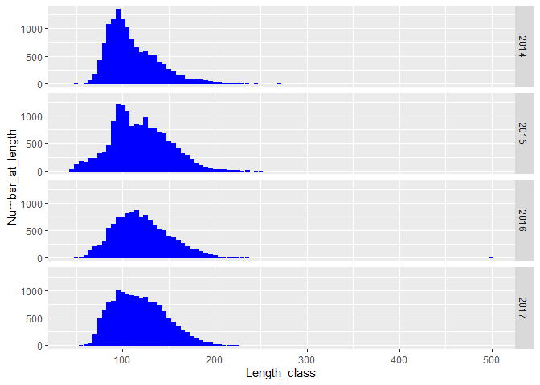
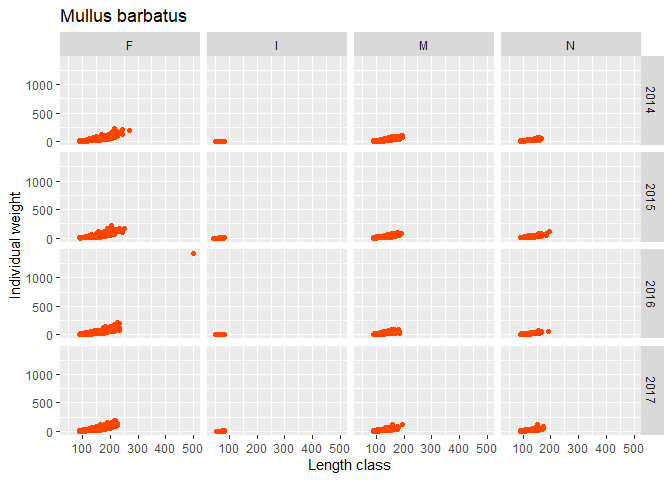
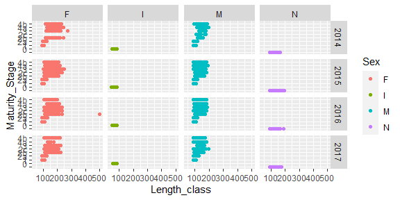
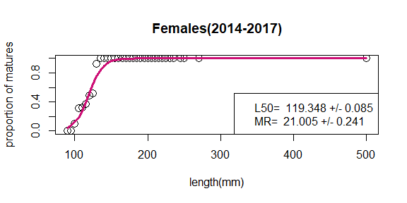
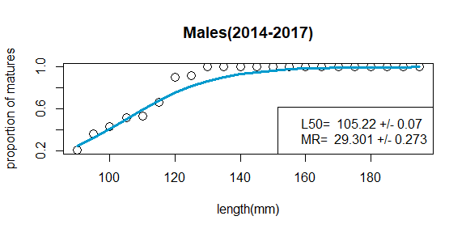
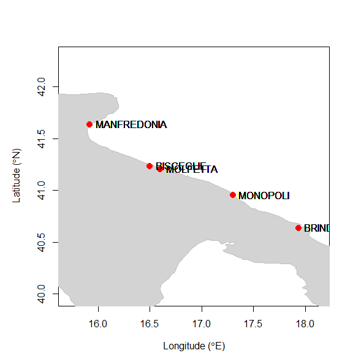

A priori quality checks on RCG CS and CL dataformats
================

RDBqc allows to carry out a set of quality checks on detailed sampling
data and on aggregated landing data. The supported data formats in
version 0.0.1 are: - RCG CS - biological sampling data - RCG CL -
aggregated landing data.

``` r
library(RDBqc)
library(pander)
library(data.table) 
```

Example of Regional Coordination Group Mediterranean & Black Sea data
formats:

``` r
head(data_ex)
#>   Sampling_type Flag_country Year  Trip_code Harbour
#> 1             S          ITA 2016 01_18_2016   ITMOL
#> 2             S          ITA 2016 01_18_2016   ITMOL
#> 3             S          ITA 2016 01_18_2016   ITMOL
#> 4             S          ITA 2016 01_18_2016   ITMOL
#> 5             S          ITA 2016 01_18_2016   ITMOL
#> 6             S          ITA 2016 01_18_2016   ITMOL
#>   Number_of_sets_hauls_on_trip Days_at_sea Sampling.method Aggregation_level
#> 1                            4           1    SelfSampling              TRUE
#> 2                            4           1    SelfSampling              TRUE
#> 3                            4           1    SelfSampling              TRUE
#> 4                            4           1    SelfSampling              TRUE
#> 5                            4           1    SelfSampling              TRUE
#> 6                            4           1    SelfSampling              TRUE
#>   Station_number Duration_of_fishing_operation Initial_latitude
#> 1            999                           960               NA
#> 2            999                           960               NA
#> 3            999                           960               NA
#> 4            999                           960               NA
#> 5            999                           960               NA
#> 6            999                           960               NA
#>   Initial_longitude Final_latitude Final_longitude Depth_of_fishing_operation
#> 1                NA             NA              NA                        113
#> 2                NA             NA              NA                        113
#> 3                NA             NA              NA                        113
#> 4                NA             NA              NA                        113
#> 5                NA             NA              NA                        113
#> 6                NA             NA              NA                        113
#>   Water_depth Catch_registration Species_registration       Date  Area
#> 1          NA                Lan                  All 18/02/2016 GSA99
#> 2          NA                Lan                  All 18/02/2016 GSA99
#> 3          NA                Lan                  All 18/02/2016 GSA99
#> 4          NA                Lan                  All 18/02/2016 GSA99
#> 5          NA                Lan                  All 18/02/2016 GSA99
#> 6          NA                Lan                  All 18/02/2016 GSA99
#>   Fishing_activity_category_National Fishing_activity_category_European_lvl_6
#> 1                          OTB_shelf                         OTB_DEF_>=40_0_0
#> 2                          OTB_shelf                         OTB_DEF_>=40_0_0
#> 3                          OTB_shelf                         OTB_DEF_>=40_0_0
#> 4                          OTB_shelf                         OTB_DEF_>=40_0_0
#> 5                          OTB_shelf                         OTB_DEF_>=40_0_0
#> 6                          OTB_shelf                         OTB_DEF_>=40_0_0
#>           Species Catch_category Weight Subsample_weight Sex Maturity_method
#> 1 Mullus barbatus            Lan  18000             6000   F            Macr
#> 2 Mullus barbatus            Lan  18000             6000   F            Macr
#> 3 Mullus barbatus            Lan  18000             6000   F            Macr
#> 4 Mullus barbatus            Lan  18000             6000   F            Macr
#> 5 Mullus barbatus            Lan  18000             6000   F            Macr
#> 6 Mullus barbatus            Lan  18000             6000   F            Macr
#>   Maturity_scale Maturity_Stage Ageing.method Age Length_code Length_class
#> 1   Medits scale             2b           OWR  NA         scm          500
#> 2   Medits scale             2b           OWR  NA         scm          170
#> 3   Medits scale             2b           OWR  NA         scm          175
#> 4   Medits scale             2b           OWR  NA         scm          180
#> 5   Medits scale             2c           OWR  NA         scm          180
#> 6   Medits scale             2b           OWR  10         scm          185
#>   Number_at_length Commercial_size_category_scale Commercial_size_category
#> 1                2                            ITA                        1
#> 2                1                            ITA                        1
#> 3                7                            ITA                        1
#> 4               10                            ITA                        1
#> 5                2                            ITA                        1
#> 6                2                            ITA                        1
#>   fish_ID Individual_weight
#> 1      NA        1424.34463
#> 2      NA          49.41020
#> 3      NA          34.40999
#> 4      NA          49.40479
#> 5      NA          97.93418
#> 6      NA          74.61447
head(data_exampleCL)
#>   landCtry vslFlgCtry year quarter month  area rect subRect
#> 1       NA   COUNTRY1 1900       1     1 GSA99   NA      NA
#> 2       NA   COUNTRY1 1900       1     2 GSA99   NA      NA
#> 3       NA   COUNTRY1 1900       1     3 GSA99   NA      NA
#> 4       NA   COUNTRY1 1900       2     4 GSA99   NA      NA
#> 5       NA   COUNTRY1 1900       2     5 GSA99   NA      NA
#> 6       NA   COUNTRY1 1900       2     6 GSA99   NA      NA
#>                      taxon landCat commCatScl commCat  foCatNat foCatEu5
#> 1 Parapenaeus longirostris      NA         NA      NA OTB_shelf       NA
#> 2 Parapenaeus longirostris      NA         NA      NA OTB_shelf       NA
#> 3 Parapenaeus longirostris      NA         NA      NA OTB_shelf       NA
#> 4 Parapenaeus longirostris      NA         NA      NA OTB_shelf       NA
#> 5 Parapenaeus longirostris      NA         NA      NA OTB_shelf       NA
#> 6 Parapenaeus longirostris      NA         NA      NA OTB_shelf       NA
#>           foCatEu6 harbour vslLenCat unallocCatchWt misRepCatchWt    landWt
#> 1 OTB_DEF_>=40_0_0    Port        NA             NA            NA  73452.53
#> 2 OTB_DEF_>=40_0_0    Port        NA             NA            NA  78741.52
#> 3 OTB_DEF_>=40_0_0    Port        NA             NA            NA  82021.10
#> 4 OTB_DEF_>=40_0_0    Port        NA             NA            NA  89022.59
#> 5 OTB_DEF_>=40_0_0    Port        NA             NA            NA 103911.92
#> 6 OTB_DEF_>=40_0_0    Port        NA             NA            NA 102987.30
#>   landMult landValue
#> 1       NA  372658.8
#> 2       NA  392665.2
#> 3       NA  460280.8
#> 4       NA  433524.2
#> 5       NA  494103.4
#> 6       NA  498298.8
```

# Checks on CS

## Check LFD

This function returns 0 if all the lengths collected are within the
length range min_len-max_len; if some lengths are outside this range,
the corresponding trips are indicated.

``` r
check_LFD(data_ex,species="Mullus barbatus",min_len=6, max_len=250)
#> Warning: Ignoring unknown parameters: binwidth, bins, pad
```

<!-- -->

    #> [1] No individual length classes out of the expected range
    #>  [1] Sampling_type                           
    #>  [2] Flag_country                            
    #>  [3] Year                                    
    #>  [4] Trip_code                               
    #>  [5] Harbour                                 
    #>  [6] Number_of_sets_hauls_on_trip            
    #>  [7] Days_at_sea                             
    #>  [8] Sampling.method                         
    #>  [9] Aggregation_level                       
    #> [10] Station_number                          
    #> [11] Duration_of_fishing_operation           
    #> [12] Initial_latitude                        
    #> [13] Initial_longitude                       
    #> [14] Final_latitude                          
    #> [15] Final_longitude                         
    #> [16] Depth_of_fishing_operation              
    #> [17] Water_depth                             
    #> [18] Catch_registration                      
    #> [19] Species_registration                    
    #> [20] Date                                    
    #> [21] Area                                    
    #> [22] Fishing_activity_category_National      
    #> [23] Fishing_activity_category_European_lvl_6
    #> [24] Species                                 
    #> [25] Catch_category                          
    #> [26] Weight                                  
    #> [27] Subsample_weight                        
    #> [28] Sex                                     
    #> [29] Maturity_method                         
    #> [30] Maturity_scale                          
    #> [31] Maturity_Stage                          
    #> [32] Ageing.method                           
    #> [33] Age                                     
    #> [34] Length_code                             
    #> [35] Length_class                            
    #> [36] Number_at_length                        
    #> [37] Commercial_size_category_scale          
    #> [38] Commercial_size_category                
    #> [39] fish_ID                                 
    #> [40] Individual_weight                       
    #> <0 righe> (o 0-length row.names)

## Check LFD_comm_cat

This function reports for each year and commercial category the minimum
and maximum lengths in the dataset.

``` r
check_LFD_comm_cat(data_ex)
#> Warning: Ignoring unknown parameters: binwidth, bins, pad
#>    Year Commercial_size_category Min Max
#> 1  2014                        1  75 270
#> 2  2014                        2  60 205
#> 3  2014                        3  65 155
#> 4  2014                        S  50 130
#> 5  2015                        1  75 250
#> 6  2015                        2  45 195
#> 7  2015                        3  80 175
#> 8  2015                        S  45 140
#> 9  2016                        1  50 500
#> 10 2016                        2  70 190
#> 11 2016                        3  80 155
#> 12 2016                        S  50 130
#> 13 2017                        1  80 225
#> 14 2017                        2  70 205
#> 15 2017                        3  65 150
#> 16 2017                        S  55 130
```

## Check AL

This function reports for each year and length class the number of age
measurements in the dataset. Moreover, the function detects if the age
data are in the range min_age-max_age.

``` r
check_AL(data_ex,min_age=0,max_age=5)
#> [[1]]
#>     Year Length_class nb_age_measurements
#> 1   2015           45                   1
#> 2   2014           50                   1
#> 3   2015           50                   1
#> 4   2016           50                   1
#> 5   2015           55                   3
#> 6   2016           55                   1
#> 7   2017           55                   1
#> 8   2014           60                   4
#> 9   2015           60                   4
#> 10  2016           60                   1
#> 11  2017           60                   5
#> 12  2014           65                   3
#> 13  2015           65                   2
#> 14  2016           65                   2
#> 15  2017           65                   6
#> 16  2014           70                   5
#> 17  2015           70                   2
#> 18  2016           70                   3
#> 19  2017           70                   6
#> 20  2014           75                   3
#> 21  2015           75                   2
#> 22  2016           75                   4
#> 23  2017           75                   4
#> 24  2014           80                   3
#> 25  2015           80                   1
#> 26  2016           80                   4
#> 27  2017           80                   6
#> 28  2014           85                   2
#> 29  2015           85                   2
#> 30  2016           85                   6
#> 31  2017           85                   5
#> 32  2014           90                   6
#> 33  2015           90                   7
#> 34  2016           90                   8
#> 35  2017           90                  15
#> 36  2014           95                   5
#> 37  2015           95                   3
#> 38  2016           95                  15
#> 39  2017           95                  12
#> 40  2014          100                   4
#> 41  2015          100                   6
#> 42  2016          100                  13
#> 43  2017          100                   9
#> 44  2014          105                   8
#> 45  2015          105                   3
#> 46  2016          105                  14
#> 47  2017          105                  12
#> 48  2014          110                   9
#> 49  2015          110                   9
#> 50  2016          110                  15
#> 51  2017          110                   8
#> 52  2014          115                   9
#> 53  2015          115                  13
#> 54  2016          115                  13
#> 55  2017          115                  13
#> 56  2014          120                  10
#> 57  2015          120                  10
#> 58  2016          120                  11
#> 59  2017          120                  11
#> 60  2014          125                  15
#> 61  2015          125                   7
#> 62  2016          125                  11
#> 63  2017          125                  11
#> 64  2014          130                  11
#> 65  2015          130                   5
#> 66  2016          130                  14
#> 67  2017          130                  15
#> 68  2014          135                  11
#> 69  2015          135                   7
#> 70  2016          135                  12
#> 71  2017          135                  20
#> 72  2014          140                  13
#> 73  2015          140                   6
#> 74  2016          140                  14
#> 75  2017          140                  19
#> 76  2014          145                   8
#> 77  2015          145                   7
#> 78  2016          145                  16
#> 79  2017          145                  19
#> 80  2014          150                  10
#> 81  2015          150                   8
#> 82  2016          150                  16
#> 83  2017          150                  25
#> 84  2014          155                   6
#> 85  2015          155                  11
#> 86  2016          155                  18
#> 87  2017          155                  19
#> 88  2014          160                   8
#> 89  2015          160                  13
#> 90  2016          160                  17
#> 91  2017          160                  22
#> 92  2014          165                   9
#> 93  2015          165                  12
#> 94  2016          165                  14
#> 95  2017          165                  22
#> 96  2014          170                  11
#> 97  2015          170                   8
#> 98  2016          170                  12
#> 99  2017          170                  20
#> 100 2014          175                  13
#> 101 2015          175                  10
#> 102 2016          175                  10
#> 103 2017          175                  16
#> 104 2014          180                  13
#> 105 2015          180                  19
#> 106 2016          180                  12
#> 107 2017          180                  19
#> 108 2014          185                  12
#> 109 2015          185                  16
#> 110 2016          185                   7
#> 111 2017          185                  14
#> 112 2014          190                  11
#> 113 2015          190                  11
#> 114 2016          190                   7
#> 115 2017          190                  19
#> 116 2014          195                  12
#> 117 2015          195                  11
#> 118 2016          195                   4
#> 119 2017          195                  14
#> 120 2014          200                  10
#> 121 2015          200                  12
#> 122 2016          200                   8
#> 123 2017          200                  10
#> 124 2014          205                   6
#> 125 2015          205                  10
#> 126 2016          205                   3
#> 127 2017          205                   7
#> 128 2014          210                   6
#> 129 2015          210                   7
#> 130 2016          210                   8
#> 131 2017          210                   9
#> 132 2014          215                   6
#> 133 2015          215                   6
#> 134 2016          215                   9
#> 135 2017          215                   4
#> 136 2014          220                   6
#> 137 2015          220                   6
#> 138 2016          220                   5
#> 139 2017          220                   2
#> 140 2014          225                   5
#> 141 2015          225                   3
#> 142 2016          225                   3
#> 143 2017          225                   2
#> 144 2014          230                   1
#> 145 2015          230                   1
#> 146 2016          230                   1
#> 147 2014          235                   1
#> 148 2015          235                   3
#> 149 2016          235                   4
#> 150 2014          245                   2
#> 151 2015          245                   1
#> 152 2015          250                   1
#> 153 2014          270                   1
#> 
#> [[2]]
#>  [1] "01_18_2016" "02_18_2016" "05_18_2015" "07_18_2016" "08_18_2016"
#>  [6] "12_18_2015" "17_18_2014" "31_18_2017" "34_18_2016" "4_18_2014" 
#> [11] "57_18_2017" "66_18_2017"
```

## Check lw

This function plots for each year and sex the length-weight scatter
plot, checking if the weight data are within the boundaries in input.

``` r
check_lw(data_ex,species="Mullus barbatus",Min=0,Max=200)
```

<!-- -->

    #>      Sampling_type Flag_country Year  Trip_code Harbour
    #> 1                S          ITA 2016 01_18_2016   ITMOL
    #> 77               S          ITA 2016 02_18_2016   ITMOL
    #> 2430             S          ITA 2014 12_18_2014   ITMOL
    #> 5544             S          ITA 2014  4_18_2014   ITBDS
    #> 5777             S          ITA 2015 43_18_2015   ITMOL
    #> 7946             S          ITA 2014 87_18_2014   ITBDS
    #> 7949             S          ITA 2014 87_18_2014   ITBDS
    #>      Number_of_sets_hauls_on_trip Days_at_sea Sampling.method Aggregation_level
    #> 1                               4           1    SelfSampling              TRUE
    #> 77                              8           2        Observer              TRUE
    #> 2430                            5           1    SelfSampling              TRUE
    #> 5544                            7           2    SelfSampling              TRUE
    #> 5777                            4           1        Observer              TRUE
    #> 7946                            5           1        Observer              TRUE
    #> 7949                            5           1        Observer              TRUE
    #>      Station_number Duration_of_fishing_operation Initial_latitude
    #> 1               999                           960               NA
    #> 77              999                          2052               NA
    #> 2430            999                          1035               NA
    #> 5544            999                          1770               NA
    #> 5777            999                           990               NA
    #> 7946            999                          1209               NA
    #> 7949            999                          1209               NA
    #>      Initial_longitude Final_latitude Final_longitude
    #> 1                   NA             NA              NA
    #> 77                  NA             NA              NA
    #> 2430                NA             NA              NA
    #> 5544                NA             NA              NA
    #> 5777                NA             NA              NA
    #> 7946                NA             NA              NA
    #> 7949                NA             NA              NA
    #>      Depth_of_fishing_operation Water_depth Catch_registration
    #> 1                           113          NA                Lan
    #> 77                          165          NA                All
    #> 2430                        210          NA                Lan
    #> 5544                        183          NA                Lan
    #> 5777                         98          NA                All
    #> 7946                        120          NA                All
    #> 7949                        120          NA                All
    #>      Species_registration       Date  Area Fishing_activity_category_National
    #> 1                     All 18/02/2016 GSA99                          OTB_shelf
    #> 77                    All 21/03/2016 GSA99                          OTB_shelf
    #> 2430                  All 24/07/2014 GSA99                          OTB_shelf
    #> 5544                  All 04/07/2014 GSA99                          OTB_shelf
    #> 5777                  All 31/07/2015 GSA99                          OTB_shelf
    #> 7946                  All 05/12/2014 GSA99                          OTB_shelf
    #> 7949                  All 05/12/2014 GSA99                          OTB_shelf
    #>      Fishing_activity_category_European_lvl_6         Species Catch_category
    #> 1                            OTB_DEF_>=40_0_0 Mullus barbatus            Lan
    #> 77                           OTB_DEF_>=40_0_0 Mullus barbatus            Lan
    #> 2430                         OTB_DEF_>=40_0_0 Mullus barbatus            Lan
    #> 5544                         OTB_DEF_>=40_0_0 Mullus barbatus            Lan
    #> 5777                         OTB_DEF_>=40_0_0 Mullus barbatus            Lan
    #> 7946                         OTB_DEF_>=40_0_0 Mullus barbatus            Lan
    #> 7949                         OTB_DEF_>=40_0_0 Mullus barbatus            Lan
    #>      Weight Subsample_weight Sex Maturity_method Maturity_scale Maturity_Stage
    #> 1     18000             6000   F            Macr   Medits scale             2b
    #> 77    19200             6400   F            Macr   Medits scale              3
    #> 2430   6200             6200   F            Macr   Medits scale             4a
    #> 5544   4760             4760   F            Macr   Medits scale              3
    #> 5777   4600             4600   F            Macr   Medits scale             4b
    #> 7946   5130             5130   F            Macr   Medits scale             2b
    #> 7949   5130             5130   F            Macr   Medits scale             2b
    #>      Ageing.method Age Length_code Length_class Number_at_length
    #> 1              OWR  NA         scm          500                2
    #> 77             OWR 4.5         scm          225                1
    #> 2430           OWR 5.0         scm          220                1
    #> 5544           OWR 7.0         scm          270                1
    #> 5777           OWR 4.0         scm          205                1
    #> 7946           OWR 4.0         scm          215                1
    #> 7949           OWR 5.0         scm          245                1
    #>      Commercial_size_category_scale Commercial_size_category fish_ID
    #> 1                               ITA                        1      NA
    #> 77                              ITA                        1      NA
    #> 2430                            ITA                        1      NA
    #> 5544                            ITA                        1      NA
    #> 5777                            ITA                        1      NA
    #> 7946                            ITA                        1      NA
    #> 7949                            ITA                        1      NA
    #>      Individual_weight
    #> 1            1424.3446
    #> 77            209.2891
    #> 2430          201.8513
    #> 5544          202.9782
    #> 5777          220.3938
    #> 7946          231.6174
    #> 7949          206.2320

## Check mat

This function plots for each year and sex the length-maturity stage
scatter plot and the maturity ogive derived from the dataset by sex.

``` r
check_mat(data_ex)
```

<!-- --><!-- --><!-- -->
## Summarize individual measurements This function reports for each trip
the number of length sex, maturity, individual weight and age
measurements.

``` r
summarize_ind_meas(data_ex)
#> [[1]]
#> # A tibble: 139 x 5
#> # Groups:   Year, Area, Species [4]
#>     Year Area  Species         Trip_code  length_measurements
#>    <int> <chr> <chr>           <chr>                    <int>
#>  1  2014 GSA99 Mullus barbatus 12_18_2014                 120
#>  2  2014 GSA99 Mullus barbatus 14_18_2014                 163
#>  3  2014 GSA99 Mullus barbatus 15_18_2014                 252
#>  4  2014 GSA99 Mullus barbatus 17_18_2014                 239
#>  5  2014 GSA99 Mullus barbatus 19_18_2014                1657
#>  6  2014 GSA99 Mullus barbatus 20_18_2014                 752
#>  7  2014 GSA99 Mullus barbatus 22_18_2014                  62
#>  8  2014 GSA99 Mullus barbatus 27_18_2014                2217
#>  9  2014 GSA99 Mullus barbatus 4_18_2014                  122
#> 10  2014 GSA99 Mullus barbatus 41_18_2014                 396
#> # ... with 129 more rows
#> 
#> [[2]]
#> # A tibble: 139 x 5
#> # Groups:   Year, Area, Species [4]
#>     Year Area  Species         Trip_code  maturity_data
#>    <int> <chr> <chr>           <chr>              <int>
#>  1  2014 GSA99 Mullus barbatus 12_18_2014           120
#>  2  2014 GSA99 Mullus barbatus 14_18_2014           163
#>  3  2014 GSA99 Mullus barbatus 15_18_2014           252
#>  4  2014 GSA99 Mullus barbatus 17_18_2014           239
#>  5  2014 GSA99 Mullus barbatus 19_18_2014          1657
#>  6  2014 GSA99 Mullus barbatus 20_18_2014           752
#>  7  2014 GSA99 Mullus barbatus 22_18_2014            62
#>  8  2014 GSA99 Mullus barbatus 27_18_2014          2217
#>  9  2014 GSA99 Mullus barbatus 4_18_2014            122
#> 10  2014 GSA99 Mullus barbatus 41_18_2014           396
#> # ... with 129 more rows
#> 
#> [[3]]
#> # A tibble: 139 x 5
#> # Groups:   Year, Area, Species [4]
#>     Year Area  Species         Trip_code  sex_data
#>    <int> <chr> <chr>           <chr>         <int>
#>  1  2014 GSA99 Mullus barbatus 12_18_2014      120
#>  2  2014 GSA99 Mullus barbatus 14_18_2014      163
#>  3  2014 GSA99 Mullus barbatus 15_18_2014      252
#>  4  2014 GSA99 Mullus barbatus 17_18_2014      239
#>  5  2014 GSA99 Mullus barbatus 19_18_2014     1657
#>  6  2014 GSA99 Mullus barbatus 20_18_2014      752
#>  7  2014 GSA99 Mullus barbatus 22_18_2014       62
#>  8  2014 GSA99 Mullus barbatus 27_18_2014     2217
#>  9  2014 GSA99 Mullus barbatus 4_18_2014       122
#> 10  2014 GSA99 Mullus barbatus 41_18_2014      396
#> # ... with 129 more rows
#> 
#> [[4]]
#> # A tibble: 107 x 5
#> # Groups:   Year, Area, Species [4]
#>     Year Area  Species         Trip_code  age_data
#>    <int> <chr> <chr>           <chr>         <int>
#>  1  2014 GSA99 Mullus barbatus 12_18_2014       54
#>  2  2014 GSA99 Mullus barbatus 14_18_2014       52
#>  3  2014 GSA99 Mullus barbatus 15_18_2014       68
#>  4  2014 GSA99 Mullus barbatus 17_18_2014       27
#>  5  2014 GSA99 Mullus barbatus 19_18_2014       84
#>  6  2014 GSA99 Mullus barbatus 20_18_2014       32
#>  7  2014 GSA99 Mullus barbatus 22_18_2014       12
#>  8  2014 GSA99 Mullus barbatus 27_18_2014        1
#>  9  2014 GSA99 Mullus barbatus 4_18_2014        26
#> 10  2014 GSA99 Mullus barbatus 41_18_2014        8
#> # ... with 97 more rows
#> 
#> [[5]]
#> # A tibble: 139 x 5
#> # Groups:   Year, Area, Species [4]
#>     Year Area  Species         Trip_code  weight_data
#>    <int> <chr> <chr>           <chr>            <int>
#>  1  2014 GSA99 Mullus barbatus 12_18_2014         120
#>  2  2014 GSA99 Mullus barbatus 14_18_2014         163
#>  3  2014 GSA99 Mullus barbatus 15_18_2014         252
#>  4  2014 GSA99 Mullus barbatus 17_18_2014         239
#>  5  2014 GSA99 Mullus barbatus 19_18_2014        1657
#>  6  2014 GSA99 Mullus barbatus 20_18_2014         752
#>  7  2014 GSA99 Mullus barbatus 22_18_2014          62
#>  8  2014 GSA99 Mullus barbatus 27_18_2014        2217
#>  9  2014 GSA99 Mullus barbatus 4_18_2014          122
#> 10  2014 GSA99 Mullus barbatus 41_18_2014         396
#> # ... with 129 more rows
```

## Summarize trips

This function reports for each year, area, harbour, metier and sampling
method the number of trips in the dataset.

``` r
summarize_trips(data_ex)
#> # A tibble: 32 x 6
#> # Groups:   Year, Area, Harbour, Fishing_activity_category_European_lvl_6 [20]
#>     Year Area  Harbour Fishing_activity_category_Europ~ Sampling.method Nb_trips
#>    <int> <chr> <chr>   <chr>                            <chr>              <int>
#>  1  2014 GSA99 ITBCE   OTB_DEF_>=40_0_0                 Observer               2
#>  2  2014 GSA99 ITBDS   OTB_DEF_>=40_0_0                 Observer               2
#>  3  2014 GSA99 ITBDS   OTB_DEF_>=40_0_0                 SelfSampling           2
#>  4  2014 GSA99 ITMFR   OTB_DEF_>=40_0_0                 Observer               1
#>  5  2014 GSA99 ITMFR   OTB_DEF_>=40_0_0                 SelfSampling           7
#>  6  2014 GSA99 ITMNP   OTB_DEF_>=40_0_0                 Observer               2
#>  7  2014 GSA99 ITMOL   OTB_DEF_>=40_0_0                 Observer               6
#>  8  2014 GSA99 ITMOL   OTB_DEF_>=40_0_0                 SelfSampling           3
#>  9  2015 GSA99 ITBCE   OTB_DEF_>=40_0_0                 Observer               1
#> 10  2015 GSA99 ITBCE   OTB_DEF_>=40_0_0                 SelfSampling           1
#> # ... with 22 more rows
```

## Check trips location

This function reports for each year, area, harbour, metier and sampling
method the number of trips in the dataset.

``` r
check_loc(data_ex)
```

<!-- --> # Checks on CL This
function

``` r
check_CL(data_exampleCL)
#> [[1]]
#>    Year Quarter Month Sum_Landings
#> 1  1900       1     1     80553.10
#> 2  1900       1     2     80519.05
#> 3  1900       1     3     85107.68
#> 4  1900       2     4     90093.59
#> 5  1900       2     5    110096.34
#> 6  1900       2     6    117515.89
#> 7  1900       3     7     98584.85
#> 8  1900       3     8     49500.43
#> 9  1900       3     9     32084.59
#> 10 1900       4    10    153080.70
#> 11 1900       4    11    123574.70
#> 12 1900       4    12     99743.72
#> 
#> [[2]]
#>    Year Quarter Month Sum_LandingsValue
#> 1  1900       1     1          410296.6
#> 2  1900       1     2          400928.4
#> 3  1900       1     3          476691.5
#> 4  1900       2     4          438991.9
#> 5  1900       2     5          521380.8
#> 6  1900       2     6          571712.2
#> 7  1900       3     7          518606.2
#> 8  1900       3     8          308576.7
#> 9  1900       3     9          161772.9
#> 10 1900       4    10          609361.4
#> 11 1900       4    11          576900.8
#> 12 1900       4    12          601217.8
#> 
#> [[3]]
#>   LandCtry VslFlgCtry  Area Rect SubRect Harbour Sum_Landings
#> 1      999   COUNTRY1 GSA99  999     999    Port      1120455
#> 
#> [[4]]
#>   LandCtry VslFlgCtry  Area Rect SubRect Harbour Sum_LandingsValue
#> 1      999   COUNTRY1 GSA99  999     999    Port           5596437
#> 
#> [[5]]
#>   Year                  Species foCatEu5         foCatEu6 Sum_Landings
#> 1 1900 Parapenaeus longirostris      999 OTB_DEF_>=40_0_0  1018083.081
#> 2 1900 Parapenaeus longirostris      999 OTB_DWS_>=40_0_0     1453.471
#> 3 1900 Parapenaeus longirostris      999 OTB_MDD_>=40_0_0   100918.089
#> 
#> [[6]]
#>   Year                  Species foCatEu5         foCatEu6 Sum_LandingsValue
#> 1 1900 Parapenaeus longirostris      999 OTB_DEF_>=40_0_0       5050728.907
#> 2 1900 Parapenaeus longirostris      999 OTB_DWS_>=40_0_0          7721.884
#> 3 1900 Parapenaeus longirostris      999 OTB_MDD_>=40_0_0        537986.519
```
