RDBqc allows to carry out a set of _a priori_ quality checks on detailed sampling data and on aggregated landing data, and _a posteriori_ quality check on MEDBS, FDI and GFCM data call formats.

The supported quality checks in version 0.0.17.18 are:

### _A priori_ quality checks
* RCG CS - biological sampling data
* RCG CL - aggregated landing data

### _A posteriori_ quality checks
* MEDBS - catch data
* MEDBS - discard data
* MEDBS - landing data
* MEDBS - GP table
* MEDBS - LW table
* MEDBS - MA table
* MEDBS - ML table
* MEDBS - SA table
* MEDBS - SL table
* FDI tables (A, G, H, I and J)
* GFCM - Task II.2 table
* GFCM - Task III table
* GFCM - Task VII.2 table
* GFCM - Task VII.3.1 table
* GFCM - Task VII.3.2 table

### _Cross-checks_ among data calls
Since RBDqc version 0.0.15, the package also includes cross-check functions to perform checks between data call tables.
In particular, the following cross-check functions are available:

* Landing consistency among the different data calls: MED & BS, FDI and Annual Economic Report (AER)
* Discard consistency between MED & BS and FDI data calls
* Landing consistency between FDI and AER data calls
* Landing value consistency between FDI and AER data calls
* Number of trips consistency between MED & BS and Annual report (AR) data calls
* Number of ages consistency between MED & BS and AR data calls
* Number of weights consistency between MED & BS and AR data calls
* Number of maturity data consistency between MED & BS and AR data calls

# Checks on RCG

Example of Regional Coordination Group Mediterranean & Black Sea data formats:

**CS table**


```r
head(data_ex)
#>   Sampling_type Flag_country Year  Trip_code Harbour
#> 1             S          ITA 2016 01_18_2016   ITMOL
#> 2             S          ITA 2016 01_18_2016   ITMOL
#> 3             S          ITA 2016 01_18_2016   ITMOL
#> 4             S          ITA 2016 01_18_2016   ITMOL
#> 5             S          ITA 2016 01_18_2016   ITMOL
#> 6             S          ITA 2016 01_18_2016   ITMOL
#>   Number_of_sets_hauls_on_trip Days_at_sea Sampling_method Aggregation_level
#> 1                            4           1    SelfSampling              TRUE
#> 2                            4           1    SelfSampling              TRUE
#> 3                            4           1    SelfSampling              TRUE
#> 4                            4           1    SelfSampling              TRUE
#> 5                            4           1    SelfSampling              TRUE
#> 6                            4           1    SelfSampling              TRUE
#>   Station_number Duration_of_fishing_operation Initial_latitude
#> 1            999                           960         42.04033
#> 2            999                           960         42.04033
#> 3            999                           960         42.04033
#> 4            999                           960         42.04033
#> 5            999                           960         42.04033
#> 6            999                           960         42.04033
#>   Initial_longitude Final_latitude Final_longitude Depth_of_fishing_operation
#> 1          18.48217       42.09067        18.48483                        113
#> 2          18.48217       42.09067        18.48483                        113
#> 3          18.48217       42.09067        18.48483                        113
#> 4          18.48217       42.09067        18.48483                        113
#> 5          18.48217       42.09067        18.48483                        113
#> 6          18.48217       42.09067        18.48483                        113
#>   Water_depth Catch_registration Species_registration       Date  Area
#> 1          NA                Lan                  All 18/02/2016 GSA99
#> 2          NA                Lan                  All 18/02/2016 GSA99
#> 3          NA                Lan                  All 18/02/2016 GSA99
#> 4          NA                Lan                  All 18/02/2016 GSA99
#> 5          NA                Lan                  All 18/02/2016 GSA99
#> 6          NA                Lan                  All 18/02/2016 GSA99
#>   Fishing_activity_category_National Fishing_activity_category_European_lvl_6
#> 1                          OTB_shelf                         OTB_DEF_>=40_0_0
#> 2                          OTB_shelf                         OTB_DEF_>=40_0_0
#> 3                          OTB_shelf                         OTB_DEF_>=40_0_0
#> 4                          OTB_shelf                         OTB_DEF_>=40_0_0
#> 5                          OTB_shelf                         OTB_DEF_>=40_0_0
#> 6                          OTB_shelf                         OTB_DEF_>=40_0_0
#>           Species Catch_category Weight Subsample_weight Sex Maturity_method
#> 1 Mullus barbatus            Lan  18000             6000   F            Macr
#> 2 Mullus barbatus            Lan  18000             6000   F            Macr
#> 3 Mullus barbatus            Lan  18000             6000   F            Macr
#> 4 Mullus barbatus            Lan  18000             6000   F            Macr
#> 5 Mullus barbatus            Lan  18000             6000   F            Macr
#> 6 Mullus barbatus            Lan  18000             6000   F            Macr
#>   Maturity_scale Maturity_Stage Ageing.method Age Length_code Length_class
#> 1   Medits scale             2b           OWR  NA         scm          500
#> 2   Medits scale             2b           OWR  NA         scm          170
#> 3   Medits scale             2b           OWR  NA         scm          175
#> 4   Medits scale             2b           OWR  NA         scm          180
#> 5   Medits scale             2c           OWR  NA         scm          180
#> 6   Medits scale             2b           OWR  10         scm          185
#>   Number_at_length Commercial_size_category_scale Commercial_size_category
#> 1                2                            ITA                        1
#> 2                1                            ITA                        1
#> 3                7                            ITA                        1
#> 4               10                            ITA                        1
#> 5                2                            ITA                        1
#> 6                2                            ITA                        1
#>   fish_ID Individual_weight
#> 1      NA        1424.34463
#> 2      NA          49.41020
#> 3      NA          34.40999
#> 4      NA          49.40479
#> 5      NA          97.93418
#> 6      NA          74.61447
```

**CL table**


```r
head(data_exampleCL)
#>   flag_country year quarter month  area                  species
#> 1     COUNTRY1 2014       1     1 GSA99 Parapenaeus longirostris
#> 2     COUNTRY1 2014       1     2 GSA99 Parapenaeus longirostris
#> 3     COUNTRY1 2014       1     3 GSA99 Parapenaeus longirostris
#> 4     COUNTRY1 2014       2     4 GSA99 Parapenaeus longirostris
#> 5     COUNTRY1 2014       2     5 GSA99 Parapenaeus longirostris
#> 6     COUNTRY1 2014       2     6 GSA99 Parapenaeus longirostris
#>   fishing_activity_category_national fishing_activity_category_eu_l6 harbour
#> 1                          OTB_shelf                OTB_DEF_>=40_0_0    Port
#> 2                          OTB_shelf                OTB_DEF_>=40_0_0    Port
#> 3                          OTB_shelf                OTB_DEF_>=40_0_0    Port
#> 4                          OTB_shelf                OTB_DEF_>=40_0_0    Port
#> 5                          OTB_shelf                OTB_DEF_>=40_0_0    Port
#> 6                          OTB_shelf                OTB_DEF_>=40_0_0    Port
#>   official_landings_weight official_landings_value
#> 1                 73452.53                372658.8
#> 2                 78741.52                392665.2
#> 3                 82021.10                460280.8
#> 4                 89022.59                433524.2
#> 5                103911.92                494103.4
#> 6                102987.30                498298.8
```

## Checks on CS

### check LFD

This function `RCG_check_LFD` returns an empty data frame if all the lengths collected are within the length range min_len-max_len; if some lengths are outside this range, the corresponding records are returned as a data frame.


```r
RCG_check_LFD(data_ex,MS="ITA",GSA="GSA99", SP="Mullus barbatus",min_len=6,max_len=250)[[1]]
#>      Flag_country Year  Trip_code       Date  Area Commercial_size_category Age
#> 1             ITA 2016 01_18_2016 18/02/2016 GSA99                        1  NA
#> 5544          ITA 2014  4_18_2014 04/07/2014 GSA99                        1   7
#>      Sex Length_class fish_ID
#> 1      F          500      NA
#> 5544   F          270      NA
```

A plot of the frequency distribution is also returned:


```r
RCG_check_LFD(data_ex,MS="ITA",GSA="GSA99", SP="Mullus barbatus",min_len=6,max_len=250)[[2]]
```


### check LFD by commercial categories

This function `RCG_check_LFD_comm_cat` reports for each year and commercial category the minimum and maximum lengths in the dataset.


```r
RCG_check_LFD_comm_cat(data_ex,MS="ITA",GSA="GSA99", SP="Mullus barbatus")[[1]]
#>    Year Commercial_size_category Min Max
#> 1  2014                        1  75 270
#> 2  2014                        2  60 205
#> 3  2014                        3  65 155
#> 4  2014                        S  50 130
#> 5  2015                        1  75 250
#> 6  2015                        2  45 195
#> 7  2015                        3  80 175
#> 8  2015                        S  45 140
#> 9  2016                        1  50 500
#> 10 2016                        2  70 190
#> 11 2016                        3  80 155
#> 12 2016                        S  50 130
#> 13 2017                        1  80 225
#> 14 2017                        2  70 205
#> 15 2017                        3  65 150
#> 16 2017                        S  55 130
```

A plot of the length distributions by year and commercial category is also returned:


```r
RCG_check_LFD_comm_cat(data_ex,MS="ITA",GSA="GSA99", SP="Mullus barbatus")[[2]]
```


### Check AL 

This function `RCG_check_AL` reports for each year and length class the number of age measurements in the dataset, providing a summary data frame. 


```r
results <- RCG_check_AL(data_ex,MS="ITA",GSA="GSA99",SP="Mullus barbatus",min_age=0,max_age=5)[[1]]
#> NA included in the 'Age' field have been removed from the analysis.
head(results)
#>   Year Length_class nb_age_measurements
#> 1 2014           50                   1
#> 2 2014           60                  11
#> 3 2014           65                  20
#> 4 2014           70                  20
#> 5 2014           75                  18
#> 6 2014           80                  18
```

Moreover, the function detects if the age data are in the range min_age-max_age, reporting the list of the trip codes including outliers. 


```r
RCG_check_AL(data_ex,MS="ITA",GSA="GSA99",SP="Mullus barbatus",min_age=0,max_age=5)[[2]]
#> NA included in the 'Age' field have been removed from the analysis.
#>      Flag_country Year  Trip_code       Date  Area Commercial_size_category
#> 6             ITA 2016 01_18_2016 18/02/2016 GSA99                        1
#> 25            ITA 2016 01_18_2016 18/02/2016 GSA99                        1
#> 75            ITA 2016 02_18_2016 21/03/2016 GSA99                        1
#> 78            ITA 2016 02_18_2016 21/03/2016 GSA99                        1
#> 394           ITA 2015 05_18_2015 22/04/2015 GSA99                        1
#> 396           ITA 2015 05_18_2015 22/04/2015 GSA99                        1
#> 397           ITA 2015 05_18_2015 22/04/2015 GSA99                        1
#> 529           ITA 2016 07_18_2016 17/03/2016 GSA99                        1
#> 705           ITA 2016 08_18_2016 29/03/2016 GSA99                        1
#> 2455          ITA 2015 12_18_2015 24/05/2015 GSA99                        1
#> 4267          ITA 2014 17_18_2014 08/08/2014 GSA99                        1
#> 4269          ITA 2014 17_18_2014 08/08/2014 GSA99                        1
#> 5210          ITA 2017 31_18_2017 11/05/2017 GSA99                        1
#> 5399          ITA 2016 34_18_2016 20/06/2016 GSA99                        1
#> 5544          ITA 2014  4_18_2014 04/07/2014 GSA99                        1
#> 6786          ITA 2017 57_18_2017 24/05/2017 GSA99                        1
#> 7129          ITA 2017 66_18_2017 29/05/2017 GSA99                        1
#>       Age Sex Length_class fish_ID
#> 6    10.0   F          185      NA
#> 25    5.5   F          230      NA
#> 75    5.5   F          220      NA
#> 78    5.5   F          235      NA
#> 394   5.5   F          225      NA
#> 396   5.5   F          235      NA
#> 397   5.5   F          250      NA
#> 529   5.5   F          235      NA
#> 705   5.5   F          235      NA
#> 2455  5.5   F          245      NA
#> 4267  6.0   F          225      NA
#> 4269  6.0   F          245      NA
#> 5210  5.5   F          210      NA
#> 5399  5.5   F          235      NA
#> 5544  7.0   F          270      NA
#> 6786  5.5   F          210      NA
#> 7129  5.5   F          225      NA
```

A plot of the age/length relationship by sex and year is outputted for the selected species


```r
RCG_check_AL(data_ex,MS="ITA",GSA="GSA99",SP="Mullus barbatus",min_age=0,max_age=5)[[3]]
#> NA included in the 'Age' field have been removed from the analysis.
```


### Check lw 

This function `RCG_check_lw` plots for each year and sex the length-weight scatter plot


```r
RCG_check_lw(data_ex,MS="ITA",GSA="GSA99", SP="Mullus barbatus",Min=0,Max=200)[[2]]
```


Furthermore, it checks if the weight data are within the boundaries in input, providing the data frame of the records with the outliers


```r
RCG_check_lw(data_ex,MS="ITA",GSA="GSA99", SP="Mullus barbatus",Min=0,Max=200)[[1]]
#>      Flag_country Year  Trip_code       Date  Area Commercial_size_category Age
#> 1             ITA 2016 01_18_2016 18/02/2016 GSA99                        1  NA
#> 77            ITA 2016 02_18_2016 21/03/2016 GSA99                        1 4.5
#> 2430          ITA 2014 12_18_2014 24/07/2014 GSA99                        1 5.0
#> 5544          ITA 2014  4_18_2014 04/07/2014 GSA99                        1 7.0
#> 5777          ITA 2015 43_18_2015 31/07/2015 GSA99                        1 4.0
#> 7946          ITA 2014 87_18_2014 05/12/2014 GSA99                        1 4.0
#> 7949          ITA 2014 87_18_2014 05/12/2014 GSA99                        1 5.0
#>      Sex Length_class fish_ID
#> 1      F          500      NA
#> 77     F          225      NA
#> 2430   F          220      NA
#> 5544   F          270      NA
#> 5777   F          205      NA
#> 7946   F          215      NA
#> 7949   F          245      NA
```

### check maturity stages 

This function `RCG_check_mat` plots for each year and sex the length-maturity stage scatter plot


```r
RCG_check_mat(data_ex,MS="ITA",GSA="GSA99",SP="Mullus barbatus")
```


### check matutity ogive

This function `RCG_check_mat_ogive` plots the maturity ogive by sex derived from the dataset:


```r
RCG_check_mat_ogive(data_ex,MS="ITA",GSA="GSA99",SP="Mullus barbatus", sex="F",immature_stages=c("0","1","2a"))
```


 
### Summarize individual measurements

This function `RCG_summarize_ind_meas` reports for each trip the number of length sex, maturity, individual weight and age measurements for a selected species. 


```r
results <- RCG_summarize_ind_meas(data=data_ex,MS="ITA",GSA="GSA99",SP="Mullus barbatus")
head(results)
#>   Year  Area         Species  Trip_code age_data length_measurements
#> 1 2014 GSA99 Mullus barbatus 12_18_2014       54                 120
#> 2 2014 GSA99 Mullus barbatus 14_18_2014       52                 163
#> 3 2014 GSA99 Mullus barbatus 15_18_2014       68                 252
#> 4 2014 GSA99 Mullus barbatus 17_18_2014       27                 239
#> 5 2014 GSA99 Mullus barbatus 19_18_2014       84                1657
#> 6 2014 GSA99 Mullus barbatus 20_18_2014       32                 752
#>   maturity_data sex_data weight_data
#> 1           120      120         120
#> 2           163      163         163
#> 3           252      252         252
#> 4           239      239         239
#> 5          1657     1657        1657
#> 6           752      752         752
```

### Summarize trips

This function `RCG_summarize_trips` reports for the selected species the number of trips in the dataset for each year, area, harbour, metier and sampling method. 


```r
results <- RCG_summarize_trips(data_ex,MS="ITA",GSA="GSA99",SP="Mullus barbatus")
head(results)
#>   Year Flag_country  Area Harbour         Species
#> 1 2014          ITA GSA99   ITBCE Mullus barbatus
#> 2 2014          ITA GSA99   ITBDS Mullus barbatus
#> 3 2014          ITA GSA99   ITBDS Mullus barbatus
#> 4 2014          ITA GSA99   ITMFR Mullus barbatus
#> 5 2014          ITA GSA99   ITMFR Mullus barbatus
#> 6 2014          ITA GSA99   ITMNP Mullus barbatus
#>   Fishing_activity_category_European_lvl_6 Sampling_method Nb_trips
#> 1                         OTB_DEF_>=40_0_0        Observer        2
#> 2                         OTB_DEF_>=40_0_0        Observer        2
#> 3                         OTB_DEF_>=40_0_0    SelfSampling        2
#> 4                         OTB_DEF_>=40_0_0        Observer        1
#> 5                         OTB_DEF_>=40_0_0    SelfSampling        7
#> 6                         OTB_DEF_>=40_0_0        Observer        2
```

### Check trips location

The function `RCG_check_loc` allows to check the spatial distribution of data using the initial and final coordinates, where available, and the ports position included in the data.


```r
RCG_check_loc(data_ex)
#> Regions defined for each Polygons
```


## Checks on CL

This function `RCG_check_CL` allows to check the data in the CL table for the selected species. The output is a list of 6 data frames:

1. Sum of Landings by year, quarter and month;


```r
RCG_check_CL(data_exampleCL,MS="COUNTRY1",GSA="GSA99",SP="Parapenaeus longirostris")[[1]]
#>    Year Quarter Month Sum_Landings
#> 1  2014       1     1     80553.10
#> 2  2014       1     2     80519.05
#> 3  2014       1     3     85107.68
#> 4  2014       2     4     90093.59
#> 5  2014       2     5    110096.34
#> 6  2014       2     6    117515.89
#> 7  2014       3     7     98584.85
#> 8  2014       3     8     49500.43
#> 9  2014       3     9     32084.59
#> 10 2014       4    10    153080.70
#> 11 2014       4    11    123574.70
#> 12 2014       4    12     99743.72
```

2. Sum of Landing value by year, quarter and month;


```r
RCG_check_CL(data_exampleCL,MS="COUNTRY1",GSA="GSA99",SP="Parapenaeus longirostris")[[2]]
#>    Year Quarter Month Sum_LandingsValue
#> 1  2014       1     1          410296.6
#> 2  2014       1     2          400928.4
#> 3  2014       1     3          476691.5
#> 4  2014       2     4          438991.9
#> 5  2014       2     5          521380.8
#> 6  2014       2     6          571712.2
#> 7  2014       3     7          518606.2
#> 8  2014       3     8          308576.7
#> 9  2014       3     9          161772.9
#> 10 2014       4    10          609361.4
#> 11 2014       4    11          576900.8
#> 12 2014       4    12          601217.8
```

3. Sum of landings by LandCtry, VslFlgCtry,  Area, Rect, SubRect, Harbour;


```r
RCG_check_CL(data_exampleCL,MS="COUNTRY1",GSA="GSA99",SP="Parapenaeus longirostris")[[3]]
#>    Country  Area Harbour Sum_Landings
#> 1 COUNTRY1 GSA99    Port      1120455
```

4. Sum of landing value by LandCtry, VslFlgCtry,  Area, Rect, SubRect, Harbour;


```r
RCG_check_CL(data_exampleCL,MS="COUNTRY1",GSA="GSA99",SP="Parapenaeus longirostris")[[4]]
#>    Country  Area Harbour Sum_LandingsValue
#> 1 COUNTRY1 GSA99    Port           5596437
```

5. Sum of landings by Year, Species, foCatEu5, foCatEu6;


```r
RCG_check_CL(data_exampleCL,MS="COUNTRY1",GSA="GSA99",SP="Parapenaeus longirostris")[[5]]
#>   Year                  Species fishing_activity_category_national
#> 1 2014 Parapenaeus longirostris                         OTB_ mixed
#> 2 2014 Parapenaeus longirostris                          OTB_shelf
#> 3 2014 Parapenaeus longirostris                          OTB_slope
#>   fishing_activity_category_eu_l6 Sum_Landings
#> 1                OTB_MDD_>=40_0_0   100918.089
#> 2                OTB_DEF_>=40_0_0  1018083.081
#> 3                OTB_DWS_>=40_0_0     1453.471
```

6. Sum of landing value by Year, Species, foCatEu5, foCatEu6.


```r
RCG_check_CL(data_exampleCL,MS="COUNTRY1",GSA="GSA99",SP="Parapenaeus longirostris")[[6]]
#>   Year                  Species fishing_activity_category_national
#> 1 2014 Parapenaeus longirostris                         OTB_ mixed
#> 2 2014 Parapenaeus longirostris                          OTB_shelf
#> 3 2014 Parapenaeus longirostris                          OTB_slope
#>   fishing_activity_category_eu_l6 Sum_LandingsValue
#> 1                OTB_MDD_>=40_0_0        537986.519
#> 2                OTB_DEF_>=40_0_0       5050728.907
#> 3                OTB_DWS_>=40_0_0          7721.884
```

7. Plot of the landings by year and foCatEu6


```r
RCG_check_CL(data_exampleCL,MS="COUNTRY1",GSA="GSA99",SP="Parapenaeus longirostris")[[7]]
#> `geom_line()`: Each group consists of only one observation.
#> i Do you need to adjust the group aesthetic?
```


# Checks on MEDBS tables

_catch table_


```r
head(Catch_tab_example)
#>                              id country year quarter vessel_length gear
#> 1       ITA 2008-1GNS-1DEMFSA 9     ITA 2008      -1            -1  GNS
#> 2   ITA 2010-1OTB50D100DWSPSA 9     ITA 2010      -1            -1  OTB
#> 3   ITA 2014-1OTB50D100DWSPSA 9     ITA 2014      -1            -1  OTB
#> 4  ITA 2008-1OTB50D100DEMSPSA 9     ITA 2008      -1            -1  OTB
#> 5 ITA 2008-1OTB50D100MDDWSPSA 9     ITA 2008      -1            -1  OTB
#> 6  ITA 2007-1OTB50D100DEMSPSA 9     ITA 2007      -1            -1  OTB
#>   mesh_size_range fishery  area specon species  landings discards
#> 1              -1    DEMF GSA 9     -1     DPS   0.50829       -1
#> 2          50D100    DWSP GSA 9     -1     DPS   9.69116       -1
#> 3          50D100    DWSP GSA 9     -1     DPS   2.11283       -1
#> 4          50D100   DEMSP GSA 9     -1     DPS 187.26219       -1
#> 5          50D100  MDDWSP GSA 9     -1     DPS  66.06531       -1
#> 6          50D100   DEMSP GSA 9     -1     DPS  89.84975       -1
#>   no_samples_landings no_length_measurements_landings
#> 1                  30                               0
#> 2                   6                               0
#> 3                   2                               0
#> 4                  67                            3038
#> 5                  12                            1461
#> 6                  50                            2452
#>   no_age_measurements_landings no_samples_discards
#> 1                            0                   0
#> 2                            0                   0
#> 3                            0                   0
#> 4                            0                   0
#> 5                            0                   0
#> 6                            0                   0
#>   no_length_measurements_discards no_age_measurements_discards no_samples_catch
#> 1                              -1                           -1               -1
#> 2                              -1                           -1               -1
#> 3                              -1                           -1               -1
#> 4                              -1                           -1               -1
#> 5                              -1                           -1               -1
#> 6                              -1                           -1               -1
#>   no_length_measurements_catch no_age_measurements_catch min_age max_age age_0
#> 1                           -1                        -1      -1      -1     0
#> 2                           -1                        -1      -1      -1     0
#> 3                           -1                        -1      -1      -1     0
#> 4                           -1                        -1       0       4     0
#> 5                           -1                        -1       0       4     0
#> 6                           -1                        -1       0       4     0
#>   age_0_no_landed age_0_mean_weight_landed age_0_mean_length_landed
#> 1           0.000                    0.000                     0.00
#> 2           0.000                    0.000                     0.00
#> 3           0.000                    0.000                     0.00
#> 4        8859.650                    0.005                     1.97
#> 5         489.758                    0.006                     2.02
#> 6        1430.784                    0.006                     2.06
#>   age_0_no_discard age_0_mean_weight_discard age_0_mean_length_discard age_1
#> 1               -1                        -1                        -1     1
#> 2               -1                        -1                        -1     1
#> 3               -1                        -1                        -1     1
#> 4               -1                        -1                         0     1
#> 5               -1                        -1                         0     1
#> 6               -1                        -1                         0     1
#>   age_1_no_landed age_1_mean_weight_landed age_1_mean_length_landed
#> 1           0.000                    0.000                     0.00
#> 2           0.000                    0.000                     0.00
#> 3           0.000                    0.000                     0.00
#> 4        8431.094                    0.012                     2.68
#> 5        2721.682                    0.013                     2.80
#> 6        4638.951                    0.013                     2.77
#>   age_1_no_discard age_1_mean_weight_discard age_1_mean_length_discard age_2
#> 1               -1                        -1                        -1     2
#> 2               -1                        -1                        -1     2
#> 3               -1                        -1                        -1     2
#> 4               -1                        -1                         0     2
#> 5               -1                        -1                         0     2
#> 6               -1                        -1                         0     2
#>   age_2_no_landed age_2_mean_weight_landed age_2_mean_length_landed
#> 1           0.000                    0.000                     0.00
#> 2           0.000                    0.000                     0.00
#> 3           0.000                    0.000                     0.00
#> 4        1395.641                    0.020                     3.28
#> 5         638.159                    0.020                     3.31
#> 6         935.121                    0.021                     3.35
#>   age_2_no_discard age_2_mean_weight_discard age_2_mean_length_discard age_3
#> 1               -1                        -1                        -1     3
#> 2               -1                        -1                        -1     3
#> 3               -1                        -1                        -1     3
#> 4               -1                        -1                         0     3
#> 5               -1                        -1                         0     3
#> 6               -1                        -1                         0     3
#>   age_3_no_landed age_3_mean_weight_landed age_3_mean_length_landed
#> 1           0.000                    0.000                     0.00
#> 2           0.000                    0.000                     0.00
#> 3           0.000                    0.000                     0.00
#> 4         213.802                    0.024                     3.54
#> 5         197.337                    0.026                     3.63
#> 6          64.480                    0.022                     3.39
#>   age_3_no_discard age_3_mean_weight_discard age_3_mean_length_discard age_4
#> 1               -1                        -1                        -1     4
#> 2               -1                        -1                        -1     4
#> 3               -1                        -1                        -1     4
#> 4               -1                        -1                         0     4
#> 5               -1                        -1                         0     4
#> 6               -1                        -1                         0     4
#>   age_4_no_landed age_4_mean_weight_landed age_4_mean_length_landed
#> 1           0.000                    0.000                     0.00
#> 2           0.000                    0.000                     0.00
#> 3           0.000                    0.000                     0.00
#> 4         414.040                    0.023                     3.50
#> 5         388.771                    0.024                     3.55
#> 6          29.945                    0.023                     3.49
#>   age_4_no_discard age_4_mean_weight_discard age_4_mean_length_discard age_5
#> 1               -1                        -1                        -1     5
#> 2               -1                        -1                        -1     5
#> 3               -1                        -1                        -1     5
#> 4               -1                        -1                         0     5
#> 5               -1                        -1                         0     5
#> 6               -1                        -1                         0     5
#>   age_5_no_landed age_5_mean_weight_landed age_5_mean_length_landed
#> 1               0                        0                        0
#> 2               0                        0                        0
#> 3               0                        0                        0
#> 4               0                        0                        0
#> 5               0                        0                        0
#> 6               0                        0                        0
#>   age_5_no_discard age_5_mean_weight_discard age_5_mean_length_discard age_6
#> 1               -1                        -1                        -1     6
#> 2               -1                        -1                        -1     6
#> 3               -1                        -1                        -1     6
#> 4               -1                        -1                         0     6
#> 5               -1                        -1                         0     6
#> 6               -1                        -1                         0     6
#>   age_6_no_landed age_6_mean_weight_landed age_6_mean_length_landed
#> 1               0                        0                        0
#> 2               0                        0                        0
#> 3               0                        0                        0
#> 4               0                        0                        0
#> 5               0                        0                        0
#> 6               0                        0                        0
#>   age_6_no_discard age_6_mean_weight_discard age_6_mean_length_discard age_7
#> 1               -1                        -1                        -1     7
#> 2               -1                        -1                        -1     7
#> 3               -1                        -1                        -1     7
#> 4               -1                        -1                         0     7
#> 5               -1                        -1                         0     7
#> 6               -1                        -1                         0     7
#>   age_7_no_landed age_7_mean_weight_landed age_7_mean_length_landed
#> 1               0                        0                        0
#> 2               0                        0                        0
#> 3               0                        0                        0
#> 4               0                        0                        0
#> 5               0                        0                        0
#> 6               0                        0                        0
#>   age_7_no_discard age_7_mean_weight_discard age_7_mean_length_discard age_8
#> 1               -1                        -1                        -1     8
#> 2               -1                        -1                        -1     8
#> 3               -1                        -1                        -1     8
#> 4               -1                        -1                         0     8
#> 5               -1                        -1                         0     8
#> 6               -1                        -1                         0     8
#>   age_8_no_landed age_8_mean_weight_landed age_8_mean_length_landed
#> 1               0                        0                        0
#> 2               0                        0                        0
#> 3               0                        0                        0
#> 4               0                        0                        0
#> 5               0                        0                        0
#> 6               0                        0                        0
#>   age_8_no_discard age_8_mean_weight_discard age_8_mean_length_discard age_9
#> 1               -1                        -1                        -1     9
#> 2               -1                        -1                        -1     9
#> 3               -1                        -1                        -1     9
#> 4               -1                        -1                         0     9
#> 5               -1                        -1                         0     9
#> 6               -1                        -1                         0     9
#>   age_9_no_landed age_9_mean_weight_landed age_9_mean_length_landed
#> 1               0                        0                        0
#> 2               0                        0                        0
#> 3               0                        0                        0
#> 4               0                        0                        0
#> 5               0                        0                        0
#> 6               0                        0                        0
#>   age_9_no_discard age_9_mean_weight_discard age_9_mean_length_discard age_10
#> 1               -1                        -1                        -1     10
#> 2               -1                        -1                        -1     10
#> 3               -1                        -1                        -1     10
#> 4               -1                        -1                         0     10
#> 5               -1                        -1                         0     10
#> 6               -1                        -1                         0     10
#>   age_10_no_landed age_10_mean_weight_landed age_10_mean_length_landed
#> 1                0                         0                         0
#> 2                0                         0                         0
#> 3                0                         0                         0
#> 4                0                         0                         0
#> 5                0                         0                         0
#> 6                0                         0                         0
#>   age_10_no_discard age_10_mean_weight_discard age_10_mean_length_discard
#> 1                -1                         -1                         -1
#> 2                -1                         -1                         -1
#> 3                -1                         -1                         -1
#> 4                -1                         -1                          0
#> 5                -1                         -1                          0
#> 6                -1                         -1                          0
#>   age_11 age_11_no_landed age_11_mean_weight_landed age_11_mean_length_landed
#> 1     11                0                         0                         0
#> 2     11                0                         0                         0
#> 3     11                0                         0                         0
#> 4     11                0                         0                         0
#> 5     11                0                         0                         0
#> 6     11                0                         0                         0
#>   age_11_no_discard age_11_mean_weight_discard age_11_mean_length_discard
#> 1                -1                         -1                         -1
#> 2                -1                         -1                         -1
#> 3                -1                         -1                         -1
#> 4                -1                         -1                          0
#> 5                -1                         -1                          0
#> 6                -1                         -1                          0
#>   age_12 age_12_no_landed age_12_mean_weight_landed age_12_mean_length_landed
#> 1     12                0                         0                         0
#> 2     12                0                         0                         0
#> 3     12                0                         0                         0
#> 4     12                0                         0                         0
#> 5     12                0                         0                         0
#> 6     12                0                         0                         0
#>   age_12_no_discard age_12_mean_weight_discard age_12_mean_length_discard
#> 1                -1                         -1                         -1
#> 2                -1                         -1                         -1
#> 3                -1                         -1                         -1
#> 4                -1                         -1                          0
#> 5                -1                         -1                          0
#> 6                -1                         -1                          0
#>   age_13 age_13_no_landed age_13_mean_weight_landed age_13_mean_length_landed
#> 1     13                0                         0                         0
#> 2     13                0                         0                         0
#> 3     13                0                         0                         0
#> 4     13                0                         0                         0
#> 5     13                0                         0                         0
#> 6     13                0                         0                         0
#>   age_13_no_discard age_13_mean_weight_discard age_13_mean_length_discard
#> 1                -1                         -1                         -1
#> 2                -1                         -1                         -1
#> 3                -1                         -1                         -1
#> 4                -1                         -1                          0
#> 5                -1                         -1                          0
#> 6                -1                         -1                          0
#>   age_14 age_14_no_landed age_14_mean_weight_landed age_14_mean_length_landed
#> 1     14                0                         0                         0
#> 2     14                0                         0                         0
#> 3     14                0                         0                         0
#> 4     14                0                         0                         0
#> 5     14                0                         0                         0
#> 6     14                0                         0                         0
#>   age_14_no_discard age_14_mean_weight_discard age_14_mean_length_discard
#> 1                -1                         -1                         -1
#> 2                -1                         -1                         -1
#> 3                -1                         -1                         -1
#> 4                -1                         -1                          0
#> 5                -1                         -1                          0
#> 6                -1                         -1                          0
#>   age_15 age_15_no_landed age_15_mean_weight_landed age_15_mean_length_landed
#> 1     15                0                         0                         0
#> 2     15                0                         0                         0
#> 3     15                0                         0                         0
#> 4     15                0                         0                         0
#> 5     15                0                         0                         0
#> 6     15                0                         0                         0
#>   age_15_no_discard age_15_mean_weight_discard age_15_mean_length_discard
#> 1                -1                         -1                         -1
#> 2                -1                         -1                         -1
#> 3                -1                         -1                         -1
#> 4                -1                         -1                          0
#> 5                -1                         -1                          0
#> 6                -1                         -1                          0
#>   age_16 age_16_no_landed age_16_mean_weight_landed age_16_mean_length_landed
#> 1     16                0                         0                         0
#> 2     16                0                         0                         0
#> 3     16                0                         0                         0
#> 4     16                0                         0                         0
#> 5     16                0                         0                         0
#> 6     16                0                         0                         0
#>   age_16_no_discard age_16_mean_weight_discard age_16_mean_length_discard
#> 1                -1                         -1                         -1
#> 2                -1                         -1                         -1
#> 3                -1                         -1                         -1
#> 4                -1                         -1                          0
#> 5                -1                         -1                          0
#> 6                -1                         -1                          0
#>   age_17 age_17_no_landed age_17_mean_weight_landed age_17_mean_length_landed
#> 1     17                0                         0                         0
#> 2     17                0                         0                         0
#> 3     17                0                         0                         0
#> 4     17                0                         0                         0
#> 5     17                0                         0                         0
#> 6     17                0                         0                         0
#>   age_17_no_discard age_17_mean_weight_discard age_17_mean_length_discard
#> 1                -1                         -1                         -1
#> 2                -1                         -1                         -1
#> 3                -1                         -1                         -1
#> 4                -1                         -1                          0
#> 5                -1                         -1                          0
#> 6                -1                         -1                          0
#>   age_18 age_18_no_landed age_18_mean_weight_landed age_18_mean_length_landed
#> 1     18                0                         0                         0
#> 2     18                0                         0                         0
#> 3     18                0                         0                         0
#> 4     18                0                         0                         0
#> 5     18                0                         0                         0
#> 6     18                0                         0                         0
#>   age_18_no_discard age_18_mean_weight_discard age_18_mean_length_discard
#> 1                -1                         -1                         -1
#> 2                -1                         -1                         -1
#> 3                -1                         -1                         -1
#> 4                -1                         -1                          0
#> 5                -1                         -1                          0
#> 6                -1                         -1                          0
#>   age_19 age_19_no_landed age_19_mean_weight_landed age_19_mean_length_landed
#> 1     19                0                         0                         0
#> 2     19                0                         0                         0
#> 3     19                0                         0                         0
#> 4     19                0                         0                         0
#> 5     19                0                         0                         0
#> 6     19                0                         0                         0
#>   age_19_no_discard age_19_mean_weight_discard age_19_mean_length_discard
#> 1                -1                         -1                         -1
#> 2                -1                         -1                         -1
#> 3                -1                         -1                         -1
#> 4                -1                         -1                          0
#> 5                -1                         -1                          0
#> 6                -1                         -1                          0
#>   age_20_plus age_20_plus_no_landed age_20_plus_mean_weight_landed
#> 1          20                     0                              0
#> 2          20                     0                              0
#> 3          20                     0                              0
#> 4          20                     0                              0
#> 5          20                     0                              0
#> 6          20                     0                              0
#>   age_20_plus_mean_length_landed age_20_plus_no_discard
#> 1                              0                     -1
#> 2                              0                     -1
#> 3                              0                     -1
#> 4                              0                     -1
#> 5                              0                     -1
#> 6                              0                     -1
#>   age_20_plus_mean_weight_discard age_20_plus_mean_length_discard
#> 1                              -1                              -1
#> 2                              -1                              -1
#> 3                              -1                              -1
#> 4                              -1                               0
#> 5                              -1                               0
#> 6                              -1                               0
```

_landings table_


```r
head(Landing_tab_example)
#>                             id country year quarter vessel_length gear
#> 1     ITA 2003 1GTR-1DEMSPSA 9     ITA 2003      -1            -1  GTR
#> 2      ITA 2003 1OTB50D100SA 9     ITA 2003      -1            -1  OTB
#> 3      ITA 2004-1GNS-1DEMFSA 9     ITA 2004      -1            -1  GNS
#> 4     ITA 2004-1GTR-1DEMSPSA 9     ITA 2004      -1            -1  GTR
#> 5 ITA 2004-1OTB50D100DEMSPSA 9     ITA 2004      -1            -1  OTB
#> 6     ITA 2005-1GTR-1DEMSPSA 9     ITA 2005      -1            -1  GTR
#>   mesh_size_range fishery  area specon species   landings unit lengthclass0
#> 1              -1   DEMSP GSA 9     -1     DPS   5.933227   mm            0
#> 2          50D100      -1 GSA 9     -1     DPS 316.615971   mm            0
#> 3              -1    DEMF GSA 9     -1     DPS   3.628830   mm            0
#> 4              -1   DEMSP GSA 9     -1     DPS   4.177760   mm            0
#> 5          50D100      -1 GSA 9     -1     DPS 367.431910   mm            0
#> 6              -1   DEMSP GSA 9     -1     DPS   0.517960   mm            0
#>   lengthclass1 lengthclass2 lengthclass3 lengthclass4 lengthclass5 lengthclass6
#> 1            0            0            0            0            0            0
#> 2            0            0            0            0            0            0
#> 3            0            0            0            0            0            0
#> 4            0            0            0            0            0            0
#> 5            0            0            0            0            0            0
#> 6            0            0            0            0            0            0
#>   lengthclass7 lengthclass8 lengthclass9 lengthclass10 lengthclass11
#> 1            0            0            0             0             0
#> 2            0            0            0             0             0
#> 3            0            0            0             0             0
#> 4            0            0            0             0             0
#> 5            0            0            0             0             0
#> 6            0            0            0             0             0
#>   lengthclass12 lengthclass13 lengthclass14 lengthclass15 lengthclass16
#> 1             0             0             0             0             0
#> 2             0             0             0             0             0
#> 3             0             0             0             0             0
#> 4             0             0             0             0             0
#> 5             0             0             0             0             0
#> 6             0             0             0             0             0
#>   lengthclass17 lengthclass18 lengthclass19 lengthclass20 lengthclass21
#> 1             0             0             0             0        0.0000
#> 2             0             0             0             0      370.3284
#> 3             0             0             0             0        0.0000
#> 4             0             0             0             0        0.0000
#> 5             0             0             0             0        0.0000
#> 6             0             0             0             0        0.0000
#>   lengthclass22 lengthclass23 lengthclass24 lengthclass25 lengthclass26
#> 1        0.0000        0.0000        0.0000         0.000        0.0000
#> 2      740.6568      740.6568      740.6568      1110.985      740.6568
#> 3        0.0000        0.0000        0.0000         0.000        0.0000
#> 4        0.0000        0.0000        0.0000         0.000        0.0000
#> 5      317.9662      317.9662      953.8985      1589.831      953.8985
#> 6        0.0000        0.0000        0.0000         0.000        0.0000
#>   lengthclass27 lengthclass28 lengthclass29 lengthclass30 lengthclass31
#> 1        0.0000         0.000         0.000         0.000         0.000
#> 2     1110.9851      1110.985      1481.314      1110.985      1110.985
#> 3        0.0000         0.000         0.000         0.000         0.000
#> 4        0.0000         0.000         0.000         0.000         0.000
#> 5      953.8985      1907.797      1907.797      2543.729      1589.831
#> 6        0.0000         0.000         0.000         0.000         0.000
#>   lengthclass32 lengthclass33 lengthclass34 lengthclass35 lengthclass36
#> 1        0.0000         0.000        0.0000         0.000         0.000
#> 2      370.3284      1110.985      740.6568      1481.314      1110.985
#> 3        0.0000         0.000        0.0000         0.000         0.000
#> 4        0.0000         0.000        0.0000         0.000         0.000
#> 5     1271.8647      1907.797      953.8985      1589.831      1271.865
#> 6        0.0000         0.000        0.0000         0.000         0.000
#>   lengthclass37 lengthclass38 lengthclass39 lengthclass40 lengthclass41
#> 1        0.0000        0.0000        0.0000        0.0000        0.0000
#> 2      740.6568     1110.9851        0.0000      740.6568      740.6568
#> 3        0.0000        0.0000        0.0000        0.0000        0.0000
#> 4        0.0000        0.0000        0.0000        0.0000        0.0000
#> 5      317.9662      953.8985      635.9323      317.9662        0.0000
#> 6        0.0000        0.0000        0.0000        0.0000        0.0000
#>   lengthclass42 lengthclass43 lengthclass44 lengthclass45 lengthclass46
#> 1             0             0             0             0             0
#> 2             0             0             0             0             0
#> 3             0             0             0             0             0
#> 4             0             0             0             0             0
#> 5             0             0             0             0             0
#> 6             0             0             0             0             0
#>   lengthclass47 lengthclass48 lengthclass49 lengthclass50 lengthclass51
#> 1             0             0             0             0             0
#> 2             0             0             0             0             0
#> 3             0             0             0             0             0
#> 4             0             0             0             0             0
#> 5             0             0             0             0             0
#> 6             0             0             0             0             0
#>   lengthclass52 lengthclass53 lengthclass54 lengthclass55 lengthclass56
#> 1             0             0             0             0             0
#> 2             0             0             0             0             0
#> 3             0             0             0             0             0
#> 4             0             0             0             0             0
#> 5             0             0             0             0             0
#> 6             0             0             0             0             0
#>   lengthclass57 lengthclass58 lengthclass59 lengthclass60 lengthclass61
#> 1             0             0             0             0             0
#> 2             0             0             0             0             0
#> 3             0             0             0             0             0
#> 4             0             0             0             0             0
#> 5             0             0             0             0             0
#> 6             0             0             0             0             0
#>   lengthclass62 lengthclass63 lengthclass64 lengthclass65 lengthclass66
#> 1             0             0             0             0             0
#> 2             0             0             0             0             0
#> 3             0             0             0             0             0
#> 4             0             0             0             0             0
#> 5             0             0             0             0             0
#> 6             0             0             0             0             0
#>   lengthclass67 lengthclass68 lengthclass69 lengthclass70 lengthclass71
#> 1             0             0             0             0             0
#> 2             0             0             0             0             0
#> 3             0             0             0             0             0
#> 4             0             0             0             0             0
#> 5             0             0             0             0             0
#> 6             0             0             0             0             0
#>   lengthclass72 lengthclass73 lengthclass74 lengthclass75 lengthclass76
#> 1             0             0             0             0             0
#> 2             0             0             0             0             0
#> 3             0             0             0             0             0
#> 4             0             0             0             0             0
#> 5             0             0             0             0             0
#> 6             0             0             0             0             0
#>   lengthclass77 lengthclass78 lengthclass79 lengthclass80 lengthclass81
#> 1             0             0             0             0             0
#> 2             0             0             0             0             0
#> 3             0             0             0             0             0
#> 4             0             0             0             0             0
#> 5             0             0             0             0             0
#> 6             0             0             0             0             0
#>   lengthclass82 lengthclass83 lengthclass84 lengthclass85 lengthclass86
#> 1             0             0             0             0             0
#> 2             0             0             0             0             0
#> 3             0             0             0             0             0
#> 4             0             0             0             0             0
#> 5             0             0             0             0             0
#> 6             0             0             0             0             0
#>   lengthclass87 lengthclass88 lengthclass89 lengthclass90 lengthclass91
#> 1             0             0             0             0             0
#> 2             0             0             0             0             0
#> 3             0             0             0             0             0
#> 4             0             0             0             0             0
#> 5             0             0             0             0             0
#> 6             0             0             0             0             0
#>   lengthclass92 lengthclass93 lengthclass94 lengthclass95 lengthclass96
#> 1             0             0             0             0             0
#> 2             0             0             0             0             0
#> 3             0             0             0             0             0
#> 4             0             0             0             0             0
#> 5             0             0             0             0             0
#> 6             0             0             0             0             0
#>   lengthclass97 lengthclass98 lengthclass99 lengthclass100_plus
#> 1             0             0             0                   0
#> 2             0             0             0                   0
#> 3             0             0             0                   0
#> 4             0             0             0                   0
#> 5             0             0             0                   0
#> 6             0             0             0                   0
```

_discards table_


```r
head(Discard_tab_example)
#>      id country year quarter vessel_length gear mesh_size_range fishery  area
#> 1 44554     ITA 2009      -1            -1  OTB          50D100   DEMSP GSA 9
#> 2 44571     ITA 2010      -1            -1  OTB          50D100   DEMSP GSA 9
#> 3 44583     ITA 2010      -1            -1  OTB          50D100  MDDWSP GSA 9
#> 4 44593     ITA 2011      -1            -1  OTB          50D100   DEMSP GSA 9
#> 5 44603     ITA 2011      -1            -1  OTB          50D100  MDDWSP GSA 9
#> 6 44612     ITA 2012      -1            -1  OTB          50D100   DEMSP GSA 9
#>   specon species  discards unit lengthclass0 lengthclass1 lengthclass2
#> 1     -1     DPS 38.355420   mm            0            0            0
#> 2     -1     DPS 24.396528   mm            0            0            0
#> 3     -1     DPS  2.703603   mm            0            0            0
#> 4     -1     DPS 60.519315   mm            0            0            0
#> 5     -1     DPS  2.743526   mm            0            0            0
#> 6     -1     DPS  6.571266   mm            0            0            0
#>   lengthclass3 lengthclass4 lengthclass5 lengthclass6 lengthclass7 lengthclass8
#> 1            0            0            0            0      0.00000     74.26968
#> 2            0            0            0            0      0.00000      0.00000
#> 3            0            0            0            0      0.00000      0.00000
#> 4            0            0            0            0     23.41301    331.93787
#> 5            0            0            0            0      0.00000      0.00000
#> 6            0            0            0            0      0.00000      0.00000
#>   lengthclass9 lengthclass10 lengthclass11 lengthclass12 lengthclass13
#> 1    113.43072     442.02312      434.9182      471.1954     752.23604
#> 2    130.45957      80.11084      198.6577      145.7827     176.68910
#> 3      0.00000       0.00000        0.0000        0.0000       0.00000
#> 4   1327.75149     995.81361     4016.2372     4653.3614    5670.98422
#> 5     26.79004      61.23438      109.7116      101.0095      65.06153
#> 6      0.00000       0.00000        0.0000        0.0000       0.00000
#>   lengthclass14 lengthclass15 lengthclass16 lengthclass17 lengthclass18
#> 1   1174.441705   1831.805062   1370.380186    1159.51237    1113.68098
#> 2    283.241041    572.533620    703.764644     670.61857     823.34906
#> 3      3.310774      7.863089      3.310774      15.13318      12.00156
#> 4   5094.996618   1147.629659   2957.577556     976.13109     587.32022
#> 5     73.426166     55.973862     44.260017      35.15468      38.62213
#> 6      0.000000     35.151758     37.336046      22.22715      43.75506
#>   lengthclass19 lengthclass20 lengthclass21 lengthclass22 lengthclass23
#> 1     594.55120     498.71922     212.97009     462.96405    159.640324
#> 2     668.89430     610.65602     232.57380     230.80286    107.478681
#> 3      15.72618      10.34617      49.86152      39.07667     47.871878
#> 4     519.91832     190.70604      54.88637      15.01747     35.314873
#> 5      12.93248      15.66377      11.48145       0.00000      3.647299
#> 6     175.86297      98.13143     222.55692     106.41507     53.043923
#>   lengthclass24 lengthclass25 lengthclass26 lengthclass27 lengthclass28
#> 1    164.862551      92.79238     14.948854     19.931806    122.146589
#> 2    165.664995      90.46759     47.612437     23.733082     30.451867
#> 3     26.653323      32.38000     43.557343     11.587710      6.263249
#> 4     76.952619     331.93787      5.981089     53.379728     12.787659
#> 5      5.102865      18.85079     10.241397      7.869814      3.467449
#> 6     62.295724      26.15134     47.875720     23.355164      1.946264
#>   lengthclass29 lengthclass30 lengthclass31 lengthclass32 lengthclass33
#> 1     20.280591      0.000000      0.000000      4.982951      0.000000
#> 2      1.374058     14.504053      0.639375      0.000000      0.631143
#> 3     11.587710      0.827694      0.000000      7.863089      0.000000
#> 4     23.413008      0.000000     29.966720      0.000000      0.000000
#> 5      7.689965      1.275716      0.000000     19.351260      0.000000
#> 6      0.000000     13.377407      4.742440     14.200285      1.946264
#>   lengthclass34 lengthclass35 lengthclass36 lengthclass37 lengthclass38
#> 1      0.000000     10.126292      0.000000      0.000000       0.00000
#> 2      0.639375      0.000000      0.000000      0.000000       0.00000
#> 3      0.000000      0.000000      0.000000      0.000000       0.00000
#> 4      0.000000      0.000000      0.000000      0.000000       0.00000
#> 5      2.551432      0.000000      0.000000      0.000000      12.75716
#> 6      0.000000      1.946264      1.946264      3.892527       0.00000
#>   lengthclass39 lengthclass40 lengthclass41 lengthclass42 lengthclass43
#> 1             0             0             0             0             0
#> 2             0             0             0             0             0
#> 3             0             0             0             0             0
#> 4             0             0             0             0             0
#> 5             0             0             0             0             0
#> 6             0             0             0             0             0
#>   lengthclass44 lengthclass45 lengthclass46 lengthclass47 lengthclass48
#> 1             0             0             0             0             0
#> 2             0             0             0             0             0
#> 3             0             0             0             0             0
#> 4             0             0             0             0             0
#> 5             0             0             0             0             0
#> 6             0             0             0             0             0
#>   lengthclass49 lengthclass50 lengthclass51 lengthclass52 lengthclass53
#> 1             0             0             0             0             0
#> 2             0             0             0             0             0
#> 3             0             0             0             0             0
#> 4             0             0             0             0             0
#> 5             0             0             0             0             0
#> 6             0             0             0             0             0
#>   lengthclass54 lengthclass55 lengthclass56 lengthclass57 lengthclass58
#> 1             0             0             0             0             0
#> 2             0             0             0             0             0
#> 3             0             0             0             0             0
#> 4             0             0             0             0             0
#> 5             0             0             0             0             0
#> 6             0             0             0             0             0
#>   lengthclass59 lengthclass60 lengthclass61 lengthclass62 lengthclass63
#> 1             0             0             0             0             0
#> 2             0             0             0             0             0
#> 3             0             0             0             0             0
#> 4             0             0             0             0             0
#> 5             0             0             0             0             0
#> 6             0             0             0             0             0
#>   lengthclass64 lengthclass65 lengthclass66 lengthclass67 lengthclass68
#> 1             0             0             0             0             0
#> 2             0             0             0             0             0
#> 3             0             0             0             0             0
#> 4             0             0             0             0             0
#> 5             0             0             0             0             0
#> 6             0             0             0             0             0
#>   lengthclass69 lengthclass70 lengthclass71 lengthclass72 lengthclass73
#> 1             0             0             0             0             0
#> 2             0             0             0             0             0
#> 3             0             0             0             0             0
#> 4             0             0             0             0             0
#> 5             0             0             0             0             0
#> 6             0             0             0             0             0
#>   lengthclass74 lengthclass75 lengthclass76 lengthclass77 lengthclass78
#> 1             0             0             0             0             0
#> 2             0             0             0             0             0
#> 3             0             0             0             0             0
#> 4             0             0             0             0             0
#> 5             0             0             0             0             0
#> 6             0             0             0             0             0
#>   lengthclass79 lengthclass80 lengthclass81 lengthclass82 lengthclass83
#> 1             0             0             0             0             0
#> 2             0             0             0             0             0
#> 3             0             0             0             0             0
#> 4             0             0             0             0             0
#> 5             0             0             0             0             0
#> 6             0             0             0             0             0
#>   lengthclass84 lengthclass85 lengthclass86 lengthclass87 lengthclass88
#> 1             0             0             0             0             0
#> 2             0             0             0             0             0
#> 3             0             0             0             0             0
#> 4             0             0             0             0             0
#> 5             0             0             0             0             0
#> 6             0             0             0             0             0
#>   lengthclass89 lengthclass90 lengthclass91 lengthclass92 lengthclass93
#> 1             0             0             0             0             0
#> 2             0             0             0             0             0
#> 3             0             0             0             0             0
#> 4             0             0             0             0             0
#> 5             0             0             0             0             0
#> 6             0             0             0             0             0
#>   lengthclass94 lengthclass95 lengthclass96 lengthclass97 lengthclass98
#> 1             0             0             0             0             0
#> 2             0             0             0             0             0
#> 3             0             0             0             0             0
#> 4             0             0             0             0             0
#> 5             0             0             0             0             0
#> 6             0             0             0             0             0
#>   lengthclass99 lengthclass100_plus
#> 1             0                   0
#> 2             0                   0
#> 3             0                   0
#> 4             0                   0
#> 5             0                   0
#> 6             0                   0
```

## Checks on Catch table

The function `MEDBS_check_duplicates` checks the presence of duplicated rows in catch table 


```r
catch_with_diplicate <- rbind(Catch_tab_example,Catch_tab_example[1,])
MEDBS_check_duplicates(data=catch_with_diplicate,type="c",MS="ITA",GSA="GSA 9",SP="DPS",verbose=TRUE)
#> There is/are 1 replicated row/rows in the data.
#>                         ID COUNTRY YEAR QUARTER VESSEL_LENGTH GEAR
#> 58 ITA 2008-1GNS-1DEMFSA 9     ITA 2008      -1            -1  GNS
#>    MESH_SIZE_RANGE FISHERY  AREA SPECON SPECIES LANDINGS DISCARDS
#> 58              -1    DEMF GSA 9     -1     DPS  0.50829        0
#>    NO_SAMPLES_LANDINGS NO_LENGTH_MEASUREMENTS_LANDINGS
#> 58                  30                               0
#>    NO_AGE_MEASUREMENTS_LANDINGS NO_SAMPLES_DISCARDS
#> 58                            0                   0
#>    NO_LENGTH_MEASUREMENTS_DISCARDS NO_AGE_MEASUREMENTS_DISCARDS
#> 58                              -1                           -1
#>    NO_SAMPLES_CATCH NO_LENGTH_MEASUREMENTS_CATCH NO_AGE_MEASUREMENTS_CATCH
#> 58               -1                           -1                        -1
#>    MIN_AGE MAX_AGE
#> 58      -1      -1
```

### Check catches coverage

The function `MEDBS_Catch_coverage` allows to check the coverage in Catch table by mean of summary tables summarizing both landing and discard volumes and producing relative plots for the selected species. In particular:

1. summary table of landings


```r
results <- suppressMessages(MEDBS_Catch_coverage(Catch_tab_example,"DPS","ITA","GSA 9"))
head(results[[1]])
#>   country year quarter vessel_length gear mesh_size_range fishery  area species
#> 1     ITA 2003      -1            -1  GTR              -1   DEMSP GSA 9     DPS
#> 2     ITA 2003      -1            -1  OTB              -1   DEMSP GSA 9     DPS
#> 3     ITA 2004      -1            -1  GNS              -1    DEMF GSA 9     DPS
#> 4     ITA 2004      -1            -1  GTR              -1   DEMSP GSA 9     DPS
#> 5     ITA 2004      -1            -1  OTB          50D100      -1 GSA 9     DPS
#> 6     ITA 2005      -1            -1  GTR              -1   DEMSP GSA 9     DPS
#>     landings
#> 1   5.933227
#> 2 316.615971
#> 3   3.628830
#> 4   4.177760
#> 5 367.431910
#> 6   0.517960
```

2. summary table of discards


```r
head(results[[2]])
#>   country year quarter vessel_length gear mesh_size_range fishery  area species
#> 1     ITA 2003      -1            -1  GTR              -1   DEMSP GSA 9     DPS
#> 2     ITA 2003      -1            -1  OTB              -1   DEMSP GSA 9     DPS
#> 3     ITA 2006      -1            -1  OTB          50D100   DEMSP GSA 9     DPS
#> 4     ITA 2006      -1            -1  OTB          50D100  MDDWSP GSA 9     DPS
#> 5     ITA 2009      -1            -1  OTB          50D100   DEMSP GSA 9     DPS
#> 6     ITA 2009      -1            -1  OTB          50D100  MDDWSP GSA 9     DPS
#>   discards
#> 1  0.00000
#> 2  0.00000
#> 3  0.00000
#> 4  0.00000
#> 5 38.35542
#> 6  0.00000
```

3. Plot of landing volumes in catch table


```r
results[[3]]
```


4. Plot of discard volumes in catch table


```r
results[[4]]
```


### check Sum of products (SOP)

The function checks if the percentage difference between SOP and both volumes of landing and discard are greater then a threshold value. The default value is fixed to 5%.

threshold = 5


```r
MEDBS_SOP(data=Catch_tab_example,SP="DPS",MS="ITA",GSA="GSA 9",threshold = 5)
#>    COUNTRY YEAR QUARTER GEAR MESH_SIZE_RANGE FISHERY  AREA SPECIES     VOLUME
#> 9      ITA 2005      -1  OTB          50D100  MDDWSP GSA 9     DPS 388.470180
#> 23     ITA 2016       2  OTB          50D100   DEMSP GSA 9     DPS   2.726606
#> 24     ITA 2009      -1  OTB          50D100   DEMSP GSA 9     DPS  38.355420
#> 42     ITA 2015      -1  OTB          50D100   DEMSP GSA 9     DPS  89.320018
#> 48     ITA 2013      -1  OTB          50D100   DEMSP GSA 9     DPS  26.761695
#> 53     ITA 2017       2  OTB          50D100   DEMSP GSA 9     DPS  10.594472
#> 54     ITA 2017       4  OTB          50D100   DEMSP GSA 9     DPS  14.491513
#>       sumprod     SOP     DATA
#> 9  211.513182 1.83662 LANDINGS
#> 23   2.571320 1.06039 DISCARDS
#> 24  41.299416 0.92872 DISCARDS
#> 42  98.809590 0.90396 DISCARDS
#> 48  25.298548 1.05784 DISCARDS
#> 53   9.972582 1.06236 DISCARDS
#> 54  15.611820 0.92824 DISCARDS
```

threshold = 2


```r
MEDBS_SOP(data=Catch_tab_example,SP="DPS",MS="ITA",GSA="GSA 9",threshold = 2)
#>     COUNTRY YEAR QUARTER GEAR MESH_SIZE_RANGE FISHERY  AREA SPECIES     VOLUME
#> 9       ITA 2005      -1  OTB          50D100  MDDWSP GSA 9     DPS 388.470180
#> 10      ITA 2005      -1  OTB          50D100   DEMSP GSA 9     DPS  41.955260
#> 11      ITA 2004      -1  OTB          50D100      -1 GSA 9     DPS 367.431910
#> 24      ITA 2009      -1  OTB          50D100   DEMSP GSA 9     DPS 238.541980
#> 30      ITA 2017       1  OTB          50D100   DEMSP GSA 9     DPS 168.457870
#> 31      ITA 2017       3  OTB          50D100   DEMSP GSA 9     DPS 163.881790
#> 40      ITA 2016       3  OTB          50D100  MDDWSP GSA 9     DPS  61.089000
#> 54      ITA 2017       4  OTB          50D100   DEMSP GSA 9     DPS 171.422780
#> 55      ITA 2017       1  OTB          50D100  MDDWSP GSA 9     DPS  16.607640
#> 21      ITA 2011      -1  OTB          50D100   DEMSP GSA 9     DPS  60.519315
#> 23      ITA 2016       2  OTB          50D100   DEMSP GSA 9     DPS   2.726606
#> 241     ITA 2009      -1  OTB          50D100   DEMSP GSA 9     DPS  38.355420
#> 25      ITA 2014      -1  OTB          50D100   DEMSP GSA 9     DPS  44.978926
#> 42      ITA 2015      -1  OTB          50D100   DEMSP GSA 9     DPS  89.320018
#> 43      ITA 2016       3  OTB          50D100   DEMSP GSA 9     DPS  18.256248
#> 44      ITA 2012      -1  OTB          50D100  MDDWSP GSA 9     DPS   0.996779
#> 48      ITA 2013      -1  OTB          50D100   DEMSP GSA 9     DPS  26.761695
#> 49      ITA 2010      -1  OTB          50D100  MDDWSP GSA 9     DPS   2.703603
#> 51      ITA 2016       1  OTB          50D100   DEMSP GSA 9     DPS   4.321935
#> 53      ITA 2017       2  OTB          50D100   DEMSP GSA 9     DPS  10.594472
#> 541     ITA 2017       4  OTB          50D100   DEMSP GSA 9     DPS  14.491513
#>        sumprod     SOP     DATA
#> 9   211.513182 1.83662 LANDINGS
#> 10   40.544003 1.03481 LANDINGS
#> 11  378.379744 0.97107 LANDINGS
#> 24  229.917551 1.03751 LANDINGS
#> 30  162.775808 1.03491 LANDINGS
#> 31  158.972780 1.03088 LANDINGS
#> 40   62.826243 0.97235 LANDINGS
#> 54  176.384518 0.97187 LANDINGS
#> 55   16.164723 1.02740 LANDINGS
#> 21   63.518599 0.95278 DISCARDS
#> 23    2.571320 1.06039 DISCARDS
#> 241  41.299416 0.92872 DISCARDS
#> 25   47.467840 0.94757 DISCARDS
#> 42   98.809590 0.90396 DISCARDS
#> 43   18.856507 0.96817 DISCARDS
#> 44    1.035454 0.96265 DISCARDS
#> 48   25.298548 1.05784 DISCARDS
#> 49    2.619310 1.03218 DISCARDS
#> 51    4.165094 1.03766 DISCARDS
#> 53    9.972582 1.06236 DISCARDS
#> 541  15.611820 0.92824 DISCARDS
```

## Checks on discard and landing tables

### check duplicated records

The function `MEDBS_check_duplicates` checks the presence of duplicated rows in landings 


```r
Landing_tab_example <- rbind(Landing_tab_example,Landing_tab_example[1,])
MEDBS_check_duplicates(data=Landing_tab_example,type="l",MS="ITA",GSA="GSA 9",SP="DPS",verbose=TRUE)
#> There is/are 1 replicated row/rows in the data.
#>                          ID COUNTRY YEAR QUARTER VESSEL_LENGTH GEAR
#> 58 ITA 2003 1GTR-1DEMSPSA 9     ITA 2003      -1            -1  GTR
#>    MESH_SIZE_RANGE FISHERY  AREA SPECON SPECIES LANDINGS UNIT
#> 58              -1   DEMSP GSA 9     -1     DPS 5.933227   mm
```

The function `MEDBS_check_duplicates` also checks the presence of duplicated rows in landings 


```r
Discard_tab_example <- rbind(Discard_tab_example,Discard_tab_example[1,])
MEDBS_check_duplicates(data=Discard_tab_example,type="d",SP="DPS",MS="ITA",GSA="GSA 9",verbose=TRUE)
#> There is/are 1 replicated row/rows in the data.
#>       ID COUNTRY YEAR QUARTER VESSEL_LENGTH GEAR MESH_SIZE_RANGE FISHERY  AREA
#> 22 44554     ITA 2009      -1            -1  OTB          50D100   DEMSP GSA 9
#>    SPECON SPECIES DISCARDS UNIT
#> 22     -1     DPS 38.35542   mm
```

## Kolmogorov-Smirnov test

The function `MEDBS_ks` allows to perform the Kolmogorov-Smirnov test on both landings and discards for a selected species. The function performs Kolmogorov-Smirnov tests on couples of years to assess if they belong to the same population, returning a summary data frame. The function returns also the cumulative length distribution plots by fishery and year.


```r
ks <- MEDBS_ks(data=Landing_tab_example, type="l", SP="DPS",MS="ITA",GSA="GSA 9",Rt=1)
#> Joining with `by = join_by(year, ID)`
```


```r
results <- ks[[1]]
head(results)
#>   year gear fishery total_number min_size mean_size max_size  sd_size
#> 1 2003  GTR   DEMSP         0.00       NA        NA       NA       NA
#> 2 2003  OTB      -1     18516.42       21  30.94000       41 5.460587
#> 3 2004  GNS    DEMF         0.00       NA        NA       NA       NA
#> 4 2004  GTR   DEMSP         0.00       NA        NA       NA       NA
#> 5 2004  OTB      -1     22257.63       22  30.77143       40 4.316747
#> 6 2005  GTR   DEMSP         0.00       NA        NA       NA       NA
```


```r
# plot(ks[[3]])
```

### Check consistency of length data

The function `MEDBS_length_ind` allows to check the consistency of length data for a selected species on both landings and discards returning a summary table of the main length size indicators time series by fishery.


```r
results <- MEDBS_length_ind(Discard_tab_example,type="d",SP="DPS",MS=c("ITA"),GSA=c("GSA 9"), splines=c(0.2,0.4,0.6,0.8),Xtresholds = c(0.25,0.5,0.75))
head(results[[1]])
#>   year gear fishery total_number min_size mean_size max_size  sd_size spline
#> 1 2009  OTB   DEMSP     22633.62        8  16.18669       35 3.691644    0.2
#> 2 2009  OTB   DEMSP     22633.62        8  16.18669       35 3.691644    0.2
#> 3 2009  OTB   DEMSP     22633.62        8  16.18669       35 3.691644    0.2
#> 4 2009  OTB   DEMSP     22633.62        8  16.18669       35 3.691644    0.4
#> 5 2009  OTB   DEMSP     22633.62        8  16.18669       35 3.691644    0.4
#> 6 2009  OTB   DEMSP     22633.62        8  16.18669       35 3.691644    0.4
#>   percentile percentile_value
#> 1       0.25         12.97333
#> 2       0.50         15.37941
#> 3       0.75         18.07179
#> 4       0.25         10.17795
#> 5       0.50         14.99112
#> 6       0.75         19.41598
```

A plot of the time series of mean length in discards and landings is returned.


```r
results[[2]]
```


A plot of the time series of median length in discards and landings is returned.


```r
results[[3]]
```


### Check of null individuals in landings and discards

The function `MEDBS_lengthclass_0` checks landings and discards for the presence of length class filled in having weigth > 0, returning a data frame with the rows with 0 values length class having weigth > 0.


```r
results <- MEDBS_lengthclass_0(data=Landing_tab_example,type="l",SP="DPS",MS="ITA",GSA="GSA 9",verbose=TRUE)
#> 17 cases in which length class number are zero and landings > 0
head(results)
#>                               id country year quarter vessel_length gear
#> 1       ITA 2003 1GTR-1DEMSPSA 9     ITA 2003      -1            -1  GTR
#> 3        ITA 2004-1GNS-1DEMFSA 9     ITA 2004      -1            -1  GNS
#> 4       ITA 2004-1GTR-1DEMSPSA 9     ITA 2004      -1            -1  GTR
#> 6       ITA 2005-1GTR-1DEMSPSA 9     ITA 2005      -1            -1  GTR
#> 10 ITA 2006-1OTB50D100MDDWSPSA 9     ITA 2006      -1            -1  OTB
#> 11       ITA 2007-1GNS-1DEMFSA 9     ITA 2007      -1            -1  GNS
#>    mesh_size_range fishery  area specon species   landings ck_0_length
#> 1               -1   DEMSP GSA 9     -1     DPS   5.933227           0
#> 3               -1    DEMF GSA 9     -1     DPS   3.628830           0
#> 4               -1   DEMSP GSA 9     -1     DPS   4.177760           0
#> 6               -1   DEMSP GSA 9     -1     DPS   0.517960           0
#> 10          50D100  MDDWSP GSA 9     -1     DPS 407.103060           0
#> 11              -1    DEMF GSA 9     -1     DPS   2.263080           0
```

### weight 0 in landings and discards

The function `MEDBS_weight_0` checks landings or discards in weight equal to 0 having length classes filled in, returning the number of rows with 0 values in weights having length classes filled in.


```r
MEDBS_weight_0(data=Discard_tab_example,type="d",SP="DPS",MS="ITA",GSA="GSA 9", verbose=TRUE)
#> There aren't 0 discards
#>  [1] id              country         year            quarter        
#>  [5] vessel_length   gear            mesh_size_range fishery        
#>  [9] area            specon          species         discards       
#> [13] unit           
#> <0 righe> (o 0-length row.names)
```

### weight -1 in landings and discards

The function `MEDBS_weight_minus1` checks landings in weight equal to -1 having length class filled in, returning the number of rows with -1 values in landing weights having length class filled in.


```r
MEDBS_weight_minus1(data=Discard_tab_example,type="d",SP="DPS",MS="ITA",GSA="GSA 9",verbose=TRUE)
#> There aren't -1 discards
#>  [1] id              country         year            quarter        
#>  [5] vessel_length   gear            mesh_size_range fishery        
#>  [9] area            specon          species         discards       
#> [13] unit           
#> <0 righe> (o 0-length row.names)
```

### Years with missing length distributions

The function `MEDBS_yr_missing_length` checks the presence of years with missing length distributions in both landings and discards for a selected species. A data frame of the missing length distributions is returned.


```r
results <- MEDBS_yr_missing_length(data=Landing_tab_example,type="l",SP="DPS",MS="ITA",GSA="GSA 9")
head(results)
#> [[1]]
#>    year gear fishery total_number_landed
#> 1  2003  GTR   DEMSP                   0
#> 2  2004  GNS    DEMF                   0
#> 3  2004  GTR   DEMSP                   0
#> 4  2005  GTR   DEMSP                   0
#> 5  2006  OTB  MDDWSP                   0
#> 6  2007  GNS    DEMF                   0
#> 7  2008  GNS    DEMF                   0
#> 8  2008  OTB    DWSP                   0
#> 9  2010  OTB    DWSP                   0
#> 10 2011  OTB    DWSP                   0
#> 11 2012  GTR   DEMSP                   0
#> 12 2012  OTB    DWSP                   0
#> 13 2013  OTB    DWSP                   0
#> 14 2014  GNS    DEMF                   0
#> 15 2014  OTB    DWSP                   0
#> 16 2017  GNS    DEMF                   0
#> 
#> [[2]]
#> [1] NA
```

## Checks on landings

### Comparison between landings in weight by quarter accounting for vessel length

The function `MEDBS_comp_land_Q_VL` allows to perform the comparison of landings of a selected species aggregated by quarters accounting for the presence of vessel length. A dataframe for the comparison of landings aggregated by quarters accounting for the presence of vessel length information is returned.


```r
results <- suppressMessages(MEDBS_comp_land_Q_VL(data = Landing_tab_example, 
           SP = "DPS", MS = "ITA", GSA = "GSA 9"))
head(results)
#>   YEAR GEAR QUARTER    tot_VL tot_NoVL ratio
#> 1 2003  GTR      -1  11.86645       NA    NA
#> 2 2003  OTB      -1 316.61597       NA    NA
#> 3 2004  GNS      -1   3.62883       NA    NA
#> 4 2004  GTR      -1   4.17776       NA    NA
#> 5 2004  OTB      -1 367.43191       NA    NA
#> 6 2005  GTR      -1   0.51796       NA    NA
```

### Comparison between landings in weight by quarter and fishery accounting for vessel length

The function `MEDBS_comp_land_Q_VL_fishery` allows to perform the comparison of landings of a selected species aggregated by quarters and fishery accounting for the presence of vessel length. 
The function returns a data frame for the comparison of landings aggregated by quarters and fishery accounting for the presence of vessel length information.


```r
results <- suppressMessages(MEDBS_comp_land_Q_VL_fishery(data = Landing_tab_example, 
        MS = "ITA", GSA = "GSA 9", SP = "DPS"))
head(results)
#>   YEAR GEAR FISHERY QUARTER    tot_VL tot_NoVL ratio
#> 1 2003  GTR   DEMSP      -1  11.86645       NA    NA
#> 2 2003  OTB      -1      -1 316.61597       NA    NA
#> 3 2004  GNS    DEMF      -1   3.62883       NA    NA
#> 4 2004  GTR   DEMSP      -1   4.17776       NA    NA
#> 5 2004  OTB      -1      -1 367.43191       NA    NA
#> 6 2005  GTR   DEMSP      -1   0.51796       NA    NA
```

### Comparison between landings in weight by quarter and -1

The function `MEDBS_comp_land_YQ` allows to perform the comparison of landings of a selected species aggregated by quarters and by year.
The function returns a data frame  for the comparison of landings aggregated by quarters and by year.


```r
MEDBS_comp_land_YQ(data=Landing_tab_example,SP="DPS",MS="ITA",GSA="GSA 9")
#>    YEAR GEAR     tot_q    tot_yr  ratio
#> 1  2003  GTR        NA  11.86645     NA
#> 2  2003  OTB        NA 316.61597     NA
#> 3  2004  GNS        NA   3.62883     NA
#> 4  2004  GTR        NA   4.17776     NA
#> 5  2004  OTB        NA 367.43191     NA
#> 6  2005  GTR        NA   0.51796     NA
#> 7  2005  OTB        NA 430.42544     NA
#> 8  2006  OTB        NA 462.40605     NA
#> 9  2007  GNS        NA   2.26308     NA
#> 10 2007  OTB        NA 215.16790     NA
#> 11 2008  GNS        NA   0.50829     NA
#> 12 2008  OTB        NA 253.49215     NA
#> 13 2009  OTB        NA 303.14069     NA
#> 14 2010  OTB        NA 473.29438     NA
#> 15 2011  OTB        NA 551.03147     NA
#> 16 2012  GTR        NA   0.16116     NA
#> 17 2012  OTB        NA 621.08818     NA
#> 18 2013  OTB        NA 575.66107     NA
#> 19 2014  GNS        NA   0.02736     NA
#> 20 2014  OTB        NA 561.43756     NA
#> 21 2015  OTB        NA 791.44936     NA
#> 22 2016  OTB 825.13200  10.47800 78.749
#> 23 2017  GNS   0.02688        NA     NA
#> 24 2017  OTB 856.80650        NA     NA
```

### Comparison between landings in weight by quarter, quarter -1 and by fishery

The function `MEDBS_comp_land_YQ_fishery` allows to perform the comparison of landings of a selected species aggregated by quarters and by year and fishery.
The function returns a data frame  for the comparison of landings aggregated by quarters and by year and fishery.


```r
results <- suppressMessages(MEDBS_comp_land_YQ_fishery(data = Landing_tab_example, SP = "DPS", MS = "ITA", GSA = "GSA 9"))
head(results)
#>   YEAR GEAR FISHERY tot_q    tot_yr ratio
#> 1 2003  GTR   DEMSP    NA  11.86645    NA
#> 2 2003  OTB      -1    NA 316.61597    NA
#> 3 2004  GNS    DEMF    NA   3.62883    NA
#> 4 2004  GTR   DEMSP    NA   4.17776    NA
#> 5 2004  OTB      -1    NA 367.43191    NA
#> 6 2005  GTR   DEMSP    NA   0.51796    NA
```

### Check mean weight by year,gear and fishery aggregation

The function `MEDBS_land_mean_weight` allows to check consistency of  mean landing of a selected species plotting the landings' weight by year, gear and fishery.
A summary data frame is returned.


```r
results <- MEDBS_land_mean_weight(data=Landing_tab_example,SP="DPS",MS="ITA",GSA="GSA 9")[[1]]
head(results)
#>   year quarter vessel_length gear mesh_size_range fishery      totW     totN
#> 1 2003      -1            -1  GTR              -1   DEMSP  11866454        0
#> 2 2003      -1            -1  OTB          50D100      -1 316615971 18516419
#> 3 2004      -1            -1  GNS              -1    DEMF   3628830        0
#> 4 2004      -1            -1  GTR              -1   DEMSP   4177760        0
#> 5 2004      -1            -1  OTB          50D100      -1 367431910 22257632
#> 6 2005      -1            -1  GTR              -1   DEMSP    517960        0
#>      MW(g)
#> 1       NA
#> 2 17.09920
#> 3       NA
#> 4       NA
#> 5 16.50813
#> 6       NA
```

The function returns a plot of the mean landing weight by year, gear and fishery aggregation as well.


```r
MEDBS_land_mean_weight(data=Landing_tab_example,SP="DPS",MS="ITA",GSA="GSA 9")[[2]]
```


### Plot of total landing by gear and fishery

The function `MEDBS_plot_land_vol` allows to visual check the time series of landing volumes by fishery of a selected species. The function returns a plot of the total landing time series by fishery and gear.


```r
MEDBS_plot_land_vol(data=Landing_tab_example,SP="DPS",MS="ITA",GSA="GSA 9")
```


### Plot of total landing

The function `MEDBS_plot_landing_ts` estimates the total landings time series by both year and quarters for a selected combination of member state, GSA and species. The function returns a plot of the total landing time series by year or by quarters. The plot by year also reports the landing by gear.


```r
suppressMessages(MEDBS_plot_landing_ts(data=Landing_tab_example,SP="DPS",MS="ITA",GSA="GSA 9",by="quarter"))
```


### check the coverage in Landing table

The function `MEDBS_Landing_coverage` allows to check the coverage in landing table providing a summary table


```r
results <- suppressMessages(MEDBS_Landing_coverage(Landing_tab_example,"DPS","ITA","GSA 9"))
head(results[[1]])
#>   country year quarter vessel_length gear mesh_size_range fishery  area species
#> 1     ITA 2003      -1            -1  GTR              -1   DEMSP GSA 9     DPS
#> 2     ITA 2003      -1            -1  OTB          50D100      -1 GSA 9     DPS
#> 3     ITA 2004      -1            -1  GNS              -1    DEMF GSA 9     DPS
#> 4     ITA 2004      -1            -1  GTR              -1   DEMSP GSA 9     DPS
#> 5     ITA 2004      -1            -1  OTB          50D100      -1 GSA 9     DPS
#> 6     ITA 2005      -1            -1  GTR              -1   DEMSP GSA 9     DPS
#>    landings
#> 1  11.86645
#> 2 316.61597
#> 3   3.62883
#> 4   4.17776
#> 5 367.43191
#> 6   0.51796
```

a plot of the landing coverage is also provided.


```r
results[[2]]
```


## Checks on discards

### check the coverage in discard table

The function `MEDBS_discard_coverage` allows to check the coverage of the time series in discard table for a selected species. The function returns a summary table.


```r
results <- suppressMessages(MEDBS_discard_coverage(Discard_tab_example,"DPS","ITA","GSA 9"))
head(results[[1]])
#>   country year quarter vessel_length gear mesh_size_range fishery  area species
#> 1     ITA 2009      -1            -1  OTB          50D100   DEMSP GSA 9     DPS
#> 2     ITA 2010      -1            -1  OTB          50D100   DEMSP GSA 9     DPS
#> 3     ITA 2010      -1            -1  OTB          50D100  MDDWSP GSA 9     DPS
#> 4     ITA 2011      -1            -1  OTB          50D100   DEMSP GSA 9     DPS
#> 5     ITA 2011      -1            -1  OTB          50D100  MDDWSP GSA 9     DPS
#> 6     ITA 2012      -1            -1  OTB          50D100   DEMSP GSA 9     DPS
#>    discards
#> 1 76.710840
#> 2 24.396528
#> 3  2.703603
#> 4 60.519315
#> 5  2.743526
#> 6  6.571266
```

A plots of discard time series by year and gear is also provided.


```r
results[[2]]
```


### Comparison between discards in weight by quarter and -1

The function `MEDBS_comp_disc_YQ` allows to compare the discards weights aggregated by quarter and by year for a selected species at the gear level. The function returns a data frame  for the comparison of discards aggregated by quarters and by year


```r
MEDBS_comp_disc_YQ(data=Discard_tab_example,MS="ITA",GSA="GSA 9",SP="DPS")
#>   YEAR GEAR    TOT_Q    TOT_YR RATIO
#> 1 2009  OTB       NA 76.710840    NA
#> 2 2010  OTB       NA 27.100131    NA
#> 3 2011  OTB       NA 63.262841    NA
#> 4 2012  OTB       NA  7.568045    NA
#> 5 2013  OTB       NA 30.040906    NA
#> 6 2014  OTB       NA 44.978926    NA
#> 7 2015  OTB       NA 89.320018    NA
#> 8 2016  OTB 34.93873        NA    NA
#> 9 2017  OTB 41.46659        NA    NA
```

### Comparison between discards in weight by quarter, quarter -1 and by fishery

The function `MEDBS_comp_disc_YQ_fishery` allow to estimates the discards in weight for a selected species by quarter and fishery. The function returns a data frame  for the comparison of discards aggregated by quarters and by year and fishery


```r
results <- MEDBS_comp_disc_YQ_fishery(data=Discard_tab_example,MS="ITA",GSA="GSA 9",SP="DPS")
head(results)
#>   YEAR GEAR FISHERY TOT_Q    TOT_YR RATIO
#> 1 2009  OTB   DEMSP    NA 76.710840    NA
#> 2 2010  OTB   DEMSP    NA 24.396528    NA
#> 3 2010  OTB  MDDWSP    NA  2.703603    NA
#> 4 2011  OTB   DEMSP    NA 60.519315    NA
#> 5 2011  OTB  MDDWSP    NA  2.743526    NA
#> 6 2012  OTB   DEMSP    NA  6.571266    NA
```

### Check mean weight by year,gear and fishery aggregation in discard

The function `MEDBS_disc_mean_weight` allows to check consistency of mean discard weight of a selected species providing a table of the mean individual weight by year, gear and fishery. 


```r
results <- MEDBS_disc_mean_weight(data=Discard_tab_example,SP="DPS",MS="ITA",GSA="GSA 9")
head(results[[1]])
#>   YEAR QUARTER VESSEL_LENGTH GEAR MESH_SIZE_RANGE FISHERY     totW       totN
#> 1 2009      -1            -1  OTB          50D100   DEMSP 76710840 22633620.8
#> 2 2010      -1            -1  OTB          50D100   DEMSP 24396528  6011330.6
#> 3 2010      -1            -1  OTB          50D100  MDDWSP  2703603   345221.9
#> 4 2011      -1            -1  OTB          50D100   DEMSP 60519315 29133415.7
#> 5 2011      -1            -1  OTB          50D100  MDDWSP  2743526   744126.7
#> 6 2012      -1            -1  OTB          50D100   DEMSP  6571266   998156.0
#>      MW(g)
#> 1 3.389243
#> 2 4.058424
#> 3 7.831493
#> 4 2.077316
#> 5 3.686907
#> 6 6.583406
```

The function also returns a plot of the mean discards weight by year, gear and fishery aggregation.


```r
results[[2]]
#> `geom_line()`: Each group consists of only one observation.
#> i Do you need to adjust the group aesthetic?
#> `geom_line()`: Each group consists of only one observation.
#> i Do you need to adjust the group aesthetic?
```


### Plot of total discards by gear and fishery

The function `MEDBS_plot_disc_vol` allows to visual check the time series of discard volumes by fishery of a selected species. The function returns a plot of the total discards time series by fishery and gear.


```r
MEDBS_plot_disc_vol(data=Discard_tab_example,SP="DPS",MS="ITA",GSA="GSA 9")
```


### Plot of total discards time series

The function `MEDBS_plot_discard_ts` estimates the total discard time series by both year and quarters for a selected combination of member state, GSA and species. The function returns a plot of the total discard time series by year or by quarters. The parameter `by="year"` also reports the landing by gear.


```r
MEDBS_plot_discard_ts(data=Discard_tab_example,SP="DPS",MS="ITA",GSA="GSA 9",by="quarter")
```


## Other checks

### GP_tab (growth params) table check

The function `GP_check` allows to check the growth parameters by sex and year for a selected species.  The function returns a list of objects containing a summary table and different plots of the growth curves by sex


```r
results <- MEDBS_GP_check(GP_tab_example,"MUT","ITA","GSA 18")
results[[1]]
#>    COUNTRY   AREA START_YEAR END_YEAR SPECIES SEX COUNT
#> 1      ITA GSA 18       2014     2014     MUT   C     1
#> 2      ITA GSA 18       2014     2014     MUT   F     1
#> 3      ITA GSA 18       2014     2014     MUT   M     1
#> 4      ITA GSA 18       2015     2015     MUT   C     1
#> 5      ITA GSA 18       2015     2015     MUT   F     1
#> 6      ITA GSA 18       2015     2015     MUT   M     1
#> 7      ITA GSA 18       2016     2016     MUT   C     1
#> 8      ITA GSA 18       2016     2016     MUT   F     1
#> 9      ITA GSA 18       2016     2016     MUT   M     1
#> 10     ITA GSA 18       2017     2017     MUT   C     1
#> 11     ITA GSA 18       2017     2017     MUT   F     1
#> 12     ITA GSA 18       2017     2017     MUT   M     1
print(names(results)[1])
#> [1] "summary table"
```


```r
print(names(results)[2])
#> [1] "VBGF _ MUT _ ITA _ GSA 18"
results[[2]]
```

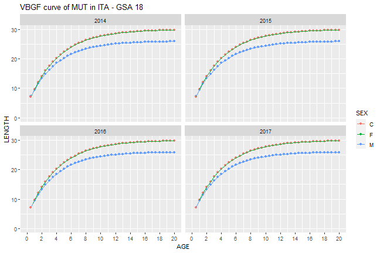


```r
print(names(results)[3])
#> [1] "VBGF_year _ MUT _ ITA _ GSA 18 _ F"
results[[3]]
```

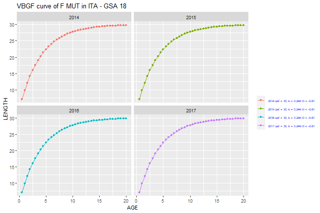


```r
print(names(results)[4])
#> [1] "VBGF_year _ MUT _ ITA _ GSA 18 _ M"
results[[4]]
```

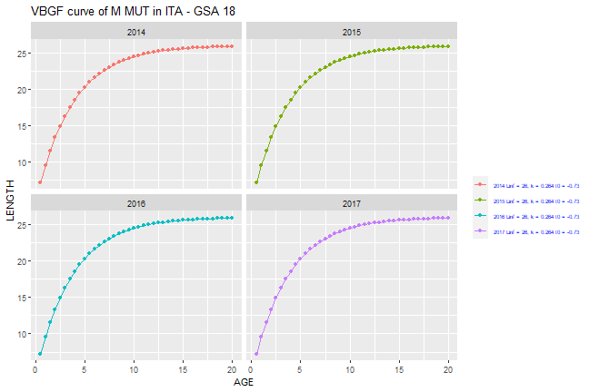


```r
print(names(results)[5])
#> [1] "VBGF_year _ MUT _ ITA _ GSA 18 _ C"
results[[5]]
```

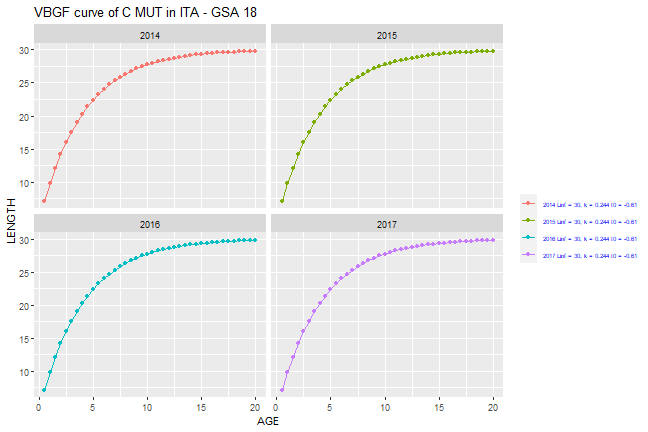


```r
print(names(results)[6])
#> [1] "VBGF_cum _ MUT _ ITA _ GSA 18 _ F"
results[[6]]
```

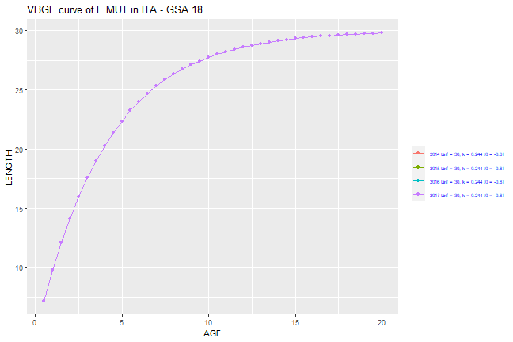


```r
print(names(results)[7])
#> [1] "VBGF_cum _ MUT _ ITA _ GSA 18 _ M"
results[[7]]
```

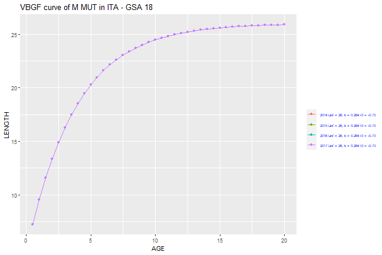


```r
print(names(results)[8])
#> [1] "VBGF_cum _ MUT _ ITA _ GSA 18 _ C"
results[[8]]
```

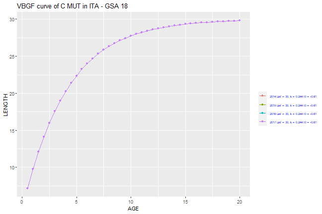

### LW params in GP_tab in table check

The function `MEDBS_LW_check` allows to check the length-weight parameters included in the GP table for a selected species. The function returns a summary table.


```r
results <- MEDBS_LW_check(GP_tab_example,"MUT","ITA","GSA 18")
results[[1]]
#>    COUNTRY   AREA START_YEAR END_YEAR SPECIES SEX COUNT
#> 1      ITA GSA 18       2014     2014     MUT   C     1
#> 2      ITA GSA 18       2014     2014     MUT   F     1
#> 3      ITA GSA 18       2014     2014     MUT   M     1
#> 4      ITA GSA 18       2015     2015     MUT   C     1
#> 5      ITA GSA 18       2015     2015     MUT   F     1
#> 6      ITA GSA 18       2015     2015     MUT   M     1
#> 7      ITA GSA 18       2016     2016     MUT   C     1
#> 8      ITA GSA 18       2016     2016     MUT   F     1
#> 9      ITA GSA 18       2016     2016     MUT   M     1
#> 10     ITA GSA 18       2017     2017     MUT   C     1
#> 11     ITA GSA 18       2017     2017     MUT   F     1
#> 12     ITA GSA 18       2017     2017     MUT   M     1
```

plots of the length-weigth relationships for the selected species by year and sex are also returned.


```r
results[[2]]
```


```r
results[[3]]
```


```r
results[[4]]
```


```r
results[[5]]
```


```r
results[[6]]
```


```r
results[[7]]
```


```r
results[[8]]
```


### MA_tab (maturity at age) table check

The function `MEDBS_MA_check` allows to check the maturity at age (MA) table providing a summary table of the data coverage.


```r
results <- MEDBS_MA_check(MA_tab_example,"DPS","ITA","GSA 99")
results[[1]]
#>    COUNTRY   AREA START_YEAR END_YEAR SPECIES SEX COUNT
#> 1      ITA GSA 99       2006     2006     DPS   F     6
#> 2      ITA GSA 99       2007     2007     DPS   F     6
#> 3      ITA GSA 99       2008     2008     DPS   F     6
#> 4      ITA GSA 99       2009     2009     DPS   F     6
#> 5      ITA GSA 99       2010     2010     DPS   F     6
#> 6      ITA GSA 99       2011     2011     DPS   F     6
#> 7      ITA GSA 99       2012     2012     DPS   F     6
#> 8      ITA GSA 99       2013     2013     DPS   F     6
#> 9      ITA GSA 99       2014     2014     DPS   F     6
#> 10     ITA GSA 99       2015     2015     DPS   F     5
#> 11     ITA GSA 99       2016     2016     DPS   F     6
#> 12     ITA GSA 99       2017     2016     DPS   F     6
```

The function also provides plots for the selected species of the proportion of matures for age class by sex and year.


```r
results[[2]]
```


```r
results[[3]]
```


### ML_tab (maturity at length) table check

The function `MEDBS_ML_check` allows to check the maturity at length (ML) table providing a summary table of the data coverage for the selected species of the proportion of matures for age class by sex and year.


```r
results <- MEDBS_ML_check(ML_tab_example, "DPS", "ITA", "GSA 99")
```


```r
results[[1]]
#>    COUNTRY   AREA START_YEAR END_YEAR SPECIES SEX COUNT
#> 1      ITA GSA 99       2006     2006     DPS   F    31
#> 2      ITA GSA 99       2007     2007     DPS   F    32
#> 3      ITA GSA 99       2008     2008     DPS   F    33
#> 4      ITA GSA 99       2009     2009     DPS   F    42
#> 5      ITA GSA 99       2010     2010     DPS   F    39
#> 6      ITA GSA 99       2011     2011     DPS   F    41
#> 7      ITA GSA 99       2012     2012     DPS   F    35
#> 8      ITA GSA 99       2013     2013     DPS   F    38
#> 9      ITA GSA 99       2014     2014     DPS   F    38
#> 10     ITA GSA 99       2015     2015     DPS   F    35
#> 11     ITA GSA 99       2016     2016     DPS   F    37
#> 12     ITA GSA 99       2017     2017     DPS   F    36
```

Plots for the selected species of the proportion of matures for age class by sex and year are also returned.


```r
results[[2]]
```


### SA_tab (sex ratio at age) table check

The function `MEDBS_SA_check` allows to check the sex ratio at age (SA) table providing a summary table of the data coverage for the selected species of the proportion of sex ratio for age class by year.


```r
results <- MEDBS_SA_check(SA_tab_example, "DPS", "ITA", "GSA 99")
results[[1]]
#>    COUNTRY   AREA START_YEAR END_YEAR SPECIES
#> 1      ITA GSA 99       2003     2005     DPS
#> 2      ITA GSA 99       2006     2006     DPS
#> 3      ITA GSA 99       2007     2007     DPS
#> 4      ITA GSA 99       2008     2008     DPS
#> 5      ITA GSA 99       2009     2009     DPS
#> 6      ITA GSA 99       2010     2010     DPS
#> 7      ITA GSA 99       2011     2011     DPS
#> 8      ITA GSA 99       2012     2012     DPS
#> 9      ITA GSA 99       2013     2013     DPS
#> 10     ITA GSA 99       2014     2014     DPS
#> 11     ITA GSA 99       2015     2015     DPS
#> 12     ITA GSA 99       2016     2016     DPS
#> 13     ITA GSA 99       2017     2017     DPS
```

Plots for the selected species of the proportion of sex ratio for age class by year are also returned.


```r
results[[2]]
```


```r
results[[3]]
```


### SL_tab (sex ratio at length) table check

The function `MEDBS_SL_check` allows to check the sex ratio at length (SL) table providing a summary table of the data coverage for the selected species of the proportion of sex ratio for length class by year.


```r
results <- MEDBS_SL_check(SL_tab_example,"DPS","ITA","GSA 99")
results[[1]]
#>    COUNTRY    GSA START_YEAR END_YEAR SPECIES COUNT
#> 1      ITA GSA 99       2003     2005     DPS    30
#> 2      ITA GSA 99       2006     2006     DPS    29
#> 3      ITA GSA 99       2007     2007     DPS    29
#> 4      ITA GSA 99       2008     2008     DPS    32
#> 5      ITA GSA 99       2009     2009     DPS    40
#> 6      ITA GSA 99       2010     2010     DPS    39
#> 7      ITA GSA 99       2011     2011     DPS    40
#> 8      ITA GSA 99       2012     2012     DPS    35
#> 9      ITA GSA 99       2013     2013     DPS    37
#> 10     ITA GSA 99       2014     2014     DPS    37
#> 11     ITA GSA 99       2015     2015     DPS    32
#> 12     ITA GSA 99       2016     2016     DPS    37
#> 13     ITA GSA 99       2017     2017     DPS    37
```

Plots for the selected species of the proportion of sex ratio for length class by year are returned.


```r
results[[2]]
```


```r
results[[3]]
```


# Checks on FDI tables

## Table A

### Check empty fields in FDI A table

The function `check_EF_FDI_A` checks the presence of not allowed empty data in the given table, according to the 'Fisheries Dependent Information data call 2022 - Annex 1'.
A list is returned by the function. The first list's object is a vector containing the number of NA for each reference column. 


```r
check_EF_FDI_A(fdi_a_catch, verbose=FALSE)[[1]]
#>           country              year           quarter     vessel_length 
#>                 0                 0                 0                 0 
#>      fishing_tech         gear_type target_assemblage   mesh_size_range 
#>                 0                 0                 0               446 
#>            metier   domain_discards   domain_landings      supra_region 
#>                 0                 0                 0                 0 
#>        sub_region     eez_indicator     geo_indicator           species 
#>                 0              2563                 0                 0 
#>      totwghtlandg       totvallandg          discards      confidential 
#>                30                33                 0                 0
```

The second list's object gives the index of each NA in the reference column.


```r
check_EF_FDI_A(fdi_a_catch, verbose=FALSE)[[2]]
#> $country
#> integer(0)
#> 
#> $year
#> integer(0)
#> 
#> $quarter
#> integer(0)
#> 
#> $vessel_length
#> integer(0)
#> 
#> $fishing_tech
#> integer(0)
#> 
#> $gear_type
#> integer(0)
#> 
#> $target_assemblage
#> integer(0)
#> 
#> $mesh_size_range
#>   [1]    4    5    6    7    8    9   10   11   12   13   14   15   16   17   18
#>  [16]   19   20   21   22   23   24   25   26   27   28   29  447  448  449  450
#>  [31]  451  452  453  454  455  456  457  458  459  460  461  462  463  464  465
#>  [46]  466  467  468  469  470  471  472  473  474  475  476  477  478  479  480
#>  [61]  481  482  483  484  485  486  487  488  489  490  491  492  493  494  495
#>  [76]  496  497  498  499  500  501  502  503  504  505  506  507  508  509  510
#>  [91]  511  512  513  514  515  516  517  518  519  520  521  522  523  524  525
#> [106]  526  527  528  529  530  657  658  659  660  661  662  663  664  665  666
#> [121]  667  668  669  670  671  672  673  674  675  676  677  678  679  680  681
#> [136]  682  683  684  685  686  687 1730 1731 1732 1733 1734 1735 1736 1737 1738
#> [151] 1739 1740 1741 1742 1743 1744 1745 1746 1747 1748 1749 1750 1751 1752 1753
#> [166] 1754 1755 1756 1757 1758 1759 1760 1761 1762 1763 1764 1765 1766 1767 1768
#> [181] 1769 1770 1771 1772 1773 1774 1775 1776 1777 1778 1779 1780 1781 1782 1783
#> [196] 1784 1785 1786 1787 1788 1789 1790 1791 1792 1793 1794 1795 1796 1797 1798
#> [211] 1799 1800 1801 1802 1803 1804 1805 1806 1807 1808 1809 1810 1811 1812 1813
#> [226] 1814 1815 1816 1817 1818 1819 1820 1821 1822 1823 1824 1825 1826 1827 1828
#> [241] 1829 1830 1831 1832 1833 1834 1868 1869 1870 1871 1872 1873 1874 1875 1876
#> [256] 1877 1878 1879 1880 1881 1882 1883 1884 1885 1886 1887 1888 1909 1910 1911
#> [271] 1912 2082 2083 2084 2085 2086 2087 2088 2089 2090 2091 2092 2093 2133 2134
#> [286] 2135 2136 2137 2138 2139 2140 2141 2142 2143 2144 2145 2146 2147 2148 2149
#> [301] 2150 2151 2152 2153 2154 2155 2156 2312 2313 2314 2315 2316 2317 2318 2319
#> [316] 2320 2321 2322 2323 2324 2325 2326 2327 2328 2329 2330 2331 2332 2333 2334
#> [331] 2335 2336 2337 2338 2339 2340 2341 2342 2343 2344 2345 2346 2347 2348 2349
#> [346] 2350 2351 2352 2353 2354 2355 2356 2357 2358 2359 2360 2361 2362 2363 2364
#> [361] 2365 2366 2367 2368 2369 2370 2371 2372 2373 2374 2375 2376 2377 2378 2379
#> [376] 2380 2381 2382 2383 2384 2385 2386 2387 2388 2389 2390 2391 2392 2393 2394
#> [391] 2395 2396 2397 2398 2399 2400 2401 2402 2403 2404 2405 2406 2407 2408 2409
#> [406] 2410 2411 2412 2413 2414 2415 2416 2417 2418 2419 2420 2421 2422 2423 2424
#> [421] 2425 2426 2427 2428 2429 2430 2431 2432 2433 2434 2435 2436 2437 2438 2439
#> [436] 2440 2441 2442 2443 2444 2445 2446 2447 2448 2449 2450
#> 
#> $metier
#> integer(0)
#> 
#> $domain_discards
#> integer(0)
#> 
#> $domain_landings
#> integer(0)
#> 
#> $supra_region
#> integer(0)
#> 
#> $sub_region
#> integer(0)
#> 
#> $eez_indicator
#>    [1]    1    2    3    4    5    6    7    8    9   10   11   12   13   14
#>   [15]   15   16   17   18   19   20   21   22   23   24   25   26   27   28
#>   [29]   29   30   31   32   33   34   35   36   37   38   39   40   41   42
#>   [43]   43   44   45   46   47   48   49   50   51   52   53   54   55   56
#>   [57]   57   58   59   60   61   62   63   64   65   66   67   68   69   70
#>   [71]   71   72   73   74   75   76   77   78   79   80   81   82   83   84
#>   [85]   85   86   87   88   89   90   91   92   93   94   95   96   97   98
#>   [99]   99  100  101  102  103  104  105  106  107  108  109  110  111  112
#>  [113]  113  114  115  116  117  118  119  120  121  122  123  124  125  126
#>  [127]  127  128  129  130  131  132  133  134  135  136  137  138  139  140
#>  [141]  141  142  143  144  145  146  147  148  149  150  151  152  153  154
#>  [155]  155  156  157  158  159  160  161  162  163  164  165  166  167  168
#>  [169]  169  170  171  172  173  174  175  176  177  178  179  180  181  182
#>  [183]  183  184  185  186  187  188  189  190  191  192  193  194  195  196
#>  [197]  197  198  199  200  201  202  203  204  205  206  207  208  209  210
#>  [211]  211  212  213  214  215  216  217  218  219  220  221  222  223  224
#>  [225]  225  226  227  228  229  230  231  232  233  234  235  236  237  238
#>  [239]  239  240  241  242  243  244  245  246  247  248  249  250  251  252
#>  [253]  253  254  255  256  257  258  259  260  261  262  263  264  265  266
#>  [267]  267  268  269  270  271  272  273  274  275  276  277  278  279  280
#>  [281]  281  282  283  284  285  286  287  288  289  290  291  292  293  294
#>  [295]  295  296  297  298  299  300  301  302  303  304  305  306  307  308
#>  [309]  309  310  311  312  313  314  315  316  317  318  319  320  321  322
#>  [323]  323  324  325  326  327  328  329  330  331  332  333  334  335  336
#>  [337]  337  338  339  340  341  342  343  344  345  346  347  348  349  350
#>  [351]  351  352  353  354  355  356  357  358  359  360  361  362  363  364
#>  [365]  365  366  367  368  369  370  371  372  373  374  375  376  377  378
#>  [379]  379  380  381  382  383  384  385  386  387  388  389  390  391  392
#>  [393]  393  394  395  396  397  398  399  400  401  402  403  404  405  406
#>  [407]  407  408  409  410  411  412  413  414  415  416  417  418  419  420
#>  [421]  421  422  423  424  425  426  427  428  429  430  431  432  433  434
#>  [435]  435  436  437  438  439  440  441  442  443  444  445  446  447  448
#>  [449]  449  450  451  452  453  454  455  456  457  458  459  460  461  462
#>  [463]  463  464  465  466  467  468  469  470  471  472  473  474  475  476
#>  [477]  477  478  479  480  481  482  483  484  485  486  487  488  489  490
#>  [491]  491  492  493  494  495  496  497  498  499  500  501  502  503  504
#>  [505]  505  506  507  508  509  510  511  512  513  514  515  516  517  518
#>  [519]  519  520  521  522  523  524  525  526  528  537  538  539  540  541
#>  [533]  542  543  544  545  546  547  548  549  550  551  552  553  554  555
#>  [547]  556  557  558  559  560  561  562  563  564  565  566  567  568  569
#>  [561]  570  571  572  573  574  575  576  577  578  579  580  581  582  583
#>  [575]  584  585  586  587  588  589  590  591  592  593  594  595  596  597
#>  [589]  598  599  600  601  602  603  604  605  606  607  608  609  610  611
#>  [603]  612  613  614  615  616  622  623  624  625  626  627  628  629  630
#>  [617]  631  632  633  634  635  636  637  638  639  640  641  642  643  644
#>  [631]  645  646  647  648  649  650  651  652  653  654  655  656  657  658
#>  [645]  659  660  661  662  663  664  665  666  667  668  669  670  671  672
#>  [659]  673  674  675  676  677  678  679  680  681  682  683  684  685  686
#>  [673]  687  688  689  690  691  692  693  694  695  696  697  698  699  700
#>  [687]  701  702  703  704  705  706  707  708  709  710  711  712  713  714
#>  [701]  715  716  717  718  719  720  721  722  723  724  725  726  727  728
#>  [715]  729  730  731  732  733  734  735  736  737  738  739  740  741  742
#>  [729]  743  744  745  746  747  748  749  750  751  752  753  754  755  756
#>  [743]  757  758  759  760  761  762  763  764  765  766  767  768  769  770
#>  [757]  771  772  773  774  775  776  777  778  779  780  781  782  783  784
#>  [771]  785  786  787  788  789  790  791  792  793  794  795  796  797  798
#>  [785]  799  800  801  802  803  804  805  806  807  808  809  810  811  812
#>  [799]  813  814  815  816  817  818  819  820  821  822  823  824  825  826
#>  [813]  827  828  829  830  831  832  833  834  835  836  837  838  839  840
#>  [827]  841  842  843  844  845  846  847  848  849  850  851  852  853  854
#>  [841]  855  856  857  858  859  860  861  862  864  865  866  867  868  869
#>  [855]  870  871  872  873  874  875  876  877  878  879  880  881  882  883
#>  [869]  884  885  886  887  888  889  890  891  892  893  894  895  896  897
#>  [883]  898  899  900  901  902  903  904  905  906  907  908  909  910  911
#>  [897]  912  913  914  915  916  917  918  919  920  921  922  923  924  925
#>  [911]  926  927  928  929  930  931  932  933  934  935  936  937  938  939
#>  [925]  940  941  942  943  944  945  946  947  948  949  950  951  952  953
#>  [939]  954  955  956  957  958  959  960  961  962  963  964  965  966  967
#>  [953]  968  969  970  971  972  973  974  975  976  977  978  979  980  981
#>  [967]  982  983  984  985  986  987  988  989  990  991  992  993  994  995
#>  [981]  996  997  998  999 1000 1001 1002 1003 1004 1005 1006 1007 1008 1009
#>  [995] 1010 1011 1012 1013 1014 1015 1016 1017 1018 1019 1020 1021 1022 1023
#> [1009] 1024 1025 1026 1027 1028 1029 1030 1031 1032 1033 1034 1037 1038 1039
#> [1023] 1040 1041 1042 1043 1044 1045 1046 1047 1048 1049 1050 1051 1052 1053
#> [1037] 1054 1055 1056 1057 1058 1059 1060 1061 1062 1063 1064 1065 1066 1067
#> [1051] 1068 1069 1070 1071 1072 1073 1074 1075 1076 1077 1078 1079 1080 1081
#> [1065] 1082 1083 1084 1085 1086 1087 1088 1089 1090 1091 1092 1093 1094 1095
#> [1079] 1096 1097 1098 1099 1100 1101 1102 1103 1104 1105 1106 1107 1108 1109
#> [1093] 1110 1111 1112 1113 1114 1115 1116 1117 1118 1119 1120 1121 1122 1123
#> [1107] 1124 1125 1126 1127 1128 1129 1130 1131 1132 1133 1134 1135 1136 1137
#> [1121] 1138 1139 1140 1141 1142 1143 1144 1145 1146 1147 1148 1149 1150 1151
#> [1135] 1152 1153 1154 1155 1156 1157 1158 1159 1160 1161 1162 1163 1164 1165
#> [1149] 1166 1167 1168 1169 1170 1171 1172 1173 1174 1175 1176 1177 1178 1179
#> [1163] 1180 1181 1182 1183 1184 1185 1186 1187 1188 1189 1190 1191 1192 1193
#> [1177] 1194 1195 1196 1197 1198 1199 1200 1201 1202 1203 1204 1205 1206 1207
#> [1191] 1208 1209 1210 1211 1212 1213 1214 1215 1216 1217 1218 1219 1220 1221
#> [1205] 1222 1223 1224 1227 1228 1229 1230 1231 1232 1233 1234 1235 1236 1237
#> [1219] 1238 1239 1240 1241 1242 1243 1244 1245 1246 1247 1248 1249 1250 1251
#> [1233] 1252 1253 1254 1255 1256 1257 1258 1259 1260 1261 1262 1263 1264 1265
#> [1247] 1266 1267 1268 1269 1270 1271 1272 1273 1274 1275 1276 1277 1278 1279
#> [1261] 1280 1281 1282 1283 1284 1285 1286 1287 1288 1289 1290 1291 1292 1293
#> [1275] 1294 1295 1296 1297 1298 1299 1300 1301 1302 1303 1304 1305 1306 1307
#> [1289] 1308 1309 1310 1311 1312 1313 1314 1315 1316 1317 1318 1319 1320 1321
#> [1303] 1322 1323 1324 1325 1326 1327 1328 1329 1330 1331 1332 1333 1334 1335
#> [1317] 1336 1337 1338 1339 1340 1341 1342 1343 1344 1345 1346 1347 1348 1349
#> [1331] 1350 1351 1352 1353 1354 1355 1356 1357 1358 1359 1360 1361 1362 1363
#> [1345] 1364 1365 1366 1367 1368 1369 1370 1371 1372 1373 1374 1375 1376 1377
#> [1359] 1378 1379 1380 1381 1382 1383 1384 1385 1386 1387 1388 1389 1390 1391
#> [1373] 1392 1393 1394 1395 1396 1397 1398 1399 1400 1401 1402 1403 1404 1405
#> [1387] 1406 1407 1408 1409 1410 1411 1412 1413 1414 1415 1416 1417 1418 1419
#> [1401] 1420 1421 1422 1423 1424 1425 1426 1427 1428 1429 1430 1431 1432 1433
#> [1415] 1434 1435 1436 1437 1438 1439 1440 1441 1442 1443 1444 1445 1446 1447
#> [1429] 1448 1449 1450 1451 1452 1453 1454 1455 1456 1457 1458 1459 1460 1461
#> [1443] 1462 1463 1464 1465 1466 1467 1468 1469 1470 1471 1472 1473 1474 1475
#> [1457] 1476 1477 1478 1479 1480 1481 1482 1483 1484 1485 1486 1487 1488 1489
#> [1471] 1490 1491 1492 1493 1494 1495 1496 1497 1498 1499 1500 1501 1502 1503
#> [1485] 1504 1505 1506 1507 1508 1509 1510 1511 1512 1513 1514 1515 1516 1517
#> [1499] 1519 1520 1521 1522 1523 1524 1525 1526 1527 1528 1529 1530 1531 1532
#> [1513] 1533 1534 1535 1536 1537 1538 1539 1540 1541 1542 1543 1544 1545 1546
#> [1527] 1547 1548 1549 1550 1551 1552 1553 1554 1555 1556 1557 1558 1559 1560
#> [1541] 1561 1562 1563 1564 1565 1566 1567 1568 1569 1570 1571 1572 1573 1574
#> [1555] 1575 1576 1577 1578 1579 1580 1581 1582 1583 1584 1585 1586 1587 1588
#> [1569] 1589 1590 1591 1592 1593 1594 1595 1596 1597 1598 1599 1600 1601 1602
#> [1583] 1603 1604 1605 1607 1608 1609 1610 1611 1612 1613 1614 1615 1616 1617
#> [1597] 1618 1619 1620 1621 1622 1623 1624 1625 1626 1627 1628 1629 1630 1631
#> [1611] 1632 1633 1634 1635 1636 1637 1638 1639 1640 1641 1642 1643 1644 1645
#> [1625] 1646 1647 1648 1649 1650 1651 1652 1653 1654 1655 1656 1657 1658 1659
#> [1639] 1660 1661 1662 1663 1664 1665 1666 1667 1668 1669 1670 1671 1672 1673
#> [1653] 1674 1675 1676 1677 1678 1679 1680 1681 1682 1683 1684 1685 1686 1687
#> [1667] 1688 1689 1690 1691 1692 1693 1694 1695 1696 1697 1698 1699 1700 1701
#> [1681] 1702 1703 1704 1705 1706 1707 1708 1709 1710 1711 1712 1713 1714 1715
#> [1695] 1716 1717 1718 1719 1720 1721 1722 1723 1724 1725 1726 1727 1728 1729
#> [1709] 1730 1731 1732 1733 1734 1735 1736 1737 1738 1739 1740 1741 1742 1743
#> [1723] 1744 1745 1746 1747 1748 1749 1750 1751 1752 1753 1754 1755 1756 1757
#> [1737] 1758 1759 1760 1761 1762 1763 1764 1765 1766 1768 1769 1770 1771 1772
#> [1751] 1773 1774 1775 1777 1779 1780 1781 1782 1783 1784 1785 1786 1787 1788
#> [1765] 1789 1790 1791 1792 1793 1794 1795 1796 1797 1798 1799 1800 1801 1802
#> [1779] 1803 1804 1805 1806 1807 1808 1809 1810 1811 1812 1813 1814 1815 1816
#> [1793] 1817 1818 1819 1820 1821 1822 1823 1824 1825 1826 1827 1828 1829 1830
#> [1807] 1831 1832 1833 1834 1835 1836 1837 1838 1839 1840 1841 1842 1843 1844
#> [1821] 1845 1846 1847 1848 1849 1850 1851 1852 1853 1854 1855 1856 1857 1858
#> [1835] 1859 1860 1861 1862 1863 1864 1865 1866 1867 1868 1869 1870 1871 1872
#> [1849] 1873 1874 1875 1876 1877 1878 1879 1880 1881 1882 1883 1884 1885 1886
#> [1863] 1887 1888 1889 1890 1891 1892 1893 1894 1895 1896 1897 1898 1899 1900
#> [1877] 1901 1902 1903 1904 1905 1906 1907 1908 1909 1910 1911 1912 1913 1914
#> [1891] 1915 1916 1917 1918 1919 1920 1921 1922 1923 1924 1925 1926 1927 1928
#> [1905] 1929 1930 1931 1932 1933 1934 1935 1936 1937 1938 1939 1940 1941 1942
#> [1919] 1943 1944 1945 1946 1947 1948 1949 1950 1951 1952 1953 1954 1955 1956
#> [1933] 1957 1958 1959 1960 1961 1962 1963 1964 1965 1966 1967 1968 1969 1970
#> [1947] 1971 1972 1973 1974 1975 1976 1977 1978 1979 1980 1981 1982 1983 1984
#> [1961] 1985 1986 1987 1988 1989 1990 1991 1992 1993 1994 1995 1996 1997 1998
#> [1975] 1999 2000 2001 2002 2003 2004 2005 2006 2007 2008 2009 2010 2011 2012
#> [1989] 2013 2014 2015 2016 2017 2018 2019 2020 2021 2022 2023 2024 2025 2026
#> [2003] 2027 2028 2029 2030 2031 2032 2033 2034 2035 2036 2037 2038 2039 2040
#> [2017] 2041 2042 2043 2044 2045 2046 2047 2048 2049 2050 2051 2052 2054 2055
#> [2031] 2056 2057 2059 2060 2061 2062 2063 2064 2065 2066 2067 2068 2069 2070
#> [2045] 2071 2072 2073 2074 2075 2076 2077 2078 2079 2080 2081 2082 2083 2084
#> [2059] 2085 2086 2087 2088 2089 2090 2091 2092 2093 2094 2095 2096 2097 2098
#> [2073] 2099 2100 2101 2102 2103 2104 2105 2106 2107 2108 2109 2110 2111 2112
#> [2087] 2113 2114 2115 2116 2117 2118 2119 2120 2121 2122 2123 2124 2125 2126
#> [2101] 2127 2128 2129 2130 2131 2132 2133 2134 2135 2136 2137 2138 2139 2140
#> [2115] 2141 2142 2143 2144 2145 2146 2147 2148 2149 2150 2151 2152 2153 2154
#> [2129] 2155 2156 2157 2158 2159 2160 2161 2162 2163 2164 2165 2166 2167 2168
#> [2143] 2169 2170 2171 2172 2173 2174 2175 2176 2177 2178 2179 2180 2181 2182
#> [2157] 2183 2184 2185 2186 2187 2188 2189 2190 2191 2192 2193 2194 2195 2196
#> [2171] 2197 2198 2199 2200 2201 2202 2203 2204 2205 2206 2208 2209 2210 2211
#> [2185] 2212 2213 2214 2215 2216 2217 2218 2219 2220 2221 2222 2223 2224 2225
#> [2199] 2226 2227 2228 2229 2230 2231 2232 2233 2234 2235 2236 2237 2238 2239
#> [2213] 2240 2241 2242 2243 2244 2245 2246 2247 2248 2249 2250 2251 2252 2253
#> [2227] 2254 2255 2256 2257 2258 2259 2260 2261 2262 2263 2264 2265 2266 2267
#> [2241] 2268 2269 2270 2271 2272 2273 2274 2275 2276 2277 2278 2279 2280 2283
#> [2255] 2284 2285 2286 2287 2288 2289 2290 2291 2292 2293 2294 2295 2296 2297
#> [2269] 2298 2299 2300 2301 2302 2303 2304 2305 2306 2307 2308 2309 2310 2311
#> [2283] 2312 2313 2314 2315 2316 2317 2318 2319 2320 2321 2322 2323 2324 2325
#> [2297] 2326 2327 2328 2329 2330 2331 2332 2333 2334 2335 2336 2337 2338 2339
#> [2311] 2340 2341 2342 2343 2344 2345 2346 2347 2348 2349 2350 2351 2352 2353
#> [2325] 2354 2355 2356 2357 2358 2359 2360 2361 2362 2363 2364 2365 2366 2367
#> [2339] 2368 2369 2370 2371 2372 2373 2374 2375 2376 2377 2378 2379 2380 2381
#> [2353] 2382 2383 2384 2385 2386 2387 2388 2389 2390 2391 2392 2393 2394 2395
#> [2367] 2396 2397 2398 2399 2400 2401 2402 2403 2404 2405 2406 2407 2408 2409
#> [2381] 2410 2411 2412 2413 2414 2415 2416 2417 2418 2419 2420 2421 2422 2423
#> [2395] 2426 2430 2431 2432 2433 2434 2438 2439 2440 2441 2442 2443 2444 2445
#> [2409] 2446 2447 2448 2449 2450 2451 2452 2453 2454 2455 2456 2457 2458 2459
#> [2423] 2460 2461 2462 2463 2464 2465 2466 2467 2468 2469 2470 2471 2472 2473
#> [2437] 2474 2475 2476 2477 2478 2479 2480 2481 2482 2483 2484 2485 2486 2487
#> [2451] 2488 2489 2490 2491 2492 2493 2494 2495 2496 2497 2498 2499 2500 2501
#> [2465] 2502 2503 2504 2505 2506 2507 2508 2509 2510 2511 2512 2513 2514 2515
#> [2479] 2516 2517 2518 2519 2520 2521 2522 2523 2524 2525 2526 2527 2528 2529
#> [2493] 2530 2531 2532 2533 2534 2535 2536 2537 2538 2539 2540 2541 2542 2543
#> [2507] 2544 2545 2546 2547 2548 2549 2550 2551 2552 2553 2554 2555 2556 2557
#> [2521] 2558 2559 2560 2561 2562 2563 2564 2565 2566 2567 2568 2569 2570 2571
#> [2535] 2572 2573 2574 2575 2576 2577 2578 2579 2580 2581 2582 2583 2584 2585
#> [2549] 2586 2587 2588 2589 2590 2591 2592 2593 2594 2595 2596 2597 2598 2599
#> [2563] 2600
#> 
#> $geo_indicator
#> integer(0)
#> 
#> $species
#> integer(0)
#> 
#> $totwghtlandg
#>  [1]   31   32   33  189  190  191  407  408  409 1336 1337 1338 1547 1548 1549
#> [16] 1875 1876 1877 2033 2034 2035 2163 2164 2165 2336 2337 2338 2347 2348 2349
#> 
#> $totvallandg
#>  [1]  189  190  191  407  408  409  578  579  580  745  746  747 1040 1041 1042
#> [16] 1711 1712 1713 1785 1786 1787 1823 1824 1825 2033 2034 2035 2163 2164 2165
#> [31] 2336 2337 2338
#> 
#> $discards
#> integer(0)
#> 
#> $confidential
#> integer(0)
```

### Check duplicated records in FDI A table

The function `check_RD_FDI_A` check the presence of duplicated records. In particular, it checks whether the combination of the first 19 columns generates duplicate records. The function returns the indices of the duplicated rows.


```r
check_RD_FDI_A(fdi_a_catch)
#> 2 record/s duplicated
#> [1] 153 641
```

### Coverage of data by GSA and year in table A

The function `FDI_coverage` returns a data frame reporting the coverage of the selected table in terms of number of records by country, GSA and year. The function works on FDI tables A, G, H, I and J.


```r
FDI_coverage(data=fdi_a_catch, MS="PSP", verbose = FALSE)
#>   year country   gsa records
#> 1 2018     PSP GSA97      59
#> 2 2018     PSP GSA98      91
#> 3 2014     PSP GSA99     429
#> 4 2015     PSP GSA99     258
#> 5 2016     PSP GSA99     258
#> 6 2017     PSP GSA99     301
#> 7 2018     PSP GSA99     387
#> 8 2019     PSP GSA99     430
#> 9 2020     PSP GSA99     387
```
### Coverage of FDI discard data

The functions checks the discard coverage in table A for the selected MS by GSAs


```r
FDI_disc_coverage(fdi_a_catch, MS="PSP",GSA="GSA99",SP="HKE", verbose=TRUE)
#> Warning in FDI_disc_coverage(fdi_a_catch, MS = "PSP", GSA = "GSA99", SP =
#> "HKE", : NA introdotti per coercizione

#> Warning in FDI_disc_coverage(fdi_a_catch, MS = "PSP", GSA = "GSA99", SP =
#> "HKE", : NA introdotti per coercizione
#>   year   gsa Total_lands Lands_(disc > 0) % Lands_(disc >0) Lands_(disc = 0)
#> 1 2014 GSA99       1.099            0.305            27.75%            0.192
#> 2 2015 GSA99       0.249            0.000                 0            0.000
#> 3 2016 GSA99       0.152            0.110            72.37%            0.000
#> 4 2017 GSA99       0.088            0.000                 0            0.032
#> 5 2018 GSA99      33.917            0.000                 0            0.046
#> 6 2019 GSA99      33.907            0.044             0.13%            0.000
#> 7 2020 GSA99       0.485            0.000                 0            0.000
#>   % Lands_(disc = 0) Lands_(disc = NK) % Lands_(disc = NK)
#> 1             17.47%             0.602              54.78%
#> 2                  0             0.249             100.00%
#> 3                  0             0.042              27.63%
#> 4             36.36%             0.056              63.64%
#> 5              0.14%            33.871              99.86%
#> 6                  0            33.863              99.87%
#> 7                  0             0.485             100.00%
```

### Check number of record in FDI A table

The function checks and count the numbers of records data in the given table A grouped by year, GSA, MS, species, vessels length, and fishing techniques for three variables (Total live weight landed (ton), total value of landings (euro), and total discards (ton)). If SP, Vessel length, and fishing technique are not specified by the user the function combines those by default.


```r
head(FDI_cov_tableA(data=fdi_a_catch, SP="MUT", MS="PSP",fishtech=unique(fdi_a_catch$fishing_tech), GSA="GSA99")[[1]])
#>   year sub_region country species vessel_length fishing_tech totwghtlandg
#> 1 2014      GSA99     PSP     MUT      COMBINED          DFN            4
#> 2 2014      GSA99     PSP     MUT      COMBINED          DRB            1
#> 3 2015      GSA99     PSP     MUT      COMBINED          DFN            1
#> 4 2015      GSA99     PSP     MUT      COMBINED          DTS            2
#> 5 2015      GSA99     PSP     MUT      COMBINED          PMP            1
#> 6 2016      GSA99     PSP     MUT      COMBINED          DTS            1
#>   totvallandg discards
#> 1           4        0
#> 2           1        0
#> 3           1        1
#> 4           2        2
#> 5           1        1
#> 6           1        0
```

The function also provides a summary tables of the sum of the values grouped by year, GSA, MS, species, vessels length, and fishing techniques for same three variables (Total live weight landed (ton), total value of landings (euro), and total discards (ton)).


```r
head(FDI_cov_tableA(data=fdi_a_catch, SP="MUT", MS="PSP",fishtech=unique(fdi_a_catch$fishing_tech), GSA="GSA99")[[2]])
#>   year sub_region country species vessel_length fishing_tech totwghtlandg
#> 1 2014      GSA99     PSP     MUT      COMBINED          DFN        2.222
#> 2 2014      GSA99     PSP     MUT      COMBINED          DRB        0.035
#> 3 2015      GSA99     PSP     MUT      COMBINED          DFN        0.002
#> 4 2015      GSA99     PSP     MUT      COMBINED          DTS        0.224
#> 5 2015      GSA99     PSP     MUT      COMBINED          PMP        0.017
#> 6 2016      GSA99     PSP     MUT      COMBINED          DTS        0.014
#>   totvallandg discards
#> 1  1150.56688    0.000
#> 2   348.01141    0.000
#> 3    13.73272    0.000
#> 4  4050.27014    0.003
#> 5   116.72815    0.000
#> 6   139.20457    0.000
```

A plot for each of the three metrics is also provided: 


```r
FDI_cov_tableA(data=fdi_a_catch, SP="MUT", MS="PSP",fishtech=unique(fdi_a_catch$fishing_tech), GSA="GSA99")[[3]]
```

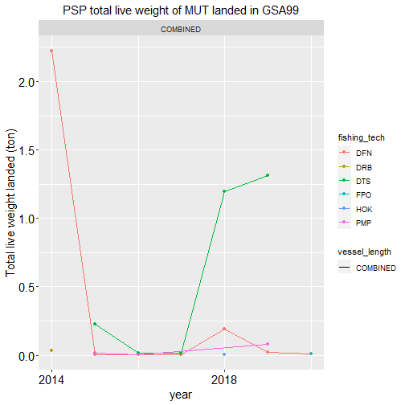

```r
FDI_cov_tableA(data=fdi_a_catch, SP="MUT", MS="PSP",fishtech=unique(fdi_a_catch$fishing_tech), GSA="GSA99")[[4]]
```

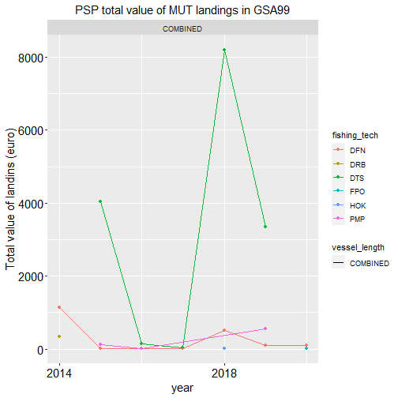

```r
FDI_cov_tableA(data=fdi_a_catch, SP="MUT", MS="PSP",fishtech=unique(fdi_a_catch$fishing_tech), GSA="GSA99")[[5]]
```

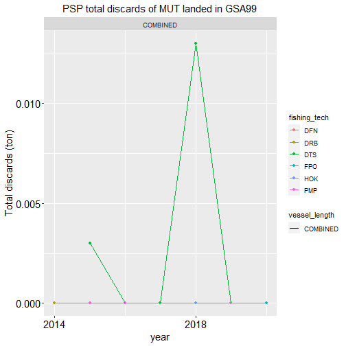

### Check of species value

The function estimates from the FDI table A an average price per species and year and compares it with average price calculated per country and species. Furthermore, the function performs comparisons between total weight landings and total value landings. In particular it identifies the cases with total landings > 0 but landings value = 0. In case SP parameter is not specified, the analysis is conducted over all the species in the provided data frame.


```r
FDI_prices_not_null(data = fdi_a_catch, MS = "PSP", GSA = "GSA99",SP = c("HKE"), verbose = FALSE)[[1]]
#>   species year land weight land value    price av_price
#> 1     HKE 2014       1.099  7607.1731 6.921905 4.596886
#> 2     HKE 2015       0.249  1944.6006 7.809641 4.596886
#> 3     HKE 2016       0.152   709.8665 4.670174 4.596886
#> 4     HKE 2017       0.088   495.4508 5.630123 4.596886
#> 5     HKE 2018      33.917 41572.5541 1.225714 4.596886
#> 6     HKE 2019      33.907 44517.1845 1.312920 4.596886
#> 7     HKE 2020       0.485  2234.7473 4.607726 4.596886
```

Furthermore, the function performs comparisons between total weight landings and total value landings. In particular it identifies the cases with total landings > 0 but landings value = 0. In case SP parameter is not specified, the analysis is conducted over all the species in the provided data frame.


```r
FDI_prices_not_null(data = fdi_a_catch, MS = "PSP", GSA = "GSA99",SP = c("HKE"), verbose = TRUE)[[2]]
#> [1] "Average price per species in PSP"
#> No cases with total landings > 0 but landings value = 0
#> [1] year        species     land weight land value  price      
#> <0 righe> (o 0-length row.names)
```


### Check prices trend in FDI A table

The function checks the trend prices in the given table grouped by year, GSA, MS, and species. If SP are not specified by the user the function combines those by default.


```r
FDI_prices_cov(data = fdi_a_catch, SP = c("HKE"), MS = "PSP", GSA = "GSA99",verbose=FALSE)[[1]]
#>   year country sub_region species totwghtlandg totvallandg mean_price
#> 1 2014     PSP      GSA99     HKE        1.099   7607.1731   6.921905
#> 2 2015     PSP      GSA99     HKE        0.249   1944.6006   7.809641
#> 3 2016     PSP      GSA99     HKE        0.152    709.8665   4.670174
#> 4 2017     PSP      GSA99     HKE        0.088    495.4508   5.630123
#> 5 2018     PSP      GSA99     HKE       33.917  41572.5541   1.225714
#> 6 2019     PSP      GSA99     HKE       33.907  44517.1845   1.312920
#> 7 2020     PSP      GSA99     HKE        0.485   2234.7473   4.607726
```

```r
FDI_prices_cov(data = fdi_a_catch, SP = c("HKE"), MS = "PSP", GSA = "GSA99",verbose=FALSE)[[2]]
#>   year country sub_region species totwghtlandg totvallandg mean_price
#> 1 2014     PSP   COMBINED     HKE        1.099   7607.1731   6.921905
#> 2 2015     PSP   COMBINED     HKE        0.249   1944.6006   7.809641
#> 3 2016     PSP   COMBINED     HKE        0.152    709.8665   4.670174
#> 4 2017     PSP   COMBINED     HKE        0.088    495.4508   5.630123
#> 5 2018     PSP   COMBINED     HKE       33.917  41572.5541   1.225714
#> 6 2019     PSP   COMBINED     HKE       33.907  44517.1845   1.312920
#> 7 2020     PSP   COMBINED     HKE        0.485   2234.7473   4.607726
```

## Table G

### Check empty fields in FDI G table

The function `check_EF_FDI_G` checks the presence of not allowed empty data in the given table, according to the 'Fisheries Dependent Information data call 2021 - Annex 1'.
A list is returned by the function. The first list's object is a vector containing the number of NA for each reference column. 


```r
check_EF_FDI_G(fdi_g_effort, verbose=FALSE)[[1]]
#>           country              year           quarter     vessel_length 
#>                 0                 0                 0                 0 
#>      fishing_tech         gear_type target_assemblage   mesh_size_range 
#>                 0                 0                 0               446 
#>            metier      supra_region        sub_region     eez_indicator 
#>                 0                 0                 0              2413 
#>     geo_indicator        totseadays    totkwdaysatsea    totgtdaysatsea 
#>                 0                 0                 0                18 
#>       totfishdays     totkwfishdays     totgtfishdays             hrsea 
#>                18                79               103                18 
#>           kwhrsea           gthrsea            totves      confidential 
#>                18                18                 0                 0
```

The second list's object gives the index of each NA in the reference column.


```r
check_EF_FDI_G(fdi_g_effort, verbose=FALSE)[[2]]
#> $country
#> integer(0)
#> 
#> $year
#> integer(0)
#> 
#> $quarter
#> integer(0)
#> 
#> $vessel_length
#> integer(0)
#> 
#> $fishing_tech
#> integer(0)
#> 
#> $gear_type
#> integer(0)
#> 
#> $target_assemblage
#> integer(0)
#> 
#> $mesh_size_range
#>   [1]    4    5    6    7    8    9   10   11   12   13   14   15   16   17   18
#>  [16]   19   20   21   22   23   24   25   26   27   28   29  447  448  449  450
#>  [31]  451  452  453  454  455  456  457  458  459  460  461  462  463  464  465
#>  [46]  466  467  468  469  470  471  472  473  474  475  476  477  478  479  480
#>  [61]  481  482  483  484  485  486  487  488  489  490  491  492  493  494  495
#>  [76]  496  497  498  499  500  501  502  503  504  505  506  507  508  509  510
#>  [91]  511  512  513  514  515  516  517  518  519  520  521  522  523  524  525
#> [106]  526  527  528  529  530  657  658  659  660  661  662  663  664  665  666
#> [121]  667  668  669  670  671  672  673  674  675  676  677  678  679  680  681
#> [136]  682  683  684  685  686  687 1730 1731 1732 1733 1734 1735 1736 1737 1738
#> [151] 1739 1740 1741 1742 1743 1744 1745 1746 1747 1748 1749 1750 1751 1752 1753
#> [166] 1754 1755 1756 1757 1758 1759 1760 1761 1762 1763 1764 1765 1766 1767 1768
#> [181] 1769 1770 1771 1772 1773 1774 1775 1776 1777 1778 1779 1780 1781 1782 1783
#> [196] 1784 1785 1786 1787 1788 1789 1790 1791 1792 1793 1794 1795 1796 1797 1798
#> [211] 1799 1800 1801 1802 1803 1804 1805 1806 1807 1808 1809 1810 1811 1812 1813
#> [226] 1814 1815 1816 1817 1818 1819 1820 1821 1822 1823 1824 1825 1826 1827 1828
#> [241] 1829 1830 1831 1832 1833 1834 1868 1869 1870 1871 1872 1873 1874 1875 1876
#> [256] 1877 1878 1879 1880 1881 1882 1883 1884 1885 1886 1887 1888 1909 1910 1911
#> [271] 1912 2082 2083 2084 2085 2086 2087 2088 2089 2090 2091 2092 2093 2133 2134
#> [286] 2135 2136 2137 2138 2139 2140 2141 2142 2143 2144 2145 2146 2147 2148 2149
#> [301] 2150 2151 2152 2153 2154 2155 2156 2312 2313 2314 2315 2316 2317 2318 2319
#> [316] 2320 2321 2322 2323 2324 2325 2326 2327 2328 2329 2330 2331 2332 2333 2334
#> [331] 2335 2336 2337 2338 2339 2340 2341 2342 2343 2344 2345 2346 2347 2348 2349
#> [346] 2350 2351 2352 2353 2354 2355 2356 2357 2358 2359 2360 2361 2362 2363 2364
#> [361] 2365 2366 2367 2368 2369 2370 2371 2372 2373 2374 2375 2376 2377 2378 2379
#> [376] 2380 2381 2382 2383 2384 2385 2386 2387 2388 2389 2390 2391 2392 2393 2394
#> [391] 2395 2396 2397 2398 2399 2400 2401 2402 2403 2404 2405 2406 2407 2408 2409
#> [406] 2410 2411 2412 2413 2414 2415 2416 2417 2418 2419 2420 2421 2422 2423 2424
#> [421] 2425 2426 2427 2428 2429 2430 2431 2432 2433 2434 2435 2436 2437 2438 2439
#> [436] 2440 2441 2442 2443 2444 2445 2446 2447 2448 2449 2450
#> 
#> $metier
#> integer(0)
#> 
#> $supra_region
#> integer(0)
#> 
#> $sub_region
#> integer(0)
#> 
#> $eez_indicator
#>    [1]    1    2    3    4    5    6    7    8    9   10   11   12   13   14
#>   [15]   15   16   17   18   19   20   21   22   23   24   25   26   27   28
#>   [29]   29   30   31   32   33   34   35   36   37   38   39   40   41   42
#>   [43]   43   44   45   46   47   48   49   50   51   52   53   54   55   56
#>   [57]   57   58   59   60   61   62   63   64   65   66   67   68   69   70
#>   [71]   71   72   73   74   75   76   77   78   79   80   81   82   83   84
#>   [85]   85   86   87   88   89   90   91   92   93   94   95   96   97   98
#>   [99]   99  100  101  102  103  104  105  106  107  108  109  110  111  112
#>  [113]  113  114  115  116  117  118  119  120  121  122  123  124  125  126
#>  [127]  127  128  129  130  131  132  133  134  135  136  137  138  139  140
#>  [141]  141  142  143  144  145  146  147  148  149  150  151  152  153  154
#>  [155]  155  156  157  158  159  160  161  162  163  164  165  166  167  168
#>  [169]  169  170  171  172  173  174  175  176  177  178  179  180  181  182
#>  [183]  183  184  185  186  187  188  189  190  191  192  193  194  195  196
#>  [197]  197  198  199  200  201  202  203  204  205  206  207  208  209  210
#>  [211]  211  212  213  214  215  216  217  218  219  220  221  222  223  224
#>  [225]  225  226  227  228  229  230  231  232  233  234  235  236  237  238
#>  [239]  239  240  241  242  243  244  245  246  247  248  249  250  251  252
#>  [253]  253  254  255  256  257  258  259  260  261  262  263  264  265  266
#>  [267]  267  268  269  270  271  272  273  274  275  276  277  278  279  280
#>  [281]  281  282  283  284  285  286  287  288  289  290  291  292  293  294
#>  [295]  295  296  297  298  299  300  301  302  303  304  305  306  307  308
#>  [309]  309  310  311  312  313  314  315  316  317  318  319  320  321  322
#>  [323]  323  324  325  326  327  328  329  330  331  332  333  334  335  336
#>  [337]  337  338  339  340  341  342  343  344  345  346  347  348  349  350
#>  [351]  351  352  353  354  355  356  357  358  359  360  361  362  363  364
#>  [365]  365  366  367  368  369  370  371  372  373  374  375  376  377  378
#>  [379]  379  380  381  382  383  384  385  386  387  388  389  390  391  392
#>  [393]  393  394  395  396  397  398  399  400  401  402  403  404  405  406
#>  [407]  407  408  409  410  411  412  413  414  415  416  417  418  419  420
#>  [421]  421  422  423  424  425  426  427  428  429  430  431  432  433  434
#>  [435]  435  436  437  438  439  440  441  442  443  444  445  446  447  448
#>  [449]  449  450  451  452  453  454  455  456  457  458  459  460  461  462
#>  [463]  463  464  465  466  467  468  469  470  471  472  473  474  475  476
#>  [477]  477  478  479  480  481  482  483  484  485  486  487  488  489  490
#>  [491]  491  492  493  494  495  496  497  498  499  500  501  502  503  504
#>  [505]  505  506  507  508  509  510  511  512  513  514  515  516  517  518
#>  [519]  519  520  521  522  523  524  525  526  528  537  538  539  540  541
#>  [533]  542  543  544  545  546  547  548  549  550  551  552  553  554  555
#>  [547]  556  557  558  559  560  561  562  563  564  565  566  567  568  569
#>  [561]  570  571  572  573  574  575  576  577  578  579  580  581  582  583
#>  [575]  584  585  586  587  588  589  590  591  592  593  594  595  596  597
#>  [589]  598  599  600  601  602  603  604  605  606  607  608  609  610  611
#>  [603]  612  613  614  615  616  622  623  624  625  626  627  628  629  630
#>  [617]  631  632  633  634  635  636  637  638  639  640  641  642  643  644
#>  [631]  645  646  647  648  649  650  651  652  653  654  655  656  657  658
#>  [645]  659  660  661  662  663  664  665  666  667  668  669  670  671  672
#>  [659]  673  674  675  676  677  678  679  680  681  682  683  684  685  686
#>  [673]  687  688  689  690  691  692  693  694  695  696  697  698  699  700
#>  [687]  701  702  703  704  705  706  707  708  709  710  711  712  713  714
#>  [701]  715  716  717  718  719  720  721  722  723  724  725  726  727  728
#>  [715]  729  730  731  732  733  734  735  736  737  738  739  740  741  742
#>  [729]  743  744  745  746  747  748  749  750  751  752  753  754  755  756
#>  [743]  757  758  759  760  761  762  763  764  765  766  767  768  769  770
#>  [757]  771  772  773  774  775  776  777  778  779  780  781  782  783  784
#>  [771]  785  786  787  788  789  790  791  792  793  794  795  796  797  798
#>  [785]  799  800  801  802  803  804  805  806  807  808  809  810  811  812
#>  [799]  813  814  815  816  817  818  819  820  821  822  823  824  825  826
#>  [813]  827  828  829  830  831  832  833  834  835  836  837  838  839  840
#>  [827]  841  842  843  844  845  846  847  848  849  850  851  852  853  854
#>  [841]  855  856  857  858  859  860  861  862  864  865  866  867  868  869
#>  [855]  870  871  872  873  874  875  876  877  878  879  880  881  882  883
#>  [869]  884  885  886  887  888  889  890  891  892  893  894  895  896  897
#>  [883]  898  899  900  901  902  903  904  905  906  907  908  909  910  911
#>  [897]  912  913  914  915  916  917  918  919  920  921  922  923  924  925
#>  [911]  926  927  928  929  930  931  932  933  934  935  936  937  938  939
#>  [925]  940  941  942  943  944  945  946  947  948  949  950  951  952  953
#>  [939]  954  955  956  957  958  959  960  961  962  963  964  965  966  967
#>  [953]  968  969  970  971  972  973  974  975  976  977  978  979  980  981
#>  [967]  982  983  984  985  986  987  988  989  990  991  992  993  994  995
#>  [981]  996  997  998  999 1000 1001 1002 1003 1004 1005 1006 1007 1008 1009
#>  [995] 1010 1011 1012 1013 1014 1015 1016 1017 1018 1019 1020 1021 1022 1023
#> [1009] 1024 1025 1026 1027 1028 1029 1030 1031 1032 1033 1034 1037 1038 1039
#> [1023] 1040 1041 1042 1043 1044 1045 1046 1047 1048 1049 1050 1051 1052 1053
#> [1037] 1054 1055 1056 1057 1058 1059 1060 1061 1062 1063 1064 1065 1066 1067
#> [1051] 1068 1069 1070 1071 1072 1073 1074 1075 1076 1077 1078 1079 1080 1081
#> [1065] 1082 1083 1084 1085 1086 1087 1088 1089 1090 1091 1092 1093 1094 1095
#> [1079] 1096 1097 1098 1099 1100 1101 1102 1103 1104 1105 1106 1107 1108 1109
#> [1093] 1110 1111 1112 1113 1114 1115 1116 1117 1118 1119 1120 1121 1122 1123
#> [1107] 1124 1125 1126 1127 1128 1129 1130 1131 1132 1133 1134 1135 1136 1137
#> [1121] 1138 1139 1140 1141 1142 1143 1144 1145 1146 1147 1148 1149 1150 1151
#> [1135] 1152 1153 1154 1155 1156 1157 1158 1159 1160 1161 1162 1163 1164 1165
#> [1149] 1166 1167 1168 1169 1170 1171 1172 1173 1174 1175 1176 1177 1178 1179
#> [1163] 1180 1181 1182 1183 1184 1185 1186 1187 1188 1189 1190 1191 1192 1193
#> [1177] 1194 1195 1196 1197 1198 1199 1200 1201 1202 1203 1204 1205 1206 1207
#> [1191] 1208 1209 1210 1211 1212 1213 1214 1215 1216 1217 1218 1219 1220 1221
#> [1205] 1222 1223 1224 1227 1228 1229 1230 1231 1232 1233 1234 1235 1236 1237
#> [1219] 1238 1239 1240 1241 1242 1243 1244 1245 1246 1247 1248 1249 1250 1251
#> [1233] 1252 1253 1254 1255 1256 1257 1258 1259 1260 1261 1262 1263 1264 1265
#> [1247] 1266 1267 1268 1269 1270 1271 1272 1273 1274 1275 1276 1277 1278 1279
#> [1261] 1280 1281 1282 1283 1284 1285 1286 1287 1288 1289 1290 1291 1292 1293
#> [1275] 1294 1295 1296 1297 1298 1299 1300 1301 1302 1303 1304 1305 1306 1307
#> [1289] 1308 1309 1310 1311 1312 1313 1314 1315 1316 1317 1318 1319 1320 1321
#> [1303] 1322 1323 1324 1325 1326 1327 1328 1329 1330 1331 1332 1333 1334 1335
#> [1317] 1336 1337 1338 1339 1340 1341 1342 1343 1344 1345 1346 1347 1348 1349
#> [1331] 1350 1351 1352 1353 1354 1355 1356 1357 1358 1359 1360 1361 1362 1363
#> [1345] 1364 1365 1366 1367 1368 1369 1370 1371 1372 1373 1374 1375 1376 1377
#> [1359] 1378 1379 1380 1381 1382 1383 1384 1385 1386 1387 1388 1389 1390 1391
#> [1373] 1392 1393 1394 1395 1396 1397 1398 1399 1400 1401 1402 1403 1404 1405
#> [1387] 1406 1407 1408 1409 1410 1411 1412 1413 1414 1415 1416 1417 1418 1419
#> [1401] 1420 1421 1422 1423 1424 1425 1426 1427 1428 1429 1430 1431 1432 1433
#> [1415] 1434 1435 1436 1437 1438 1439 1440 1441 1442 1443 1444 1445 1446 1447
#> [1429] 1448 1449 1450 1451 1452 1453 1454 1455 1456 1457 1458 1459 1460 1461
#> [1443] 1462 1463 1464 1465 1466 1467 1468 1469 1470 1471 1472 1473 1474 1475
#> [1457] 1476 1477 1478 1479 1480 1481 1482 1483 1484 1485 1486 1487 1488 1489
#> [1471] 1490 1491 1492 1493 1494 1495 1496 1497 1498 1499 1500 1501 1502 1503
#> [1485] 1504 1505 1506 1507 1508 1509 1510 1511 1512 1513 1514 1515 1516 1517
#> [1499] 1519 1520 1521 1522 1523 1524 1525 1526 1527 1528 1529 1530 1531 1532
#> [1513] 1533 1534 1535 1536 1537 1538 1539 1540 1541 1542 1543 1544 1545 1546
#> [1527] 1547 1548 1549 1550 1551 1552 1553 1554 1555 1556 1557 1558 1559 1560
#> [1541] 1561 1562 1563 1564 1565 1566 1567 1568 1569 1570 1571 1572 1573 1574
#> [1555] 1575 1576 1577 1578 1579 1580 1581 1582 1583 1584 1585 1586 1587 1588
#> [1569] 1589 1590 1591 1592 1593 1594 1595 1596 1597 1598 1599 1600 1601 1602
#> [1583] 1603 1604 1605 1607 1608 1609 1610 1611 1612 1613 1614 1615 1616 1617
#> [1597] 1618 1619 1620 1621 1622 1623 1624 1625 1626 1627 1628 1629 1630 1631
#> [1611] 1632 1633 1634 1635 1636 1637 1638 1639 1640 1641 1642 1643 1644 1645
#> [1625] 1646 1647 1648 1649 1650 1651 1652 1653 1654 1655 1656 1657 1658 1659
#> [1639] 1660 1661 1662 1663 1664 1665 1666 1667 1668 1669 1670 1671 1672 1673
#> [1653] 1674 1675 1676 1677 1678 1679 1680 1681 1682 1683 1684 1685 1686 1687
#> [1667] 1688 1689 1690 1691 1692 1693 1694 1695 1696 1697 1698 1699 1700 1701
#> [1681] 1702 1703 1704 1705 1706 1707 1708 1709 1710 1711 1712 1713 1714 1715
#> [1695] 1716 1717 1718 1719 1720 1721 1722 1723 1724 1725 1726 1727 1728 1729
#> [1709] 1730 1731 1732 1733 1734 1735 1736 1737 1738 1739 1740 1741 1742 1743
#> [1723] 1744 1745 1746 1747 1748 1749 1750 1751 1752 1753 1754 1755 1756 1757
#> [1737] 1758 1759 1760 1761 1762 1763 1764 1765 1766 1768 1769 1770 1771 1772
#> [1751] 1773 1774 1775 1777 1779 1780 1781 1782 1783 1784 1785 1786 1787 1788
#> [1765] 1789 1790 1791 1792 1793 1794 1795 1796 1797 1798 1799 1800 1801 1802
#> [1779] 1803 1804 1805 1806 1807 1808 1809 1810 1811 1812 1813 1814 1815 1816
#> [1793] 1817 1818 1819 1820 1821 1822 1823 1824 1825 1826 1827 1828 1829 1830
#> [1807] 1831 1832 1833 1834 1835 1836 1837 1838 1839 1840 1841 1842 1843 1844
#> [1821] 1845 1846 1847 1848 1849 1850 1851 1852 1853 1854 1855 1856 1857 1858
#> [1835] 1859 1860 1861 1862 1863 1864 1865 1866 1867 1868 1869 1870 1871 1872
#> [1849] 1873 1874 1875 1876 1877 1878 1879 1880 1881 1882 1883 1884 1885 1886
#> [1863] 1887 1888 1889 1890 1891 1892 1893 1894 1895 1896 1897 1898 1899 1900
#> [1877] 1901 1902 1903 1904 1905 1906 1907 1908 1909 1910 1911 1912 1913 1914
#> [1891] 1915 1916 1917 1918 1919 1920 1921 1922 1923 1924 1925 1926 1927 1928
#> [1905] 1929 1930 1931 1932 1933 1934 1935 1936 1937 1938 1939 1940 1941 1942
#> [1919] 1943 1944 1945 1946 1947 1948 1949 1950 1951 1952 1953 1954 1955 1956
#> [1933] 1957 1958 1959 1960 1961 1962 1963 1964 1965 1966 1967 1968 1969 1970
#> [1947] 1971 1972 1973 1974 1975 1976 1977 1978 1979 1980 1981 1982 1983 1984
#> [1961] 1985 1986 1987 1988 1989 1990 1991 1992 1993 1994 1995 1996 1997 1998
#> [1975] 1999 2000 2001 2002 2003 2004 2005 2006 2007 2008 2009 2010 2011 2012
#> [1989] 2013 2014 2015 2016 2017 2018 2019 2020 2021 2022 2023 2024 2025 2026
#> [2003] 2027 2028 2029 2030 2031 2032 2033 2034 2035 2036 2037 2038 2039 2040
#> [2017] 2041 2042 2043 2044 2045 2046 2047 2048 2049 2050 2051 2052 2054 2055
#> [2031] 2056 2057 2059 2060 2061 2062 2063 2064 2065 2066 2067 2068 2069 2070
#> [2045] 2071 2072 2073 2074 2075 2076 2077 2078 2079 2080 2081 2082 2083 2084
#> [2059] 2085 2086 2087 2088 2089 2090 2091 2092 2093 2094 2095 2096 2097 2098
#> [2073] 2099 2100 2101 2102 2103 2104 2105 2106 2107 2108 2109 2110 2111 2112
#> [2087] 2113 2114 2115 2116 2117 2118 2119 2120 2121 2122 2123 2124 2125 2126
#> [2101] 2127 2128 2129 2130 2131 2132 2133 2134 2135 2136 2137 2138 2139 2140
#> [2115] 2141 2142 2143 2144 2145 2146 2147 2148 2149 2150 2151 2152 2153 2154
#> [2129] 2155 2156 2157 2158 2159 2160 2161 2162 2163 2164 2165 2166 2167 2168
#> [2143] 2169 2170 2171 2172 2173 2174 2175 2176 2177 2178 2179 2180 2181 2182
#> [2157] 2183 2184 2185 2186 2187 2188 2189 2190 2191 2192 2193 2194 2195 2196
#> [2171] 2197 2198 2199 2200 2201 2202 2203 2204 2205 2206 2208 2209 2210 2211
#> [2185] 2212 2213 2214 2215 2216 2217 2218 2219 2220 2221 2222 2223 2224 2225
#> [2199] 2226 2227 2228 2229 2230 2231 2232 2233 2234 2235 2236 2237 2238 2239
#> [2213] 2240 2241 2242 2243 2244 2245 2246 2247 2248 2249 2250 2251 2252 2253
#> [2227] 2254 2255 2256 2257 2258 2259 2260 2261 2262 2263 2264 2265 2266 2267
#> [2241] 2268 2269 2270 2271 2272 2273 2274 2275 2276 2277 2278 2279 2280 2283
#> [2255] 2284 2285 2286 2287 2288 2289 2290 2291 2292 2293 2294 2295 2296 2297
#> [2269] 2298 2299 2300 2301 2302 2303 2304 2305 2306 2307 2308 2309 2310 2311
#> [2283] 2312 2313 2314 2315 2316 2317 2318 2319 2320 2321 2322 2323 2324 2325
#> [2297] 2326 2327 2328 2329 2330 2331 2332 2333 2334 2335 2336 2337 2338 2339
#> [2311] 2340 2341 2342 2343 2344 2345 2346 2347 2348 2349 2350 2351 2352 2353
#> [2325] 2354 2355 2356 2357 2358 2359 2360 2361 2362 2363 2364 2365 2366 2367
#> [2339] 2368 2369 2370 2371 2372 2373 2374 2375 2376 2377 2378 2379 2380 2381
#> [2353] 2382 2383 2384 2385 2386 2387 2388 2389 2390 2391 2392 2393 2394 2395
#> [2367] 2396 2397 2398 2399 2400 2401 2402 2403 2404 2405 2406 2407 2408 2409
#> [2381] 2410 2411 2412 2413 2414 2415 2416 2417 2418 2419 2420 2421 2422 2423
#> [2395] 2426 2430 2431 2432 2433 2434 2438 2439 2440 2441 2442 2443 2444 2445
#> [2409] 2446 2447 2448 2449 2450
#> 
#> $geo_indicator
#> integer(0)
#> 
#> $totseadays
#> integer(0)
#> 
#> $totkwdaysatsea
#> integer(0)
#> 
#> $totgtdaysatsea
#>  [1] 602 603 604 605 606 607 608 609 610 611 612 613 614 615 616 617 618 619
#> 
#> $totfishdays
#>  [1] 602 603 604 605 606 607 608 609 610 611 612 613 614 615 616 617 618 619
#> 
#> $totkwfishdays
#>  [1]   12   13   14   15   16   17   18   19   20   21   22   23   24  322  323
#> [16]  324  325  326  327  328  329  330  331  332  333  334  527  528  529  530
#> [31]  531  532  533  534  535  536  537  538  539  602  603  604  605  606  607
#> [46]  608  609  610  611  612  613  614  615  616  617  618  619  728  729  730
#> [61]  731  732  733  734  735  736  737  738  739  740 1224 1225 1226 1350 1351
#> [76] 1352 1513 1514 1515
#> 
#> $totgtfishdays
#>   [1]   72   73   74   75   76   77   78   79   80   81   82   83   84  154  155
#>  [16]  156  157  158  159  160  161  162  163  164  165  166  445  446  447  448
#>  [31]  449  450  451  452  453  454  455  456  457  602  603  604  605  606  607
#>  [46]  608  609  610  611  612  613  614  615  616  617  618  619  645  646  647
#>  [61]  648  649  650  651  652  653  654  655  656  657  807  808  809  810  811
#>  [76]  812  813  814  815  816  817  818  819  974  975  976  977  978  979  980
#>  [91]  981  982  983  984  985  986  987 1350 1351 1352 1519 1520 1521
#> 
#> $hrsea
#>  [1] 602 603 604 605 606 607 608 609 610 611 612 613 614 615 616 617 618 619
#> 
#> $kwhrsea
#>  [1] 602 603 604 605 606 607 608 609 610 611 612 613 614 615 616 617 618 619
#> 
#> $gthrsea
#>  [1] 602 603 604 605 606 607 608 609 610 611 612 613 614 615 616 617 618 619
#> 
#> $totves
#> integer(0)
#> 
#> $confidential
#> integer(0)
```

### Check duplicated records in FDI G table

The function `check_RD_FDI_G` check the presence of duplicated records. In particular, it checks whether the combination of the first 15 columns generates duplicate records. The function returns the indices of the duplicated rows.


```r
head(check_RD_FDI_G(fdi_g_effort))
#> 668 record/s duplicated
#> [1] 42 43 44 45 46 52
```

### Coverage of data by GSA and year in table G

The function `FDI_coverage` returns a data frame reporting the coverage of the selected table in terms of number of records by country, GSA and year. The function work on FDI tables A, G, H, I and J.


```r
FDI_coverage(data=fdi_g_effort,MS="PSP", verbose = FALSE)
#>   year country   gsa records
#> 1 2014     PSP GSA99     429
#> 2 2015     PSP GSA99     258
#> 3 2016     PSP GSA99     258
#> 4 2017     PSP GSA99     301
#> 5 2018     PSP GSA99     387
#> 6 2019     PSP GSA99     430
#> 7 2020     PSP GSA99     387
```

### Check number of record in FDI G table

The function checks and count the numbers of records data in the given table grouped by year, GSA, MS, vessels length, fishing techniques, and metier for the following 8 variables: Total days at sea; Total Fishing Days; Total kW days at Sea; total GT days at sea; Total kW fishing days; totgtfishdays; Hours at Sea; kW hours at sea. If Vessel length, fishing technique, and metier are not specified by the user the function combines those by default.


```r
FDI_cov_tableG(data=fdi_g_effort, MS="PSP", GSA="GSA99")[[1]]
#>   year sub_region country vessel_length fishing_tech   metier totseadays
#> 1 2014      GSA99     PSP      COMBINED     COMBINED COMBINED        429
#> 2 2015      GSA99     PSP      COMBINED     COMBINED COMBINED        258
#> 3 2016      GSA99     PSP      COMBINED     COMBINED COMBINED        258
#> 4 2017      GSA99     PSP      COMBINED     COMBINED COMBINED        301
#> 5 2018      GSA99     PSP      COMBINED     COMBINED COMBINED        387
#> 6 2019      GSA99     PSP      COMBINED     COMBINED COMBINED        430
#> 7 2020      GSA99     PSP      COMBINED     COMBINED COMBINED        387
#>   totfishdays totkwdaysatsea totgtdaysatsea totkwfishdays totgtfishdays hrsea
#> 1         421            429            421           417           419   398
#> 2         252            258            252           248           252   244
#> 3         258            258            258           234           244   243
#> 4         301            301            301           288           290   291
#> 5         387            387            387           368           385   357
#> 6         430            430            430           411           401   393
#> 7         383            387            383           373           364   360
#>   kwhrsea
#> 1     398
#> 2     244
#> 3     243
#> 4     291
#> 5     357
#> 6     393
#> 7     360
```


```r
FDI_cov_tableG(data=fdi_g_effort, MS="PSP", GSA="GSA99")[[2]]
#>   year sub_region country vessel_length fishing_tech   metier totseadays
#> 1 2014      GSA99     PSP      COMBINED     COMBINED COMBINED      43774
#> 2 2015      GSA99     PSP      COMBINED     COMBINED COMBINED      33808
#> 3 2016      GSA99     PSP      COMBINED     COMBINED COMBINED      30133
#> 4 2017      GSA99     PSP      COMBINED     COMBINED COMBINED      30792
#> 5 2018      GSA99     PSP      COMBINED     COMBINED COMBINED      27531
#> 6 2019      GSA99     PSP      COMBINED     COMBINED COMBINED      54994
#> 7 2020      GSA99     PSP      COMBINED     COMBINED COMBINED      47260
#>   totfishdays totkwdaysatsea totgtdaysatsea totkwfishdays totgtfishdays  hrsea
#> 1   1167896.7          43173        4409290            NA            NA     NA
#> 2   1055410.4          33101        3525484            NA            NA     NA
#> 3    831831.1          29250        3672117       2878550      779545.5 304445
#> 4    586293.7          30399        2474672       2394149      563031.3 386703
#> 5    777467.5          26995        3215308       3069861      746276.9 311062
#> 6   1249878.1          54537        4834741       4647969     1188048.0 300004
#> 7   1643316.1          46697        5665237            NA            NA     NA
#>    kwhrsea
#> 1       NA
#> 2       NA
#> 3 62946924
#> 4 96712548
#> 5 62348605
#> 6 49104568
#> 7       NA
```


```r
FDI_cov_tableG(data=fdi_g_effort, MS="PSP", GSA="GSA99")[[3]]
```

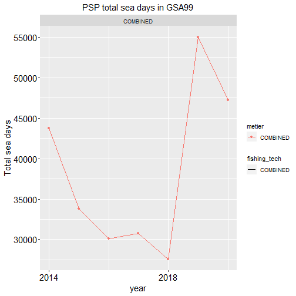

```r
FDI_cov_tableG(data=fdi_g_effort, MS="PSP", GSA="GSA99")[[4]]
```

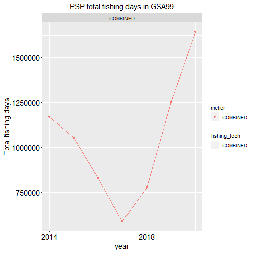

```r
FDI_cov_tableG(data=fdi_g_effort, MS="PSP", GSA="GSA99")[[5]]
```


```r
FDI_cov_tableG(data=fdi_g_effort, MS="PSP", GSA="GSA99")[[6]]
```

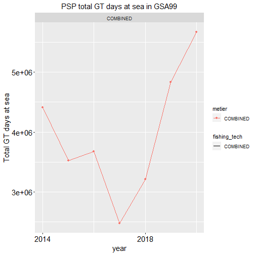

```r
FDI_cov_tableG(data=fdi_g_effort, MS="PSP", GSA="GSA99")[[7]]
#> Warning: Removed 3 rows containing missing values (`geom_point()`).
#> Warning: Removed 3 rows containing missing values (`geom_line()`).
```

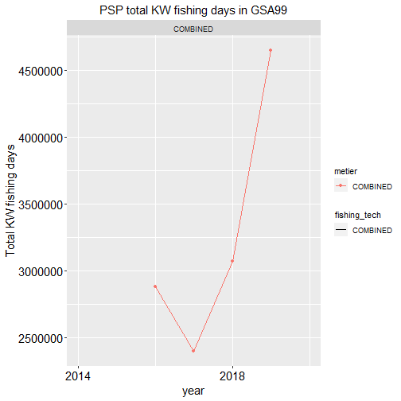

```r
FDI_cov_tableG(data=fdi_g_effort, MS="PSP", GSA="GSA99")[[8]]
#> Warning: Removed 3 rows containing missing values (`geom_point()`).
#> Removed 3 rows containing missing values (`geom_line()`).
```

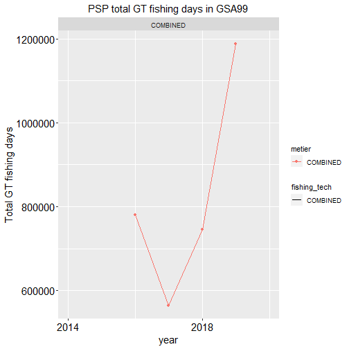

```r
FDI_cov_tableG(data=fdi_g_effort, MS="PSP", GSA="GSA99")[[9]]
#> Warning: Removed 3 rows containing missing values (`geom_point()`).
#> Removed 3 rows containing missing values (`geom_line()`).
```

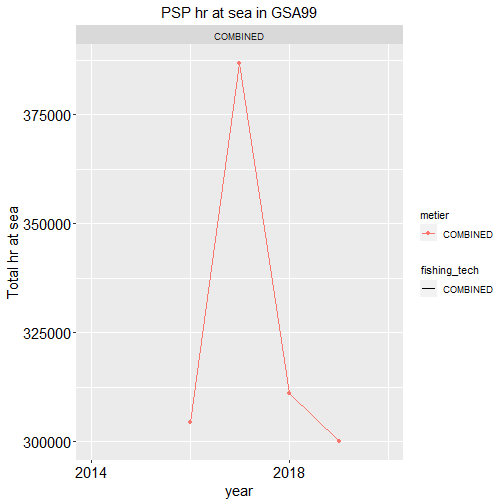

```r
FDI_cov_tableG(data=fdi_g_effort, MS="PSP", GSA="GSA99")[[10]]
#> Warning: Removed 3 rows containing missing values (`geom_point()`).
#> Removed 3 rows containing missing values (`geom_line()`).
```

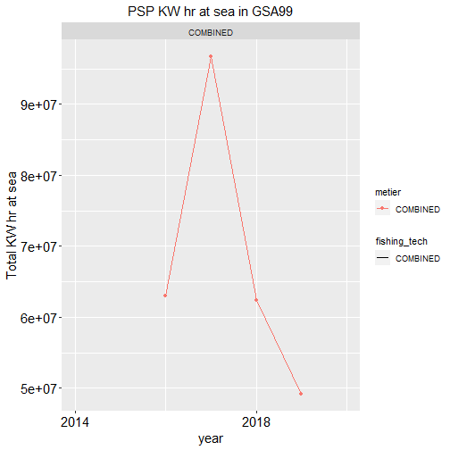

## Table H

### Check empty fields in FDI H table

The function `check_EF_FDI_H` checks the presence of not allowed empty data in the given table, according to the 'Fisheries Dependent Information data call 2021 - Annex 1'.
A list is returned by the function. The first list's object is a vector containing the number of NA for each reference column. 


```r
check_EF_FDI_H(fdi_h_spatial_landings, verbose=FALSE)[[1]]
#>           country              year           quarter     vessel_length 
#>                 0                 0                 0                 0 
#>      fishing_tech         gear_type target_assemblage   mesh_size_range 
#>                 0                 0               446                 0 
#>            metier      supra_region        sub_region     eez_indicator 
#>                 0                 0                 0                 0 
#>     geo_indicator           species      totwghtlandg       totvallandg 
#>                 0                 0                 0                 0 
#>      confidential 
#>              2450
```

The second list's object gives the index of each NA in the reference column.


```r
check_EF_FDI_H(fdi_h_spatial_landings, verbose=FALSE)[[2]]
#> $country
#> integer(0)
#> 
#> $year
#> integer(0)
#> 
#> $quarter
#> integer(0)
#> 
#> $vessel_length
#> integer(0)
#> 
#> $fishing_tech
#> integer(0)
#> 
#> $gear_type
#> integer(0)
#> 
#> $target_assemblage
#>   [1]    4    5    6    7    8    9   10   11   12   13   14   15   16   17   18
#>  [16]   19   20   21   22   23   24   25   26   27   28   29  447  448  449  450
#>  [31]  451  452  453  454  455  456  457  458  459  460  461  462  463  464  465
#>  [46]  466  467  468  469  470  471  472  473  474  475  476  477  478  479  480
#>  [61]  481  482  483  484  485  486  487  488  489  490  491  492  493  494  495
#>  [76]  496  497  498  499  500  501  502  503  504  505  506  507  508  509  510
#>  [91]  511  512  513  514  515  516  517  518  519  520  521  522  523  524  525
#> [106]  526  527  528  529  530  657  658  659  660  661  662  663  664  665  666
#> [121]  667  668  669  670  671  672  673  674  675  676  677  678  679  680  681
#> [136]  682  683  684  685  686  687 1730 1731 1732 1733 1734 1735 1736 1737 1738
#> [151] 1739 1740 1741 1742 1743 1744 1745 1746 1747 1748 1749 1750 1751 1752 1753
#> [166] 1754 1755 1756 1757 1758 1759 1760 1761 1762 1763 1764 1765 1766 1767 1768
#> [181] 1769 1770 1771 1772 1773 1774 1775 1776 1777 1778 1779 1780 1781 1782 1783
#> [196] 1784 1785 1786 1787 1788 1789 1790 1791 1792 1793 1794 1795 1796 1797 1798
#> [211] 1799 1800 1801 1802 1803 1804 1805 1806 1807 1808 1809 1810 1811 1812 1813
#> [226] 1814 1815 1816 1817 1818 1819 1820 1821 1822 1823 1824 1825 1826 1827 1828
#> [241] 1829 1830 1831 1832 1833 1834 1868 1869 1870 1871 1872 1873 1874 1875 1876
#> [256] 1877 1878 1879 1880 1881 1882 1883 1884 1885 1886 1887 1888 1909 1910 1911
#> [271] 1912 2082 2083 2084 2085 2086 2087 2088 2089 2090 2091 2092 2093 2133 2134
#> [286] 2135 2136 2137 2138 2139 2140 2141 2142 2143 2144 2145 2146 2147 2148 2149
#> [301] 2150 2151 2152 2153 2154 2155 2156 2312 2313 2314 2315 2316 2317 2318 2319
#> [316] 2320 2321 2322 2323 2324 2325 2326 2327 2328 2329 2330 2331 2332 2333 2334
#> [331] 2335 2336 2337 2338 2339 2340 2341 2342 2343 2344 2345 2346 2347 2348 2349
#> [346] 2350 2351 2352 2353 2354 2355 2356 2357 2358 2359 2360 2361 2362 2363 2364
#> [361] 2365 2366 2367 2368 2369 2370 2371 2372 2373 2374 2375 2376 2377 2378 2379
#> [376] 2380 2381 2382 2383 2384 2385 2386 2387 2388 2389 2390 2391 2392 2393 2394
#> [391] 2395 2396 2397 2398 2399 2400 2401 2402 2403 2404 2405 2406 2407 2408 2409
#> [406] 2410 2411 2412 2413 2414 2415 2416 2417 2418 2419 2420 2421 2422 2423 2424
#> [421] 2425 2426 2427 2428 2429 2430 2431 2432 2433 2434 2435 2436 2437 2438 2439
#> [436] 2440 2441 2442 2443 2444 2445 2446 2447 2448 2449 2450
#> 
#> $mesh_size_range
#> integer(0)
#> 
#> $metier
#> integer(0)
#> 
#> $supra_region
#> integer(0)
#> 
#> $sub_region
#> integer(0)
#> 
#> $eez_indicator
#> integer(0)
#> 
#> $geo_indicator
#> integer(0)
#> 
#> $species
#> integer(0)
#> 
#> $totwghtlandg
#> integer(0)
#> 
#> $totvallandg
#> integer(0)
#> 
#> $confidential
#>    [1]    1    2    3    4    5    6    7    8    9   10   11   12   13   14
#>   [15]   15   16   17   18   19   20   21   22   23   24   25   26   27   28
#>   [29]   29   30   31   32   33   34   35   36   37   38   39   40   41   42
#>   [43]   43   44   45   46   47   48   49   50   51   52   53   54   55   56
#>   [57]   57   58   59   60   61   62   63   64   65   66   67   68   69   70
#>   [71]   71   72   73   74   75   76   77   78   79   80   81   82   83   84
#>   [85]   85   86   87   88   89   90   91   92   93   94   95   96   97   98
#>   [99]   99  100  101  102  103  104  105  106  107  108  109  110  111  112
#>  [113]  113  114  115  116  117  118  119  120  121  122  123  124  125  126
#>  [127]  127  128  129  130  131  132  133  134  135  136  137  138  139  140
#>  [141]  141  142  143  144  145  146  147  148  149  150  151  152  153  154
#>  [155]  155  156  157  158  159  160  161  162  163  164  165  166  167  168
#>  [169]  169  170  171  172  173  174  175  176  177  178  179  180  181  182
#>  [183]  183  184  185  186  187  188  189  190  191  192  193  194  195  196
#>  [197]  197  198  199  200  201  202  203  204  205  206  207  208  209  210
#>  [211]  211  212  213  214  215  216  217  218  219  220  221  222  223  224
#>  [225]  225  226  227  228  229  230  231  232  233  234  235  236  237  238
#>  [239]  239  240  241  242  243  244  245  246  247  248  249  250  251  252
#>  [253]  253  254  255  256  257  258  259  260  261  262  263  264  265  266
#>  [267]  267  268  269  270  271  272  273  274  275  276  277  278  279  280
#>  [281]  281  282  283  284  285  286  287  288  289  290  291  292  293  294
#>  [295]  295  296  297  298  299  300  301  302  303  304  305  306  307  308
#>  [309]  309  310  311  312  313  314  315  316  317  318  319  320  321  322
#>  [323]  323  324  325  326  327  328  329  330  331  332  333  334  335  336
#>  [337]  337  338  339  340  341  342  343  344  345  346  347  348  349  350
#>  [351]  351  352  353  354  355  356  357  358  359  360  361  362  363  364
#>  [365]  365  366  367  368  369  370  371  372  373  374  375  376  377  378
#>  [379]  379  380  381  382  383  384  385  386  387  388  389  390  391  392
#>  [393]  393  394  395  396  397  398  399  400  401  402  403  404  405  406
#>  [407]  407  408  409  410  411  412  413  414  415  416  417  418  419  420
#>  [421]  421  422  423  424  425  426  427  428  429  430  431  432  433  434
#>  [435]  435  436  437  438  439  440  441  442  443  444  445  446  447  448
#>  [449]  449  450  451  452  453  454  455  456  457  458  459  460  461  462
#>  [463]  463  464  465  466  467  468  469  470  471  472  473  474  475  476
#>  [477]  477  478  479  480  481  482  483  484  485  486  487  488  489  490
#>  [491]  491  492  493  494  495  496  497  498  499  500  501  502  503  504
#>  [505]  505  506  507  508  509  510  511  512  513  514  515  516  517  518
#>  [519]  519  520  521  522  523  524  525  526  527  528  529  530  531  532
#>  [533]  533  534  535  536  537  538  539  540  541  542  543  544  545  546
#>  [547]  547  548  549  550  551  552  553  554  555  556  557  558  559  560
#>  [561]  561  562  563  564  565  566  567  568  569  570  571  572  573  574
#>  [575]  575  576  577  578  579  580  581  582  583  584  585  586  587  588
#>  [589]  589  590  591  592  593  594  595  596  597  598  599  600  601  602
#>  [603]  603  604  605  606  607  608  609  610  611  612  613  614  615  616
#>  [617]  617  618  619  620  621  622  623  624  625  626  627  628  629  630
#>  [631]  631  632  633  634  635  636  637  638  639  640  641  642  643  644
#>  [645]  645  646  647  648  649  650  651  652  653  654  655  656  657  658
#>  [659]  659  660  661  662  663  664  665  666  667  668  669  670  671  672
#>  [673]  673  674  675  676  677  678  679  680  681  682  683  684  685  686
#>  [687]  687  688  689  690  691  692  693  694  695  696  697  698  699  700
#>  [701]  701  702  703  704  705  706  707  708  709  710  711  712  713  714
#>  [715]  715  716  717  718  719  720  721  722  723  724  725  726  727  728
#>  [729]  729  730  731  732  733  734  735  736  737  738  739  740  741  742
#>  [743]  743  744  745  746  747  748  749  750  751  752  753  754  755  756
#>  [757]  757  758  759  760  761  762  763  764  765  766  767  768  769  770
#>  [771]  771  772  773  774  775  776  777  778  779  780  781  782  783  784
#>  [785]  785  786  787  788  789  790  791  792  793  794  795  796  797  798
#>  [799]  799  800  801  802  803  804  805  806  807  808  809  810  811  812
#>  [813]  813  814  815  816  817  818  819  820  821  822  823  824  825  826
#>  [827]  827  828  829  830  831  832  833  834  835  836  837  838  839  840
#>  [841]  841  842  843  844  845  846  847  848  849  850  851  852  853  854
#>  [855]  855  856  857  858  859  860  861  862  863  864  865  866  867  868
#>  [869]  869  870  871  872  873  874  875  876  877  878  879  880  881  882
#>  [883]  883  884  885  886  887  888  889  890  891  892  893  894  895  896
#>  [897]  897  898  899  900  901  902  903  904  905  906  907  908  909  910
#>  [911]  911  912  913  914  915  916  917  918  919  920  921  922  923  924
#>  [925]  925  926  927  928  929  930  931  932  933  934  935  936  937  938
#>  [939]  939  940  941  942  943  944  945  946  947  948  949  950  951  952
#>  [953]  953  954  955  956  957  958  959  960  961  962  963  964  965  966
#>  [967]  967  968  969  970  971  972  973  974  975  976  977  978  979  980
#>  [981]  981  982  983  984  985  986  987  988  989  990  991  992  993  994
#>  [995]  995  996  997  998  999 1000 1001 1002 1003 1004 1005 1006 1007 1008
#> [1009] 1009 1010 1011 1012 1013 1014 1015 1016 1017 1018 1019 1020 1021 1022
#> [1023] 1023 1024 1025 1026 1027 1028 1029 1030 1031 1032 1033 1034 1035 1036
#> [1037] 1037 1038 1039 1040 1041 1042 1043 1044 1045 1046 1047 1048 1049 1050
#> [1051] 1051 1052 1053 1054 1055 1056 1057 1058 1059 1060 1061 1062 1063 1064
#> [1065] 1065 1066 1067 1068 1069 1070 1071 1072 1073 1074 1075 1076 1077 1078
#> [1079] 1079 1080 1081 1082 1083 1084 1085 1086 1087 1088 1089 1090 1091 1092
#> [1093] 1093 1094 1095 1096 1097 1098 1099 1100 1101 1102 1103 1104 1105 1106
#> [1107] 1107 1108 1109 1110 1111 1112 1113 1114 1115 1116 1117 1118 1119 1120
#> [1121] 1121 1122 1123 1124 1125 1126 1127 1128 1129 1130 1131 1132 1133 1134
#> [1135] 1135 1136 1137 1138 1139 1140 1141 1142 1143 1144 1145 1146 1147 1148
#> [1149] 1149 1150 1151 1152 1153 1154 1155 1156 1157 1158 1159 1160 1161 1162
#> [1163] 1163 1164 1165 1166 1167 1168 1169 1170 1171 1172 1173 1174 1175 1176
#> [1177] 1177 1178 1179 1180 1181 1182 1183 1184 1185 1186 1187 1188 1189 1190
#> [1191] 1191 1192 1193 1194 1195 1196 1197 1198 1199 1200 1201 1202 1203 1204
#> [1205] 1205 1206 1207 1208 1209 1210 1211 1212 1213 1214 1215 1216 1217 1218
#> [1219] 1219 1220 1221 1222 1223 1224 1225 1226 1227 1228 1229 1230 1231 1232
#> [1233] 1233 1234 1235 1236 1237 1238 1239 1240 1241 1242 1243 1244 1245 1246
#> [1247] 1247 1248 1249 1250 1251 1252 1253 1254 1255 1256 1257 1258 1259 1260
#> [1261] 1261 1262 1263 1264 1265 1266 1267 1268 1269 1270 1271 1272 1273 1274
#> [1275] 1275 1276 1277 1278 1279 1280 1281 1282 1283 1284 1285 1286 1287 1288
#> [1289] 1289 1290 1291 1292 1293 1294 1295 1296 1297 1298 1299 1300 1301 1302
#> [1303] 1303 1304 1305 1306 1307 1308 1309 1310 1311 1312 1313 1314 1315 1316
#> [1317] 1317 1318 1319 1320 1321 1322 1323 1324 1325 1326 1327 1328 1329 1330
#> [1331] 1331 1332 1333 1334 1335 1336 1337 1338 1339 1340 1341 1342 1343 1344
#> [1345] 1345 1346 1347 1348 1349 1350 1351 1352 1353 1354 1355 1356 1357 1358
#> [1359] 1359 1360 1361 1362 1363 1364 1365 1366 1367 1368 1369 1370 1371 1372
#> [1373] 1373 1374 1375 1376 1377 1378 1379 1380 1381 1382 1383 1384 1385 1386
#> [1387] 1387 1388 1389 1390 1391 1392 1393 1394 1395 1396 1397 1398 1399 1400
#> [1401] 1401 1402 1403 1404 1405 1406 1407 1408 1409 1410 1411 1412 1413 1414
#> [1415] 1415 1416 1417 1418 1419 1420 1421 1422 1423 1424 1425 1426 1427 1428
#> [1429] 1429 1430 1431 1432 1433 1434 1435 1436 1437 1438 1439 1440 1441 1442
#> [1443] 1443 1444 1445 1446 1447 1448 1449 1450 1451 1452 1453 1454 1455 1456
#> [1457] 1457 1458 1459 1460 1461 1462 1463 1464 1465 1466 1467 1468 1469 1470
#> [1471] 1471 1472 1473 1474 1475 1476 1477 1478 1479 1480 1481 1482 1483 1484
#> [1485] 1485 1486 1487 1488 1489 1490 1491 1492 1493 1494 1495 1496 1497 1498
#> [1499] 1499 1500 1501 1502 1503 1504 1505 1506 1507 1508 1509 1510 1511 1512
#> [1513] 1513 1514 1515 1516 1517 1518 1519 1520 1521 1522 1523 1524 1525 1526
#> [1527] 1527 1528 1529 1530 1531 1532 1533 1534 1535 1536 1537 1538 1539 1540
#> [1541] 1541 1542 1543 1544 1545 1546 1547 1548 1549 1550 1551 1552 1553 1554
#> [1555] 1555 1556 1557 1558 1559 1560 1561 1562 1563 1564 1565 1566 1567 1568
#> [1569] 1569 1570 1571 1572 1573 1574 1575 1576 1577 1578 1579 1580 1581 1582
#> [1583] 1583 1584 1585 1586 1587 1588 1589 1590 1591 1592 1593 1594 1595 1596
#> [1597] 1597 1598 1599 1600 1601 1602 1603 1604 1605 1606 1607 1608 1609 1610
#> [1611] 1611 1612 1613 1614 1615 1616 1617 1618 1619 1620 1621 1622 1623 1624
#> [1625] 1625 1626 1627 1628 1629 1630 1631 1632 1633 1634 1635 1636 1637 1638
#> [1639] 1639 1640 1641 1642 1643 1644 1645 1646 1647 1648 1649 1650 1651 1652
#> [1653] 1653 1654 1655 1656 1657 1658 1659 1660 1661 1662 1663 1664 1665 1666
#> [1667] 1667 1668 1669 1670 1671 1672 1673 1674 1675 1676 1677 1678 1679 1680
#> [1681] 1681 1682 1683 1684 1685 1686 1687 1688 1689 1690 1691 1692 1693 1694
#> [1695] 1695 1696 1697 1698 1699 1700 1701 1702 1703 1704 1705 1706 1707 1708
#> [1709] 1709 1710 1711 1712 1713 1714 1715 1716 1717 1718 1719 1720 1721 1722
#> [1723] 1723 1724 1725 1726 1727 1728 1729 1730 1731 1732 1733 1734 1735 1736
#> [1737] 1737 1738 1739 1740 1741 1742 1743 1744 1745 1746 1747 1748 1749 1750
#> [1751] 1751 1752 1753 1754 1755 1756 1757 1758 1759 1760 1761 1762 1763 1764
#> [1765] 1765 1766 1767 1768 1769 1770 1771 1772 1773 1774 1775 1776 1777 1778
#> [1779] 1779 1780 1781 1782 1783 1784 1785 1786 1787 1788 1789 1790 1791 1792
#> [1793] 1793 1794 1795 1796 1797 1798 1799 1800 1801 1802 1803 1804 1805 1806
#> [1807] 1807 1808 1809 1810 1811 1812 1813 1814 1815 1816 1817 1818 1819 1820
#> [1821] 1821 1822 1823 1824 1825 1826 1827 1828 1829 1830 1831 1832 1833 1834
#> [1835] 1835 1836 1837 1838 1839 1840 1841 1842 1843 1844 1845 1846 1847 1848
#> [1849] 1849 1850 1851 1852 1853 1854 1855 1856 1857 1858 1859 1860 1861 1862
#> [1863] 1863 1864 1865 1866 1867 1868 1869 1870 1871 1872 1873 1874 1875 1876
#> [1877] 1877 1878 1879 1880 1881 1882 1883 1884 1885 1886 1887 1888 1889 1890
#> [1891] 1891 1892 1893 1894 1895 1896 1897 1898 1899 1900 1901 1902 1903 1904
#> [1905] 1905 1906 1907 1908 1909 1910 1911 1912 1913 1914 1915 1916 1917 1918
#> [1919] 1919 1920 1921 1922 1923 1924 1925 1926 1927 1928 1929 1930 1931 1932
#> [1933] 1933 1934 1935 1936 1937 1938 1939 1940 1941 1942 1943 1944 1945 1946
#> [1947] 1947 1948 1949 1950 1951 1952 1953 1954 1955 1956 1957 1958 1959 1960
#> [1961] 1961 1962 1963 1964 1965 1966 1967 1968 1969 1970 1971 1972 1973 1974
#> [1975] 1975 1976 1977 1978 1979 1980 1981 1982 1983 1984 1985 1986 1987 1988
#> [1989] 1989 1990 1991 1992 1993 1994 1995 1996 1997 1998 1999 2000 2001 2002
#> [2003] 2003 2004 2005 2006 2007 2008 2009 2010 2011 2012 2013 2014 2015 2016
#> [2017] 2017 2018 2019 2020 2021 2022 2023 2024 2025 2026 2027 2028 2029 2030
#> [2031] 2031 2032 2033 2034 2035 2036 2037 2038 2039 2040 2041 2042 2043 2044
#> [2045] 2045 2046 2047 2048 2049 2050 2051 2052 2053 2054 2055 2056 2057 2058
#> [2059] 2059 2060 2061 2062 2063 2064 2065 2066 2067 2068 2069 2070 2071 2072
#> [2073] 2073 2074 2075 2076 2077 2078 2079 2080 2081 2082 2083 2084 2085 2086
#> [2087] 2087 2088 2089 2090 2091 2092 2093 2094 2095 2096 2097 2098 2099 2100
#> [2101] 2101 2102 2103 2104 2105 2106 2107 2108 2109 2110 2111 2112 2113 2114
#> [2115] 2115 2116 2117 2118 2119 2120 2121 2122 2123 2124 2125 2126 2127 2128
#> [2129] 2129 2130 2131 2132 2133 2134 2135 2136 2137 2138 2139 2140 2141 2142
#> [2143] 2143 2144 2145 2146 2147 2148 2149 2150 2151 2152 2153 2154 2155 2156
#> [2157] 2157 2158 2159 2160 2161 2162 2163 2164 2165 2166 2167 2168 2169 2170
#> [2171] 2171 2172 2173 2174 2175 2176 2177 2178 2179 2180 2181 2182 2183 2184
#> [2185] 2185 2186 2187 2188 2189 2190 2191 2192 2193 2194 2195 2196 2197 2198
#> [2199] 2199 2200 2201 2202 2203 2204 2205 2206 2207 2208 2209 2210 2211 2212
#> [2213] 2213 2214 2215 2216 2217 2218 2219 2220 2221 2222 2223 2224 2225 2226
#> [2227] 2227 2228 2229 2230 2231 2232 2233 2234 2235 2236 2237 2238 2239 2240
#> [2241] 2241 2242 2243 2244 2245 2246 2247 2248 2249 2250 2251 2252 2253 2254
#> [2255] 2255 2256 2257 2258 2259 2260 2261 2262 2263 2264 2265 2266 2267 2268
#> [2269] 2269 2270 2271 2272 2273 2274 2275 2276 2277 2278 2279 2280 2281 2282
#> [2283] 2283 2284 2285 2286 2287 2288 2289 2290 2291 2292 2293 2294 2295 2296
#> [2297] 2297 2298 2299 2300 2301 2302 2303 2304 2305 2306 2307 2308 2309 2310
#> [2311] 2311 2312 2313 2314 2315 2316 2317 2318 2319 2320 2321 2322 2323 2324
#> [2325] 2325 2326 2327 2328 2329 2330 2331 2332 2333 2334 2335 2336 2337 2338
#> [2339] 2339 2340 2341 2342 2343 2344 2345 2346 2347 2348 2349 2350 2351 2352
#> [2353] 2353 2354 2355 2356 2357 2358 2359 2360 2361 2362 2363 2364 2365 2366
#> [2367] 2367 2368 2369 2370 2371 2372 2373 2374 2375 2376 2377 2378 2379 2380
#> [2381] 2381 2382 2383 2384 2385 2386 2387 2388 2389 2390 2391 2392 2393 2394
#> [2395] 2395 2396 2397 2398 2399 2400 2401 2402 2403 2404 2405 2406 2407 2408
#> [2409] 2409 2410 2411 2412 2413 2414 2415 2416 2417 2418 2419 2420 2421 2422
#> [2423] 2423 2424 2425 2426 2427 2428 2429 2430 2431 2432 2433 2434 2435 2436
#> [2437] 2437 2438 2439 2440 2441 2442 2443 2444 2445 2446 2447 2448 2449 2450
```

### Check duplicated records in FDI H table

The function `check_RD_FDI_H` check the presence of duplicated records. In particular, it checks whether the combination of the first 15 columns generates duplicate records. The function returns the indices of the duplicated rows.


```r
h_spatial_land <- rbind(fdi_h_spatial_landings,fdi_h_spatial_landings[1,])
check_RD_FDI_H(h_spatial_land)
#> 22 record/s duplicated
#>  [1]  853  881  887  888  923  924 1091 1111 1122 1161 1325 1371 1389 1420 1421
#> [16] 1422 1453 1479 1481 1499 2366 2451
```

### Coverage of data by GSA and year in table H

The function `FDI_coverage` returns a data frame reporting the coverage of the selected table in terms of number of records by country, GSA and year. The function work on FDI tables A, G, H, I and J.


```r
FDI_coverage(data=fdi_h_spatial_landings ,MS="PSP", verbose = FALSE)
#>   year country   gsa records
#> 1 2014     PSP GSA99     429
#> 2 2015     PSP GSA99     258
#> 3 2016     PSP GSA99     258
#> 4 2017     PSP GSA99     301
#> 5 2018     PSP GSA99     387
#> 6 2019     PSP GSA99     430
#> 7 2020     PSP GSA99     387
```

### check NA values in spatial columns of table H

The function checks the incorrect combination of NA in the spatial columns in both table H (Landings by rectangle) and table I (Effort by rectangle). The following check are included:
- presence of NA values in 'c_square' field when 'rectangle_type', 'rectangle_lat', 'rectangle_lon' are all NA
- the presence any data in 'rectangle_type', 'rectangle_lat', 'rectangle_lon' when 'c_square' is reported
- the presence of any data in 'c-squares' when 'rectangle_type', 'rectangle_lat', 'rectangle_lon' are filled in

Furthermore the function identifies the records without any sub-region assignment.


```r
head(FDI_checks_spatial_HI(data=fdi_h_spatial_landings,MS="PSP", verbose=TRUE)[[1]])
#> no NAs in 'c_square' field when 'rectangle_type', 'latitude' (rectangle_lat), 'longitude' (rectangle_lon) are all NA
#> 2450  record with at least one data among 'rectangle_type', 'latitude' (rectangle_lat), 'longitude' (rectangle_lon) when 'c_square' is reported
#> no data reported in 'c-squares' when 'rectangle_type', 'latitude' (rectangle_lat), 'longitude' (rectangle_lon) are filled in
#> 0 record/s with 'NK' values in 'sub_region' field
#> 0 record/s with 'NA' values in 'sub_region' field
#>   country year quarter vessel_length fishing_tech gear_type target_assemblage
#> 1     PSP 2014       1            NK          DTS       OTB                NK
#> 2     PSP 2014       2            NK          DTS       OTB                NK
#> 3     PSP 2014       3            NK          DTS       OTB                NK
#> 4     PSP 2014       1        VL0006          DRB       DRB              <NA>
#> 5     PSP 2014       4        VL0612          PMP       DRB              <NA>
#> 6     PSP 2014       1        VL1218          PMP       DRB              <NA>
#>   mesh_size_range           metier supra_region sub_region rectangle_type
#> 1             DEF OTB_DEF_>=40_0_0          OFR      GSA99          05*05
#> 2             DEF OTB_DEF_>=40_0_0          OFR      GSA99          05*05
#> 3             DWS OTB_DWS_>=40_0_0          OFR      GSA99          05*05
#> 4             MOL    DRB_MOL_0_0_0          OFR      GSA99          05*05
#> 5             MOL    DRB_MOL_0_0_0          MBS      GSA99          05*05
#> 6             MOL    DRB_MOL_0_0_0          MBS      GSA99          05*05
#>   rectangle_lat rectangle_lon   c_square
#> 1            NA            NA 1000:100:1
#> 2            NA            NA 1000:100:2
#> 3            NA            NA 1000:100:2
#> 4            NA            NA 1000:100:3
#> 5            NA            NA 1000:100:1
#> 6            NA            NA 1000:100:1
```


```r
FDI_checks_spatial_HI(data=fdi_h_spatial_landings,MS="PSP", verbose=FALSE)[[2]]
#>  [1] country           year              quarter           vessel_length    
#>  [5] fishing_tech      gear_type         target_assemblage mesh_size_range  
#>  [9] metier            supra_region      sub_region       
#> <0 righe> (o 0-length row.names)
```

### Compatibility of the geographical coordinates with rectangle type


The function checks in both tables H and I the compatibility of the geographical coordinates (latitude and longitude) with the value provided for the rectangle type. The data frame of the input table is returned retaining the only records in which at least one among latitude and longitude is not compatible with the rectangle type. Two more columns (lat.check and lon.check) are included to the data frame to report the results of the checks respectively for latitude and longitude.


```r
FDI_check_coord(data=fdi_i_spatial_effort, MS="PSP",verbose=TRUE)
#> no data with rectangle coordinates available in the selected table
#> NULL
```

## Table I

### Check empty fields in FDI I table

The function `check_EF_FDI_I` checks the presence of not allowed empty data in the given table, according to the 'Fisheries Dependent Information data call 2021 - Annex 1'. A list is returned by the function. The first list's object is a vector containing the number of NA for each reference column. 


```r
check_EF_FDI_I(fdi_i_spatial_effort,verbose=FALSE)[[1]]
#>           country              year           quarter     vessel_length 
#>                 0                 0                 0                 0 
#>      fishing_tech         gear_type target_assemblage   mesh_size_range 
#>                 0                 0               446                 0 
#>            metier      supra_region        sub_region     eez_indicator 
#>                 0                 0                 0                 0 
#>     geo_indicator       totfishdays      confidential 
#>                 0                 0                 0
```

The second list's object gives the index of each NA in the reference column.


```r
check_EF_FDI_I(fdi_i_spatial_effort,verbose=FALSE)[[2]]
#> $country
#> integer(0)
#> 
#> $year
#> integer(0)
#> 
#> $quarter
#> integer(0)
#> 
#> $vessel_length
#> integer(0)
#> 
#> $fishing_tech
#> integer(0)
#> 
#> $gear_type
#> integer(0)
#> 
#> $target_assemblage
#>   [1]    4    5    6    7    8    9   10   11   12   13   14   15   16   17   18
#>  [16]   19   20   21   22   23   24   25   26   27   28   29  447  448  449  450
#>  [31]  451  452  453  454  455  456  457  458  459  460  461  462  463  464  465
#>  [46]  466  467  468  469  470  471  472  473  474  475  476  477  478  479  480
#>  [61]  481  482  483  484  485  486  487  488  489  490  491  492  493  494  495
#>  [76]  496  497  498  499  500  501  502  503  504  505  506  507  508  509  510
#>  [91]  511  512  513  514  515  516  517  518  519  520  521  522  523  524  525
#> [106]  526  527  528  529  530  657  658  659  660  661  662  663  664  665  666
#> [121]  667  668  669  670  671  672  673  674  675  676  677  678  679  680  681
#> [136]  682  683  684  685  686  687 1730 1731 1732 1733 1734 1735 1736 1737 1738
#> [151] 1739 1740 1741 1742 1743 1744 1745 1746 1747 1748 1749 1750 1751 1752 1753
#> [166] 1754 1755 1756 1757 1758 1759 1760 1761 1762 1763 1764 1765 1766 1767 1768
#> [181] 1769 1770 1771 1772 1773 1774 1775 1776 1777 1778 1779 1780 1781 1782 1783
#> [196] 1784 1785 1786 1787 1788 1789 1790 1791 1792 1793 1794 1795 1796 1797 1798
#> [211] 1799 1800 1801 1802 1803 1804 1805 1806 1807 1808 1809 1810 1811 1812 1813
#> [226] 1814 1815 1816 1817 1818 1819 1820 1821 1822 1823 1824 1825 1826 1827 1828
#> [241] 1829 1830 1831 1832 1833 1834 1868 1869 1870 1871 1872 1873 1874 1875 1876
#> [256] 1877 1878 1879 1880 1881 1882 1883 1884 1885 1886 1887 1888 1909 1910 1911
#> [271] 1912 2082 2083 2084 2085 2086 2087 2088 2089 2090 2091 2092 2093 2133 2134
#> [286] 2135 2136 2137 2138 2139 2140 2141 2142 2143 2144 2145 2146 2147 2148 2149
#> [301] 2150 2151 2152 2153 2154 2155 2156 2312 2313 2314 2315 2316 2317 2318 2319
#> [316] 2320 2321 2322 2323 2324 2325 2326 2327 2328 2329 2330 2331 2332 2333 2334
#> [331] 2335 2336 2337 2338 2339 2340 2341 2342 2343 2344 2345 2346 2347 2348 2349
#> [346] 2350 2351 2352 2353 2354 2355 2356 2357 2358 2359 2360 2361 2362 2363 2364
#> [361] 2365 2366 2367 2368 2369 2370 2371 2372 2373 2374 2375 2376 2377 2378 2379
#> [376] 2380 2381 2382 2383 2384 2385 2386 2387 2388 2389 2390 2391 2392 2393 2394
#> [391] 2395 2396 2397 2398 2399 2400 2401 2402 2403 2404 2405 2406 2407 2408 2409
#> [406] 2410 2411 2412 2413 2414 2415 2416 2417 2418 2419 2420 2421 2422 2423 2424
#> [421] 2425 2426 2427 2428 2429 2430 2431 2432 2433 2434 2435 2436 2437 2438 2439
#> [436] 2440 2441 2442 2443 2444 2445 2446 2447 2448 2449 2450
#> 
#> $mesh_size_range
#> integer(0)
#> 
#> $metier
#> integer(0)
#> 
#> $supra_region
#> integer(0)
#> 
#> $sub_region
#> integer(0)
#> 
#> $eez_indicator
#> integer(0)
#> 
#> $geo_indicator
#> integer(0)
#> 
#> $totfishdays
#> integer(0)
#> 
#> $confidential
#> integer(0)
```

### Check duplicated records in FDI I table

The function `check_RD_FDI_I` check the presence of duplicated records. In particular, it checks whether the combination of the first 15 columns generates duplicate records. The function returns the indices of the duplicated rows.


```r
i_spatial_fe <- rbind(fdi_i_spatial_effort,fdi_i_spatial_effort[1,])
head(check_RD_FDI_I(i_spatial_fe))
#> 150 record/s duplicated
#> [1] 44 45 53 54 55 61
```

### Coverage of data by GSA and year in table I

The function `FDI_coverage` returns a data frame reporting the coverage of the selected table in terms of number of records by country, GSA and year. The function work on FDI tables A, G, H, I and J.


```r
FDI_coverage(data=fdi_i_spatial_effort ,MS="PSP", verbose = FALSE)
#>   year country   gsa records
#> 1 2014     PSP GSA99     429
#> 2 2015     PSP GSA99     258
#> 3 2016     PSP GSA99     258
#> 4 2017     PSP GSA99     301
#> 5 2018     PSP GSA99     387
#> 6 2019     PSP GSA99     430
#> 7 2020     PSP GSA99     387
```

### check NA values in spatial columns of table I

The function checks the incorrect combination of NA in the spatial columns in both table H (Landings by rectangle) and table I (Effort by rectangle). The following check are included:
- presence of NA values in 'c_square' field when 'rectangle_type', 'rectangle_lat', 'rectangle_lon' are all NA
- the presence any data in 'rectangle_type', 'rectangle_lat', 'rectangle_lon' when 'c_square' is reported
- the presence of any data in 'c-squares' when 'rectangle_type', 'rectangle_lat', 'rectangle_lon' are filled in

Furthermore, the function identifies the records without any sub-region assignment.


```r
head(FDI_checks_spatial_HI(data=fdi_i_spatial_effort,MS="PSP", verbose=TRUE)[[1]])
#> no NAs in 'c_square' field when 'rectangle_type', 'latitude' (rectangle_lat), 'longitude' (rectangle_lon) are all NA
#> 2450  record with at least one data among 'rectangle_type', 'latitude' (rectangle_lat), 'longitude' (rectangle_lon) when 'c_square' is reported
#> no data reported in 'c-squares' when 'rectangle_type', 'latitude' (rectangle_lat), 'longitude' (rectangle_lon) are filled in
#> 0 record/s with 'NK' values in 'sub_region' field
#> 0 record/s with 'NA' values in 'sub_region' field
#>   country year quarter vessel_length fishing_tech gear_type target_assemblage
#> 1     PSP 2014       1            NK          DTS       OTB                NK
#> 2     PSP 2014       2            NK          DTS       OTB                NK
#> 3     PSP 2014       3            NK          DTS       OTB                NK
#> 4     PSP 2014       1        VL0006          DRB       DRB              <NA>
#> 5     PSP 2014       4        VL0612          PMP       DRB              <NA>
#> 6     PSP 2014       1        VL1218          PMP       DRB              <NA>
#>   mesh_size_range           metier supra_region sub_region rectangle_type
#> 1             DEF OTB_DEF_>=40_0_0          OFR      GSA99          05*05
#> 2             DEF OTB_DEF_>=40_0_0          OFR      GSA99          05*05
#> 3             DWS OTB_DWS_>=40_0_0          OFR      GSA99          05*05
#> 4             MOL    DRB_MOL_0_0_0          OFR      GSA99          05*05
#> 5             MOL    DRB_MOL_0_0_0          MBS      GSA99          05*05
#> 6             MOL    DRB_MOL_0_0_0          MBS      GSA99          05*05
#>   rectangle_lat rectangle_lon   c_square
#> 1            NA            NA 1000:100:1
#> 2            NA            NA 1000:100:2
#> 3            NA            NA 1000:100:2
#> 4            NA            NA 1000:100:3
#> 5            NA            NA 1000:100:1
#> 6            NA            NA 1000:100:1
```


```r
FDI_checks_spatial_HI(data=fdi_i_spatial_effort,MS="PSP", verbose=FALSE)[[2]]
#>  [1] country           year              quarter           vessel_length    
#>  [5] fishing_tech      gear_type         target_assemblage mesh_size_range  
#>  [9] metier            supra_region      sub_region       
#> <0 righe> (o 0-length row.names)
```

### Compatibility of the geographical coordinates with rectangle type

The function checks in both tables H and I the compatibility of the geographical coordinates (latitude and longitude) with the value provided for the rectangle type. The data frame of the input table is returned retaining the only records in which at least one among latitude and longitude is not compatible with the rectangle type. Two more columns (lat.check and lon.check) are included to the data frame to report the results of the checks respectively for latitude and longitude.


```r
FDI_check_coord(data=fdi_i_spatial_effort, MS="PSP",verbose=TRUE)
#> no data with rectangle coordinates available in the selected table
#> NULL
```


## Table J

### Check empty fields in FDI J table

The function `check_EF_FDI_J` checks the presence of not allowed empty data in the given table, according to the Fisheries Dependent Information data call 2021 - Annex 1. A list is returned by the function. The first list's object is a vector containing the number of NA for each reference column.


```r
check_EF_FDI_J(fdi_j_capacity, verbose=FALSE)[[1]]
#>              country                 year        vessel_length 
#>                    0                    0                    0 
#>         fishing_tech         supra_region        geo_indicator 
#>                    0                    0                    0 
#> principal_sub_region             tottrips                totkw 
#>                    0                    0                    0 
#>                totgt               totves               avgage 
#>                    0                    0                    0 
#>               avgloa           maxseadays 
#>                    0                    0
```

The second list's object gives the index of each NA in the reference column.


```r
check_EF_FDI_J(fdi_j_capacity, verbose=FALSE)[[2]]
#> $country
#> integer(0)
#> 
#> $year
#> integer(0)
#> 
#> $vessel_length
#> integer(0)
#> 
#> $fishing_tech
#> integer(0)
#> 
#> $supra_region
#> integer(0)
#> 
#> $geo_indicator
#> integer(0)
#> 
#> $principal_sub_region
#> integer(0)
#> 
#> $tottrips
#> integer(0)
#> 
#> $totkw
#> integer(0)
#> 
#> $totgt
#> integer(0)
#> 
#> $totves
#> integer(0)
#> 
#> $avgage
#> integer(0)
#> 
#> $avgloa
#> integer(0)
#> 
#> $maxseadays
#> integer(0)
```

### Check duplicated records in FDI J table

The function `check_RD_FDI_J` check the presence of duplicated records. In particular, it checks whether the combination of the first 15 columns generates duplicate records. The function returns the indices of the duplicated rows.


```r
j_capacity <- rbind(fdi_j_capacity,fdi_j_capacity[1,])
head(check_RD_FDI_J(j_capacity))
#> 2239 record/s duplicated
#> [1]  2  3 14 22 33 34
```

### Coverage of data by GSA and year in table J

The function `FDI_coverage` returns a data frame reporting the coverage of the selected table in terms of number of records by country, GSA and year. The function work on FDI tables A, G, H, I and J.


```r
FDI_coverage(data=fdi_j_capacity ,MS="PSP", verbose = FALSE)
#>   year country   gsa records
#> 1 2014     PSP GSA99     429
#> 2 2015     PSP GSA99     258
#> 3 2016     PSP GSA99     258
#> 4 2017     PSP GSA99     301
#> 5 2018     PSP GSA99     387
#> 6 2019     PSP GSA99     430
#> 7 2020     PSP GSA99     387
```

### Check of vessel lenght in FDI table J

The function checks the average vessels length with the vessel length category (table J). A list of two data frames is returned. The first reports the cases with NAs in either vessel length or vessel category or both, while the second table reports the cases in which vessel length does not match vessel length category.


```r
head(FDI_vessel_lenth(data=fdi_j_capacity, MS="PSP", verbose = TRUE)[[1]])
#> [1] "Check consistency of vessel length with vessel category in table J for PSP data"
#> found 30 cases with NAs in either vessel length or vessel category or both. Check output table
#> found 1991 cases where vessel length does not match vessel length category
#>    country year vessel_length principal_sub_region totkw totgt totves    avgage
#> 1      PSP 2014            NK                GSA99   221    21      1   7.00000
#> 2      PSP 2014            NK                GSA99   471    18      1 444.00000
#> 3      PSP 2014            NK                GSA99   441    45     44  15.00000
#> 20     PSP 2016            NK                GSA99   547   108      3  49.66667
#> 21     PSP 2017            NK                GSA99   818   200      2  44.00000
#> 22     PSP 2017            NK                GSA99  2213   854      7  18.71429
#>     avgloa consistent
#> 1   11.780         NA
#> 2   12.680         NA
#> 3  444.000         NA
#> 20 444.000         NA
#> 21  21.305         NA
#> 22  23.370         NA
```


```r
head(FDI_vessel_lenth(data=fdi_j_capacity, MS="PSP", verbose = TRUE)[[2]])
#> [1] "Check consistency of vessel length with vessel category in table J for PSP data"
#> found 30 cases with NAs in either vessel length or vessel category or both. Check output table
#> found 1991 cases where vessel length does not match vessel length category
#>    country year vessel_length principal_sub_region totkw totgt totves
#> 4      PSP 2014        VL0006                GSA99   444   108      3
#> 5      PSP 2014        VL0612                GSA99   598    44     44
#> 6      PSP 2014        VL1218                GSA99   219    68      1
#> 8      PSP 2014        VL2440                GSA99   444  1185     18
#> 9      PSP 2015        VL0006                GSA99  1326    44      6
#> 10     PSP 2015        VL0612                GSA99  1181   385      1
#>        avgage   avgloa consistent
#> 4  4444.00000 16.93333      FALSE
#> 5    14.00000 21.53000      FALSE
#> 6    27.00000 20.04000      FALSE
#> 8    36.55556 21.63611      FALSE
#> 9    44.00000 44.00000      FALSE
#> 10   14.00000 37.81000      FALSE
```

### Check number of record in FDI J table

The function checks and count the numbers of records data in the given table grouped by year, GSA, MS, vessels length, and fishing techniques for the following 4 variables: total trips; total kW; total GT; total vessels.
The function returns a list. The first element gives the summary table of records number. From the second to the fifth element gives 4 plots for each variables among:
* total trips
* total kW
* total GT
* total vessels


```r
FDI_cov_tableJ(data=fdi_j_capacity, MS="PSP", GSA="GSA99", verbose=TRUE)[[1]]
#>   year principal_sub_region country vessel_length fishing_tech total_trips
#> 1 2014                GSA99     PSP      COMBINED     COMBINED         420
#> 2 2015                GSA99     PSP      COMBINED     COMBINED         250
#> 3 2016                GSA99     PSP      COMBINED     COMBINED         252
#> 4 2017                GSA99     PSP      COMBINED     COMBINED         294
#> 5 2018                GSA99     PSP      COMBINED     COMBINED         378
#> 6 2019                GSA99     PSP      COMBINED     COMBINED         423
#> 7 2020                GSA99     PSP      COMBINED     COMBINED         377
#>   total_total_kW total_GT total_vessels
#> 1            429      429           429
#> 2            258      258           258
#> 3            258      258           258
#> 4            301      301           301
#> 5            387      387           387
#> 6            430      430           430
#> 7            387      387           387
```


```r
FDI_cov_tableJ(data=fdi_j_capacity, MS="PSP", GSA="GSA99", verbose=FALSE)[[2]]
#>   year principal_sub_region country vessel_length fishing_tech total_trips
#> 1 2014                GSA99     PSP      COMBINED     COMBINED    455248.3
#> 2 2015                GSA99     PSP      COMBINED     COMBINED    183594.9
#> 3 2016                GSA99     PSP      COMBINED     COMBINED    218005.7
#> 4 2017                GSA99     PSP      COMBINED     COMBINED    172220.7
#> 5 2018                GSA99     PSP      COMBINED     COMBINED    363788.8
#> 6 2019                GSA99     PSP      COMBINED     COMBINED    362471.2
#> 7 2020                GSA99     PSP      COMBINED     COMBINED    238462.8
#>   total_total_kW total_GT total_vessels
#> 1      1018449.9 271891.0       28929.0
#> 2       630518.2 219999.9       34332.0
#> 3       600032.3 171230.3        8761.0
#> 4       643223.7 233306.7        6079.0
#> 5       896454.6 334577.5       17438.0
#> 6      1217063.3 468387.0       19054.5
#> 7       878027.3 316756.3       19888.5
```


```r
FDI_cov_tableJ(data=fdi_j_capacity, MS="PSP", GSA="GSA99", verbose=FALSE)[[3]]
```


```r
FDI_cov_tableJ(data=fdi_j_capacity, MS="PSP", GSA="GSA99", verbose=FALSE)[[4]]
```


```r
FDI_cov_tableJ(data=fdi_j_capacity, MS="PSP", GSA="GSA99", verbose=FALSE)[[5]]
```


```r
FDI_cov_tableJ(data=fdi_j_capacity, MS="PSP", GSA="GSA99", verbose=FALSE)[[6]]
```


## Cross-checks

### Coverage comparison of totfishdays between FDI tables G and I

The function checks the coverage comparison of totfishdays in FDI tables G and I and returns a data frame of the comparison between the two tables.


```r
FDI_fishdays_cov (dataG=fdi_g_effort, dataI=fdi_i_spatial_effort, MS="PSP", verbose = TRUE)
#> [1] "Coverage of total fish days for PSP data in tables G and I"
#>   year country   gsa Total fish days table G Total fish days table I  % diff
#> 1 2014     PSP GSA99               1167896.7                1332.879 -99.89%
#> 2 2015     PSP GSA99               1055410.4                 781.721 -99.93%
#> 3 2016     PSP GSA99                831831.1                1238.866 -99.85%
#> 4 2017     PSP GSA99                586293.7                1050.782 -99.82%
#> 5 2018     PSP GSA99                777467.5                1379.131 -99.82%
#> 6 2019     PSP GSA99               1249878.1                1376.709 -99.89%
#> 7 2020     PSP GSA99               1643316.1                1371.771 -99.92%
```

### Coverage of weight of landings in FDI table A and H

The functions checks the coverage of weight of landings comparing data reported in table A and H and returns a data frame with the weight of landings by GSA and year.


```r
FDI_landweight_cov(dataA=fdi_a_catch, dataH=fdi_h_spatial_landings, MS="PSP", verbose = TRUE)
#> [1] "Coverage of landings' weight for PSP data in tables A and H"
#>   year country   gsa Lands table A Lands table H    % diff
#> 1 2014     PSP GSA99       265.910     10651.418  3905.65%
#> 2 2015     PSP GSA99       131.154      5372.477  3996.31%
#> 3 2016     PSP GSA99        41.679      5638.029 13427.27%
#> 4 2017     PSP GSA99        72.392      5266.220  7174.59%
#> 5 2018     PSP GSA97       607.990            NA      <NA>
#> 6 2018     PSP GSA98      2824.540            NA      <NA>
#> 7 2018     PSP GSA99       125.115      6301.502  4936.57%
#> 8 2019     PSP GSA99       179.482      7191.640  3906.89%
#> 9 2020     PSP GSA99       225.216      8186.780  3535.08%
```

### Check number of vessels in FDI table J and G

The function cross-checks the number of vessels in table J in comparison of the number reported in table G.
A list of data frames is returned. The first element reports the number of vessel in table J in comparison to table G and the relative difference percentage, while the second table reports the vessels not present in table G.


```r
FDI_vessel_numbers(dataJ=fdi_j_capacity, dataG=fdi_g_effort, MS="PSP", verbose = TRUE)
#> [1] "Comparing number of vessels in tables J and G for PSP"
#> $comparison_table_J_G
#>    year   gsa fish_tech  vesselsJ vesselsG     diff
#> 1  2014 GSA99       DFN 16795.000     1597   90.49%
#> 2  2014 GSA99       DRB    65.000       25   61.54%
#> 3  2014 GSA99       DTS  1090.000       85   92.20%
#> 4  2014 GSA99       FPO    31.000       23   25.81%
#> 5  2014 GSA99       HOK   773.000      480   37.90%
#> 6  2014 GSA99       PMP 10175.000      494   95.14%
#> 7  2015 GSA99       DFN 11690.000      647   94.47%
#> 8  2015 GSA99       DRB    32.000       51  -59.38%
#> 9  2015 GSA99       DTS   189.000       62   67.20%
#> 10 2015 GSA99       FPO    39.000       29   25.64%
#> 11 2015 GSA99       HOK 10183.000      147   98.56%
#> 12 2015 GSA99       PMP 12199.000      504   95.87%
#> 13 2016 GSA99       DFN  2783.000      917   67.05%
#> 14 2016 GSA99       DRB   122.000       17   86.07%
#> 15 2016 GSA99       DTS   589.000       89   84.89%
#> 16 2016 GSA99       FPO    45.000       47   -4.44%
#> 17 2016 GSA99       HOK   970.000      331   65.88%
#> 18 2016 GSA99       PMP  4252.000      673   84.17%
#> 19 2017 GSA99       DFN  1366.000      980   28.26%
#> 20 2017 GSA99       DRB    30.000       20   33.33%
#> 21 2017 GSA99       DTS   536.000       72   86.57%
#> 22 2017 GSA99       FPO    26.000       17   34.62%
#> 23 2017 GSA99       HOK  2264.000      507   77.61%
#> 24 2017 GSA99       PMP  1857.000      249   86.59%
#> 25 2018 GSA99       DFN  6899.000      657   90.48%
#> 26 2018 GSA99       DRB   527.000       57   89.18%
#> 27 2018 GSA99       DTS   174.000      215  -23.56%
#> 28 2018 GSA99       FPO    54.000       67  -24.07%
#> 29 2018 GSA99       HOK  7703.000      342   95.56%
#> 30 2018 GSA99       PMP  2081.000      494   76.26%
#> 31 2019 GSA99       DFN  5661.498      988   82.55%
#> 32 2019 GSA99       DRB   427.000       38   91.10%
#> 33 2019 GSA99       DTS   197.000       74   62.44%
#> 34 2019 GSA99       FPO   148.000       45   69.59%
#> 35 2019 GSA99       HOK  4804.000      585   87.82%
#> 36 2019 GSA99       PMP  7817.000      922   88.21%
#> 37 2020 GSA99       DFN 15556.000     1466   90.58%
#> 38 2020 GSA99       DRB    35.000      164 -368.57%
#> 39 2020 GSA99       DTS   182.000      138   24.18%
#> 40 2020 GSA99       FPO    67.000       31   53.73%
#> 41 2020 GSA99       HOK  2061.000      111   94.61%
#> 42 2020 GSA99       PMP  1987.498      271   86.36%
#> 
#> $vessels_not_present_in_table_G
#> NULL
```


### Cross check between FDI tables A and G

The function checks the possible data inconsistency between landings and effort and returns a summary table where all the mismatches between landings and effort are reported.


```r
head(FDI_cross_checks_AG(data1=fdi_a_catch, data2=fdi_g_effort))
#>     country year quarter vessel_length fishing_tech gear_type target_assemblage
#> 18      PSP 2014       1        VL0006          DFN      <NA>              <NA>
#> 33      PSP 2014       1        VL0006          PMP      <NA>              <NA>
#> 48      PSP 2014       1        VL0612          DFN      <NA>              <NA>
#> 78      PSP 2014       1        VL1218          DFN      <NA>              <NA>
#> 138     PSP 2014       1        VL2440          DFN       GTR               SLP
#> 158     PSP 2014       1          <NA>          DTS       OTB               DEF
#>     mesh_size_range           metier sub_region totwghtlandg totfishdays
#> 18          100D400             <NA>      GSA99        0.000      648.07
#> 33             <NA>             <NA>      GSA99        0.001        0.00
#> 48            20D40             <NA>      GSA99        0.000        8.12
#> 78            20D40             <NA>      GSA99        0.000       56.84
#> 138            <NA> GNS_SLP_>=16_0_0      GSA99        0.000      317.41
#> 158            <NA> OTB_DEF_>=40_0_0      GSA99        0.000       22.04
#>     totseadays                                                   Check results
#> 18          82 no landings, only effort in fishing days and sea days available
#> 33          28                                 landings and sea days available
#> 48           1 no landings, only effort in fishing days and sea days available
#> 78           7 no landings, only effort in fishing days and sea days available
#> 138         12 no landings, only effort in fishing days and sea days available
#> 158         19 no landings, only effort in fishing days and sea days available
```

### Cross check between FDI tables A and H

The function checks the possible data inconsistency between landings in table A and spatial landings in table H. The function returns a list with two tables. In the first table all the mismatches between landings in table A and spatial landings in table H are reported.


```r
FDI_cross_checks_AH(data1 = fdi_a_catch, data2 = fdi_h_spatial_landings,verbose=TRUE)[[1]]
#>    country year vessel_length fishing_tech gear_type sub_region totwghtlandg
#> 1      PSP 2014        VL0006          DFN      <NA>      GSA99         0.00
#> 2      PSP 2014        VL0612          DFN      <NA>      GSA99         0.00
#> 3      PSP 2014        VL2440          PMP       LHP      GSA99         0.00
#> 4      PSP 2014          <NA>          DTS       OTB      GSA99         0.00
#> 5      PSP 2014          <NA>          PMP       GTR      GSA99         0.00
#> 6      PSP 2014          <NA>          PMP       LHP      GSA99         0.00
#> 7      PSP 2016        VL0006          PMP       FPO      GSA99         0.00
#> 8      PSP 2016        VL2440          PMP       FPO      GSA99         0.00
#> 9      PSP 2016          <NA>          PMP       FPO      GSA99         0.00
#> 10     PSP 2017          <NA>          PMP       FPO      GSA99         0.00
#> 11     PSP 2018        VL0006          FPO       FPO      GSA98         2.13
#> 12     PSP 2018        VL0006          HOK       LLS      GSA98         5.49
#> 13     PSP 2018        VL0006           PG       GNS      GSA98        41.51
#> 14     PSP 2018        VL0006           PG       GTR      GSA98        11.64
#> 15     PSP 2018        VL0612          FPO       FPO      GSA98        10.52
#> 16     PSP 2018        VL0612          HOK       LLS      GSA97        41.46
#> 17     PSP 2018        VL0612          HOK       LLS      GSA98       216.29
#> 18     PSP 2018        VL0612          MGP        SB      GSA97         2.00
#> 19     PSP 2018        VL0612          MGP        SB      GSA98         4.05
#> 20     PSP 2018        VL0612           PG       GNS      GSA97       219.78
#> 21     PSP 2018        VL0612           PG       GNS      GSA98       423.99
#> 22     PSP 2018        VL0612           PG       GTR      GSA97       128.86
#> 23     PSP 2018        VL0612           PG       GTR      GSA98       135.44
#> 24     PSP 2018        VL1218          DTS       OTB      GSA98         6.76
#> 25     PSP 2018        VL1218          HOK       LLS      GSA97         8.75
#> 26     PSP 2018        VL1218          HOK       LLS      GSA98        53.39
#> 27     PSP 2018        VL1218          MGP        SB      GSA98         4.03
#> 28     PSP 2018        VL1218          PGP       GNS      GSA97        19.00
#> 29     PSP 2018        VL1218          PGP       GNS      GSA98        24.78
#> 30     PSP 2018        VL1218          PGP       GTR      GSA97        13.43
#> 31     PSP 2018        VL1218          PGP       GTR      GSA98        11.46
#> 32     PSP 2018        VL1824          DTS       OTB      GSA97        65.66
#> 33     PSP 2018        VL1824          DTS       OTB      GSA98       445.08
#> 34     PSP 2018        VL1824          FPO       FPO      GSA98         4.01
#> 35     PSP 2018        VL1824          HOK       LLS      GSA97         6.07
#> 36     PSP 2018        VL1824          HOK       LLS      GSA98        13.32
#> 37     PSP 2018        VL1824          PGP       GTR      GSA97         2.00
#> 38     PSP 2018        VL1824           PS        PS      GSA97         4.04
#> 39     PSP 2018        VL1824           PS        PS      GSA98         6.03
#> 40     PSP 2018        VL2440          DTS       OTB      GSA97        96.94
#> 41     PSP 2018        VL2440          DTS       OTB      GSA98      1398.61
#> 42     PSP 2018        VL2440           PS        PS      GSA98         6.01
#>     ttwghtl
#> 1  0.141613
#> 2  1.051240
#> 3  0.086005
#> 4  0.226650
#> 5  3.042935
#> 6  5.123999
#> 7  0.639140
#> 8  0.001000
#> 9  1.132000
#> 10 0.242750
#> 11 0.000000
#> 12 0.000000
#> 13 0.000000
#> 14 0.000000
#> 15 0.000000
#> 16 0.000000
#> 17 0.000000
#> 18 0.000000
#> 19 0.000000
#> 20 0.000000
#> 21 0.000000
#> 22 0.000000
#> 23 0.000000
#> 24 0.000000
#> 25 0.000000
#> 26 0.000000
#> 27 0.000000
#> 28 0.000000
#> 29 0.000000
#> 30 0.000000
#> 31 0.000000
#> 32 0.000000
#> 33 0.000000
#> 34 0.000000
#> 35 0.000000
#> 36 0.000000
#> 37 0.000000
#> 38 0.000000
#> 39 0.000000
#> 40 0.000000
#> 41 0.000000
#> 42 0.000000
#>                                                                           Data
#> 1         landings in tabel A not avalilable and landings in table H available
#> 2         landings in tabel A not avalilable and landings in table H available
#> 3         landings in tabel A not avalilable and landings in table H available
#> 4         landings in tabel A not avalilable and landings in table H available
#> 5         landings in tabel A not avalilable and landings in table H available
#> 6         landings in tabel A not avalilable and landings in table H available
#> 7         landings in tabel A not avalilable and landings in table H available
#> 8         landings in tabel A not avalilable and landings in table H available
#> 9         landings in tabel A not avalilable and landings in table H available
#> 10        landings in tabel A not avalilable and landings in table H available
#> 11 landings in table A are available and landings in table H are not available
#> 12 landings in table A are available and landings in table H are not available
#> 13 landings in table A are available and landings in table H are not available
#> 14 landings in table A are available and landings in table H are not available
#> 15 landings in table A are available and landings in table H are not available
#> 16 landings in table A are available and landings in table H are not available
#> 17 landings in table A are available and landings in table H are not available
#> 18 landings in table A are available and landings in table H are not available
#> 19 landings in table A are available and landings in table H are not available
#> 20 landings in table A are available and landings in table H are not available
#> 21 landings in table A are available and landings in table H are not available
#> 22 landings in table A are available and landings in table H are not available
#> 23 landings in table A are available and landings in table H are not available
#> 24 landings in table A are available and landings in table H are not available
#> 25 landings in table A are available and landings in table H are not available
#> 26 landings in table A are available and landings in table H are not available
#> 27 landings in table A are available and landings in table H are not available
#> 28 landings in table A are available and landings in table H are not available
#> 29 landings in table A are available and landings in table H are not available
#> 30 landings in table A are available and landings in table H are not available
#> 31 landings in table A are available and landings in table H are not available
#> 32 landings in table A are available and landings in table H are not available
#> 33 landings in table A are available and landings in table H are not available
#> 34 landings in table A are available and landings in table H are not available
#> 35 landings in table A are available and landings in table H are not available
#> 36 landings in table A are available and landings in table H are not available
#> 37 landings in table A are available and landings in table H are not available
#> 38 landings in table A are available and landings in table H are not available
#> 39 landings in table A are available and landings in table H are not available
#> 40 landings in table A are available and landings in table H are not available
#> 41 landings in table A are available and landings in table H are not available
#> 42 landings in table A are available and landings in table H are not available
```

The second table reports the comparison between total landings of table A and total spatial landings in table H.


```r
FDI_cross_checks_AH(data1 = fdi_a_catch, data2 = fdi_h_spatial_landings)[[2]]
#>   year country sub_region land_table_A land_table_H
#> 1 2014     PSP      GSA99      265.910    10651.418
#> 2 2015     PSP      GSA99      131.154     5372.477
#> 3 2016     PSP      GSA99       41.679     5638.029
#> 4 2017     PSP      GSA99       72.392     5266.220
#> 5 2018     PSP      GSA97      607.990           NA
#> 6 2018     PSP      GSA98     2824.540           NA
#> 7 2018     PSP      GSA99      125.115     6301.502
#> 8 2019     PSP      GSA99      179.482     7191.640
#> 9 2020     PSP      GSA99      225.216     8186.780
```

### ross check between FDI tables I and G

The function checks the possible data inconsistency between spatial effort in table I and effort in table G. The function returns a list with two tables. In the first table all the miss matches between spatial effort in table I and effort in table G are shown.


```r
FDI_cross_checks_IG(data1=fdi_i_spatial_effort, data2=fdi_g_effort)[[1]]
#> [1] year              vessel_length     fishing_tech      gear_type        
#> [5] sub_region        totfishdays_data1 totfishdays_data2 Data             
#> <0 righe> (o 0-length row.names)
```

In the second table the comparison between total spatial effort of table I and total effort in table G is shown.


```r
FDI_cross_checks_IG(data1=fdi_i_spatial_effort, data2=fdi_g_effort)[[2]]
#>   year sub_region spatial_effort_table_I effort_table_G
#> 1 2014      GSA99               1332.879      1167896.7
#> 2 2015      GSA99                781.721      1055410.4
#> 3 2016      GSA99               1238.866       831831.1
#> 4 2017      GSA99               1050.782       586293.7
#> 5 2018      GSA99               1379.131       777467.5
#> 6 2019      GSA99               1376.709      1249878.1
#> 7 2020      GSA99               1371.771      1643316.1
```

### Cross check between FDI tables J and G

The function checks the possible data inconsistency between the amount of vessels in table J capacity and the amount of vessels in table G. The function returns a table with all the mismatches between number of vessels in table J and G are shown.


```r
FDI_cross_checks_JG(data1=fdi_j_capacity, data2=fdi_g_effort,verbose=TRUE)
#> summary table of missing vessels
#>    country year principal_sub_region vessel_length total_vessels_tab_J
#> 1      PSP 2014                GSA99        VL0006                6814
#> 2      PSP 2014                GSA99        VL0612                3535
#> 3      PSP 2014                GSA99        VL1218                7997
#> 4      PSP 2014                GSA99        VL1824                4205
#> 5      PSP 2014                GSA99        VL2440                5685
#> 6      PSP 2014                GSA99          <NA>                 693
#> 7      PSP 2015                GSA99        VL0006                4913
#> 8      PSP 2015                GSA99        VL0612                2216
#> 9      PSP 2015                GSA99        VL1218               10202
#> 10     PSP 2015                GSA99        VL1824                3869
#> 11     PSP 2015                GSA99        VL2440               13132
#> 12     PSP 2016                GSA99        VL0006                1179
#> 13     PSP 2016                GSA99        VL0612                2803
#> 14     PSP 2016                GSA99        VL1218                1381
#> 15     PSP 2016                GSA99        VL1824                1342
#> 16     PSP 2016                GSA99        VL2440                2048
#> 17     PSP 2016                GSA99          <NA>                   8
#> 18     PSP 2017                GSA99        VL0006                1133
#> 19     PSP 2017                GSA99        VL0612                 872
#> 20     PSP 2017                GSA99        VL1218                1399
#> 21     PSP 2017                GSA99        VL1824                1140
#> 22     PSP 2017                GSA99        VL2440                1522
#> 23     PSP 2017                GSA99          <NA>                  13
#> 24     PSP 2018                GSA99        VL0006                 818
#> 25     PSP 2018                GSA99        VL0612                3231
#> 26     PSP 2018                GSA99        VL1218                3238
#> 27     PSP 2018                GSA99        VL1824                6937
#> 28     PSP 2018                GSA99        VL2440                3185
#> 29     PSP 2018                GSA99          <NA>                  29
#> 30     PSP 2019                GSA99        VL0006                3169
#> 31     PSP 2019                GSA99        VL0612                3643
#> 32     PSP 2019                GSA99        VL1218                3128
#> 33     PSP 2019                GSA99        VL1824                4015
#> 34     PSP 2019                GSA99        VL2440                4920
#> 35     PSP 2019                GSA99          <NA>                 180
#> 36     PSP 2020                GSA99        VL0006                6721
#> 37     PSP 2020                GSA99        VL0612                5160
#> 38     PSP 2020                GSA99        VL1218                2781
#> 39     PSP 2020                GSA99        VL1824                1725
#> 40     PSP 2020                GSA99        VL2440                3455
#> 41     PSP 2020                GSA99          <NA>                  46
#>    total_vessels_tab_G                                                    info
#> 1                  700  There are 6114 more vessels in table J than in table G
#> 2                  464  There are 3071 more vessels in table J than in table G
#> 3                  770  There are 7227 more vessels in table J than in table G
#> 4                  937  There are 3268 more vessels in table J than in table G
#> 5                  711  There are 4974 more vessels in table J than in table G
#> 6                  118   There are 575 more vessels in table J than in table G
#> 7                  594  There are 4319 more vessels in table J than in table G
#> 8                  749  There are 1467 more vessels in table J than in table G
#> 9                  409  There are 9793 more vessels in table J than in table G
#> 10                 372  There are 3497 more vessels in table J than in table G
#> 11                 239 There are 12893 more vessels in table J than in table G
#> 12                 459   There are 720 more vessels in table J than in table G
#> 13                 305  There are 2498 more vessels in table J than in table G
#> 14                 368  There are 1013 more vessels in table J than in table G
#> 15                 625   There are 717 more vessels in table J than in table G
#> 16                 621  There are 1427 more vessels in table J than in table G
#> 17                  84    There are 76 more vessels in table G than in table J
#> 18                 460   There are 673 more vessels in table J than in table G
#> 19                 422   There are 450 more vessels in table J than in table G
#> 20                 655   There are 744 more vessels in table J than in table G
#> 21                 476   There are 664 more vessels in table J than in table G
#> 22                 217  There are 1305 more vessels in table J than in table G
#> 23                  25    There are 12 more vessels in table G than in table J
#> 24                 357   There are 461 more vessels in table J than in table G
#> 25                 526  There are 2705 more vessels in table J than in table G
#> 26                 550  There are 2688 more vessels in table J than in table G
#> 27                 409  There are 6528 more vessels in table J than in table G
#> 28                 465  There are 2720 more vessels in table J than in table G
#> 29                  15    There are 14 more vessels in table J than in table G
#> 30                 540  There are 2629 more vessels in table J than in table G
#> 31                 785  There are 2858 more vessels in table J than in table G
#> 32                 733  There are 2395 more vessels in table J than in table G
#> 33                 533  There are 3482 more vessels in table J than in table G
#> 34                 947  There are 3973 more vessels in table J than in table G
#> 35                  25   There are 155 more vessels in table J than in table G
#> 36                 965  There are 5756 more vessels in table J than in table G
#> 37                 732  There are 4428 more vessels in table J than in table G
#> 38                 220  There are 2561 more vessels in table J than in table G
#> 39                 479  There are 1246 more vessels in table J than in table G
#> 40                 780  There are 2675 more vessels in table J than in table G
#> 41                  15    There are 31 more vessels in table J than in table G
```


#### 

# GFCM data format

## Task II.2 table

### Check empty fields in GFCM Task II.2 table

The function `check_EF_taskII2` checks the presence of not allowed empty data in the given table, according to the GFCM Data Collection Reference Framework (DCRF, V. 20.1). The function returns two lists. The first list gives the number of NA for each reference column. 


```r
check_EF_taskII2(task_ii2, verbose=FALSE)[[1]]
#> Reference_Year            CPC            GSA        Segment        Species 
#>              0              0              0              0              0 
#>        Landing          Catch 
#>              0              0
```

The second list returns the index of each NA in the reference column.


```r
check_EF_taskII2(task_ii2, verbose=FALSE)[[2]]
#> $Reference_Year
#> integer(0)
#> 
#> $CPC
#> integer(0)
#> 
#> $GSA
#> integer(0)
#> 
#> $Segment
#> integer(0)
#> 
#> $Species
#> integer(0)
#> 
#> $Landing
#> integer(0)
#> 
#> $Catch
#> integer(0)
```

### Check of missing combination GSA/Fleet segment per year

Function `check_presence_taskII2` allows to verify the completeness of the GSA/Fleet segments in Task II.2 table, as reported in the combination_taskII2 table. The output is a list of missing combinations GSA/Fleet segment per year.


